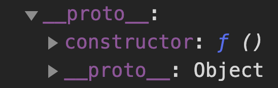

## Object Inheritance in Javascript

#### I. [Compare with Classical inheritance](#ch1)

#### II. [Prototype Inheritance](#ch2)

- [Prototype property](#ch2-1)
- [prototype chain](#ch2-2)
- [How to use constructor functions?](#ch2-3)
- [Add a method to the object](#ch2-4)
- [Add a property to the object](#ch2-5)

#### III. [Three way to create an object instance](#ch3)

- [use object literals](#ch3-1)
- [use Object.create()](#ch3-2)

#### IV. [primitives vs. objects](#ch4)

#### V. [Method shorthand(ES6)](#ch5)

<div id="ch1" />

### I. compare with classical languages inheritance

Classical inheritance (like Java):

- Advantage 1: a form of code re-use, only need to specify the difference
- Advantage 2: it includes the specification of a system of types, then devs don't have to write explicit casting operations.

Javascript:

- Advantage 1: much richer set of code re-use patterns, both classical pattern or other more expressive patterns.

<div id="ch2" />

### II. Prototype Inheritance

<div id="ch2-1" />

#### 2.1 Prototype property

Instead of direct inheritance from other objects, a level of indirection is inserted that objects are produced by **constructor functions.**

The function constructor produces the new function object, which has a **prototype property.**

- whose value is an object containing a **constructor property**
- Every function has a **prototype property**, because JS language cannot determine which functions are used as constructors.

  

Note: The prototype property of an object is where we put methods and properties that we want **other objects to inherit, but not itself**.

**For example:**

- Person Object -> Prototype
- Jennie inherits Person: then Jennie can access Person object' **prototype** in Jennie's **prototype property**.

```
Person.prototype.calculateAge = function(){......};
var jennie = new Person();
jennie.calculateAge();
```

<div id="ch2-2" />

#### 2.2 prototype chain

When a certain method or peroperty is called, it starts searching in itself, if it's not found, the search moves on to object's prototype. This continues until the method is found.

 <div id="ch2-3" />
 
#### 2.3 How to use constructor functions?

1 ) **define** the function constructor

```js
var Person = function (name, yearOfBirth, job) {
  this.name = name;
  this.yearOfBirth = yearOfBirth;
  this.job = job;
};
```

2 ) **create an instance:** use `new` key word,
What's the [**new**](<(https://developer.mozilla.org/en-US/docs/Web/JavaScript/Reference/Operators/new)>) keyword doing?

- **Step1**: Creates a blank, plain JavaScript object.
- **Step2**: Adds a property to the new object (`__proto__`) that links to the constructor function's prototype object.
- **Step3**: Binds the newly created object instance as the `this` context (i.e. all references to `this` in the constructor function now refer to the object created in the first step).
- **Step4**: Returns `this` if the function doesn't return an object.

**Mock the "new" operator's implementation** in a similar method way:

```js
Function.method("new", function () {
  // Step1 & Step2
  var that = Object.create(this.prototype);

  // Step 3
  var obj = this.apply(that, arguments);

  // Step4:  The object (not null, false, 3.1415 or other primitive types) returned by the constructor function becomes the result of the whole new expression.
  //    If the constructor function doesn't explicitly return an object,
  //    the object created in step 1 is used instead (normally constructors don't return a value, but they can choose to do so if they want to override the normal object creation process).
  if (obj && typeof obj === "object") {
    return obj;
  } else {
    return that;
  }
});
```

Instance Usage example:

```js
var jennie = new Person("Jennie", 1994, "dancer");
```

 <div id="ch2-4" />
 
#### 2.4 Add a method to the object

- use function constructor

  ```js
  var Person = function(name, yearOfBirth, job) {
  	this.calculateAge = function() {
  	console.log(2018 - this.yearOfBirth);
  };
  ```

- use prototype
  ```js
  Person.prototype.calAge = this.calAge = function () {
    console.log(2018 - this.yearOfBirth);
  };
  ```

 <div id="ch2-5" />
 
#### 2.5 Add a property to the object
we can also attach property to the prototype for other instance to access:
```js
// define a prop
Person.prototype.lastName = 'Han';
// usage
jennie.calculateAge();
var name = jennie.lastName;
```

 <div id="ch3" />
 
### 3.  Three way to create an object instance

- Object literals
- constructor functions + new (in section 2)
- [Object.create()](https://developer.mozilla.org/en-US/docs/Web/JavaScript/Reference/Global_Objects/Object/create)

 <div id="ch3-1" />
 
#### 3.1 use object literals
```js
const john = {
	name: 'John',
	yearOfBirth: 1994,
	job: 'dancer',
	getName() { // shorthand method
		return this.name;
	}
};
```

 <div id="ch3-2" />
 
#### 3.2 use Object.create()
create object that inherits from prototype: Object.create

- First define a prototype ( this is also an object) object:
  ```js
  var personProto = {
    calulateAge: function () {
      console.log(2018 - this.yearOfBirth);
    },
  };
  ```
- create instance object:
  ```js
  var jennie = Object.create(personProto);
  ```
- use **second argument**: an object that contains data we want to put into the object.

  ```js
  var jennie = Object.create(personProto, {
    name: { value: "jane" },
    yearOfBirth: { value: 1980 },
    job: { value: "designer" },
  });
  ```

- Reference: [Object/create](https://developer.mozilla.org/en-US/docs/Web/JavaScript/Reference/Global_Objects/Object/create)

 <div id="ch4" />

### 4. primitives vs. objects

- Primitives: `string, number, boolean, undefined, null`
  Primitives are passing by value, for example:
  `js
var a = 1;
var b = a;
a = 2;
// but b is still 1
`
  When we pass a primitive into a function, it will never affect the varaible outside, while we can make any change inside the function. For example:
  `js
var a = 1;
function change(a)
{
	a = 2;
}
change(a);
console.log(a); // still 1, not changed
`
- object: pass by reference
  ```js
  var obj2 = obj1;
  obj1.age = 18;
  // then obje2.age = 18, it will also change
  ```

 <div id="ch5" />

### 5. Method shorthand(ES6)

There exists a shorter syntax for methods in an object literal:

Original(ES6):

```js
const obj = {
	name: 'jelly',
	getName: function {
		return this.name;
	}
}
```

It's the same with the shorthand written syntax:

```js
const obj = {
  name: "jelly",
  getName() {
    return this.name;
  },
};
// usage
obj.getName();
```

Note: attention: since **arrow function has no "this" keyword**,

if we want to easliy access and make use of **"return this.name;"**,

then we just use `function(){}` syntax.

~~**Wrong** code:~~

```js
// wrong
const obj = {
  name: "jelly",
  getName: () => {
    return this.name; // wrong, cannot access this.name
  },
};
```
