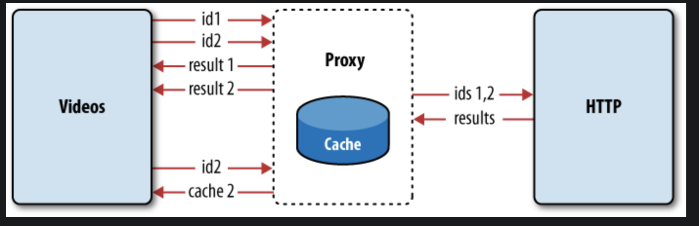

## JavaScript - Proxy Design Pattern

#### I. [Proxy Object in JavaScript](#chapter1)

- [1.1 handler.get() method](#ch1-1)
- [1.2 handler.set() method](#ch1-2)
- [1.3 handler.has() method](#ch1-3)

#### II. [BFE 88. Proxy an Array to support Negative Index](#chapter2)

#### III. [What is Proxy Pattern?](#chapter3)

- [3.1 Usage Example 1: combine HTTP calls](#ch3-1)
- [3.2 Usage Example 2: use as Cache Proxy](#ch3-2)

#### IV. [Reference and Useful Links](#chapter4)

<div id="chapter1" />

### I. Proxy Object in JavaScript

**MDN-docs:**
https://developer.mozilla.org/en-US/docs/Web/JavaScript/Reference/Global_Objects/Proxy

A `Proxy` is created with **two parameters**:

- `target`: the original object which you want to proxy
- `handler`: an object that defines which operations will be intercepted and how to redefine intercepted operations.

<div id="ch1-1" />

### 1.1 handler.get() method

**Docs:**
https://developer.mozilla.org/en-US/docs/Web/JavaScript/Reference/Global_Objects/Proxy/Proxy/get#trap_for_getting_a_property_value

**Syntax:**

```js
const p = new Proxy(target, {
  get: function (target, property, receiver) {}
});
```

**Parameters:**

- `target` : The target object.
- `property` : The name or [`Symbol`](https://developer.mozilla.org/en-US/docs/Web/JavaScript/Reference/Global_Objects/Symbol) of the property to get.
- `receiver` : Either the proxy or an object that inherits from the proxy.

**Simple Example:**

```js
const obj = {};
const proxyedObj = new Proxy(obj, {
  get: function (target, property) {
    if (property === "age") {
      return 10;
    }
    return undefined;
  }
});
console.log(proxyedObj.age); // 10
```

<div id="ch1-2" />

### 1.2 handler.set() method

**Docs:**
https://developer.mozilla.org/en-US/docs/Web/JavaScript/Reference/Global_Objects/Proxy/Proxy/set

**Syntax:**

```js
const p = new Proxy(target, {
  set: function (target, property, value, receiver) {}
});
```

**Parameters:**

- `target` : The target object.
- `property`
- `value`
- `receiver` : Either the proxy or an object that inherits from the proxy.

**Return value:**
The `set()` method should return a boolean value.

- Return `true` to indicate that assignment succeeded.
- If the `set()` method returns `false`, and the assignment happened in strict-mode code, a [`TypeError`](https://developer.mozilla.org/en-US/docs/Web/JavaScript/Reference/Global_Objects/TypeError) will be thrown.

**Simple Example:**

```js
const obj = {};
const proxyedObj = new Proxy(obj, {
  set: function (target, property, value) {
    if (
      property === "size" &&
      !["large", "small", "medium"].includes(value.toLowerCase())
    ) {
      throw "invalid size value";
    }
    target[property] = value;
    return true; // Important!
  }
});
proxyedObj["size"] = "small";
console.log(proxyedObj["size"]); // 'small'
proxyedObj["size"] = "xs"; // ERROR
```

<div id="ch1-3" />

### 1.3 handler.has() method

**Docs:**
https://developer.mozilla.org/en-US/docs/Web/JavaScript/Reference/Global_Objects/Proxy/Proxy/has

**Syntax:**

```js
const p = new Proxy(target, {
  has: function (target, prop) {}
});
```

**Parameters:**

- `target` : The target object.
- `prop`

**Simple Example:**

```js
const obj = {};
const proxyedObj = new Proxy(obj, {
  has: function (target, prop) {
    if (prop === "size") {
      return false;
    }
    return prop in target;
  }
});
proxyedObj["size"] = "small";
console.log("size" in proxyedObj); // false
```

<div id="chapter2" />

### II. BFE 88. Proxy an Array to support Negative Index

**Problem:**
Can you write a wrapper function to make **negative array index** possible?

```js
const originalArr = [1, 2, 3];
const arr = wrap(originalArr);

arr[0]; // 1
arr[1]; // 2
arr[2]; // 3
arr[3]; // undefined
arr[-1]; // 3
arr[-2]; // 2
arr[-3]; // 1
arr[-4]; // undefined
```

**Bug1:** property can be a "Symbol"

- property param: The name or Symbol of the property to get.

**Bug2:** in `set()` method, return _true_

In order to make the assignment success, for the following test-caes:

- arr.push()
- arr.shift()
- arr.pop()
- arr.unshift()

**Solution:**

```javascript
/**
 * @param {any[]} arr
 * @returns {?} - sorry no type hint for this
 */
function wrap(arr) {
  return new Proxy(arr, {
    get: function (target, property) {
      if (property === Symbol.iterator) {
        // #Bug1
        return target[property].bind(target);
      }
      if (parseInt(property) < 0) {
        property = -property;
        if (property > target.length) {
          return undefined;
        }
        return target[target.length - property];
      }
      return target[property];
    },
    set: function (target, property, value) {
      if (parseInt(property) < 0) {
        property = -property;
        if (property > target.length) {
          throw "invalid negative index";
        }
        property = target.length - property;
      }
      target[property] = value;
      return true; // #Bug2
    }
  });
}
```

**Tests:**

```js
const originalArr = [1, 2, 3];
const arr = wrap(originalArr);
// arr[0] // 1
// arr[1] // 2
// arr[2] // 3
// console.log(arr[3]); // undefined
// console.log(arr[-1]); // 3
// console.log(arr[-2]) // 2
// console.log(arr[-3]); // 1
// console.log(arr[-4]); // undefined
// // const arr = wrap([1,2,3])
// arr[-2] = 'bfe'
// console.log(arr[-2]);
// // expect(arr[-2]).toEqual('bfe')
// console.log(arr[1]);
// // expect(arr[1]).toEqual('bfe')
arr.push(4);
```

<div id="chapter3" />

### III. Native Implementation of these two Classes

In the proxy design pattern, one object acts as an interface to another object.

The proxy sits between the client of an object and the object itself and protects the access to that object.

The proxy serves as a guardian of the object (also called a “real subject”) and tries to have the real subject do as little work as possible.


<div id="ch3-1" />

#### 3.1 Usage Example 1: combine HTTP calls


<div id="ch3-2" />

#### 3.2 Usage Example 2: use as Cache Proxy

The proxy can go further in protecting the real subject http by caching the results of previous requests into a new cache property.



**Another Cache Proxy Code Example:**

```js
function GeoCoder() {
  this.getLatLng = function (address) {
    if (address === "Amsterdam") {
      return "52.3700° N, 4.8900° E";
    } else if (address === "London") {
      return "51.5171° N, 0.1062° W";
    } else if (address === "Paris") {
      return "48.8742° N, 2.3470° E";
    } else if (address === "Berlin") {
      return "52.5233° N, 13.4127° E";
    } else {
      return "";
    }
  };
}
function GeoProxy() {
  var geocoder = new GeoCoder();
  var geocache = {};

  return {
    getLatLng: function (address) {
      if (!geocache[address]) {
        geocache[address] = geocoder.getLatLng(address);
      }
      console.log(address + ": " + geocache[address]);
      return geocache[address];
    },
    getCount: function () {
      var count = 0;
      for (var code in geocache) {
        count++;
      }
      return count;
    }
  };
}
```

<div id="chapter4" />

### IV. Reference and Useful Links

- https://www.dofactory.com/javascript/design-patterns/proxy
- https://stackoverflow.com/questions/7379732/what-is-a-javascript-proxy-pattern
- Book: https://learning.oreilly.com/library/view/javascript-patterns/9781449399115/ch07.html
