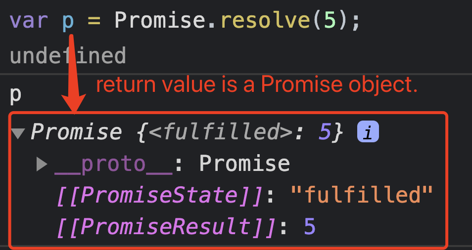

## Native implementation of Promise

#### 1.[What is Promise?](#p1)  

#### 2.[Analysis Promise object structure](#p2)  
- [Three states](#p2-1)
- [Constructor](#p2-2)
- [Static methods](#p2-3)
- [Instance method](#p2-4)

#### 3.[Implementation](#p3)  

#### 4.[Can a Promise be resovled Multiple times?](#p4)  

#### 5.[Promise.then() Chaining return value](#p5)

#### 6.[Exec Order of then, catch, finally](#p6)

<div id="p1" />

### 1. What is Promise ?

Docs: [Promise object](https://developer.mozilla.org/en-US/docs/Web/JavaScript/Reference/Global_Objects/Promise)

**A promise is an object that may produce a single value some time in the future: either a resolved or rejected value.**

How event loop deal with promise & web api callback?
- macrotask queue: async web api callbacks, eg: setTimeout, setInterval......
- microtask queue: eg: Promise
	
In a event Loop, these two task queues will run in two steps:

1.  First, check whether there is a macrotask (called it X) in old macrotask queue ;
2.  If X exists and it is running, wait for gotoing the next step until it was complete; otherwise, goto the next step immediately;
3.  Second, run all microtasks of the microtask queue;
4.  and when run the microtasks, we can still add some more microtaks into the queue, these tasks will also run.

<div id="p2" />

### 2. Analysis Promise object structure

<div id="p2-1" />

#### 2.1 `Promise`  has three states:

-   _pending_: initial state, neither fulfilled nor rejected.
-   _fulfilled_: meaning that the operation was completed successfully.
-   _rejected_: meaning that the operation failed.

<div id="p2-2" />

#### 2.2 Constructor: [`Promise()`](https://developer.mozilla.org/en-US/docs/Web/JavaScript/Reference/Global_Objects/Promise/Promise)

**Syntax:**
```js
const myFirstPromise = new Promise((resolve, reject) => {
  // do something asynchronous which eventually calls either:
  //
  //   resolve(someValue)        // fulfilled
  // or
  //   reject("failure reason")  // rejected
});
```

**Example 1:**
```js
const promise1 = new Promise((resolve, reject) => {
  setTimeout(() => {
    resolve('foo');
  }, 300);
});
```

**Example 2:**
```js
function myAsyncFunction(url) {
  return new Promise((resolve, reject) => {
    const xhr = new XMLHttpRequest()
    xhr.open("GET", url)
    xhr.onload = () => resolve(xhr.responseText)
    xhr.onerror = () => reject(xhr.statusText)
    xhr.send()
  });
}
```

<div id="p2-3" />

#### 2.3  static methods
it has so many, define the scope, what is the major method I want to implement.
- [`Promise.all(iterable)`](https://developer.mozilla.org/en-US/docs/Web/JavaScript/Reference/Global_Objects/Promise/all)
- [`Promise.reject(reason)`](https://developer.mozilla.org/en-US/docs/Web/JavaScript/Reference/Global_Objects/Promise/reject)
	Returns a new  `Promise`  object that is rejected with the given reason.
- [`Promise.resolve(value)`](https://developer.mozilla.org/en-US/docs/Web/JavaScript/Reference/Global_Objects/Promise/resolve)
	Returns a new `Promise` object that is resolved with the given value. the value can be either:
	- thenable (eg: has a `then()` method)
	- a single value

<div id="p2-4" />

#### 2.4 instance method
- catch()
- then()
- finally()

<div id="p3" />

### 3. Implementation
Gaps:
- here only return `this` instead of a new promise object described in document for `then(). catch()` method.
- only implement a few major methods
- what's about `catch()` method doing?  [Promise.prototype.catch](https://developer.mozilla.org/en-US/docs/Web/JavaScript/Reference/Global_Objects/Promise/catch)
- `then()` method can accept two arguments: `resolveHandler & rejectHandler`, [Promise.prototype.then](https://developer.mozilla.org/en-US/docs/Web/JavaScript/Reference/Global_Objects/Promise/then)

```js
const PENDING = 0;
const FULFILLED = 1;
const REJECTED = 2;

class MyPromise {
    constructor(fn) {
        console.log("constructor...");
        // store state which can be PENDING, FULFILLED or REJECTED
        this.status = PENDING;
        // store value once FULFILLED or REJECTED
        this.result = null;
        this.resolveHandlers = [];
        this.rejectHandlers = [];

        this.onResolve = this.onResolve.bind(this);
        this.onReject = this.onReject.bind(this);

        fn(this.onResolve, this.onReject);
    }
    onResolve(value) {
        this.result = value;
        this.status = FULFILLED;
        let chainedValue = value;
        try {
            this.resolveHandlers.forEach(fn => {
                chainedValue = fn(chainedValue);
            });
        }
        catch (error) {
            this.resolveHandlers = [];
            this.onReject(error);
        }
    }
    onReject(value) {
        this.result = value;
        console.log("calling onReject...");
        this.status = REJECTED;
        let chainedValue = value;
        this.rejectHandlers.forEach(fn => {
            chainedValue = fn(chainedValue);
        });
        this.rejectHandlers = [];
    }
    then(handleResolved, handleRejected) {
        if (handleResolved) {
            if (this.status === FULFILLED) {
                console.log("then: already fulfilled")
                handleResolved(this.result);
            }
            else {
                this.resolveHandlers.push(handleResolved);
            }
        }
        if (handleRejected) {
            if (this.status === REJECTED) {
                console.log("then: already rejected")
                handleRejected(this.result);
            }
            else {
                this.rejectHandlers.push(handleRejected);
            }
        }

        return this; // self chaining
    }
    catch(handleError) {
        // It behaves the same as calling Promise.prototype.then(undefined, onRejected) 
        // (in fact, calling obj.catch(onRejected)
        // internally calls obj.then(undefined, onRejected)).
        this.then(undefined, handleError);
        return this; // self chaining
    }
}

// test
const p = new MyPromise((resolve, reject) => {
    setTimeout(function () {
        // resolve("Success!")
        reject("soemthing went wrong!");
    }, 2000)
});
p.then(resp => console.log(resp)).catch(e => console.log(e));

// some time later to monitor this promise
setTimeout(() => {
    p.then(resp => console.log(resp)).catch(e => console.log(e));
}, 3000);
```

<div id="p4" />

### 4.Can a Promise be resovled Multiple times?

**NO !!!** - Reference answer: [stackoverflow-link](https://stackoverflow.com/questions/20328073/is-it-safe-to-resolve-a-promise-multiple-times)

The only thing to understand is that once resolved (or rejected), that is it for a defered object - **it is done**.

If you call `then(...)` on its promise again, you immediately get the **(first)** resolved/rejected result.

Additional calls to resolve() will **NOT** have any effect.
For example:

```js
var p = new Promise((resolve, reject) => {
  resolve(1);
  reject(2);
  resolve(3);
});

p.then(x => console.log('resolved to ' + x)) // 1
 .catch(x => console.log('never called ' + x));

p.then(x => console.log('one more ' + x)); // 1
p.then(x => console.log('two more ' + x)); // 1
p.then(x => console.log('three more ' + x)); // 1
```
Output is:
```
resolved to 1
one more 1
two more 1
three more 1
```

<div id="p5" />

### 5. ".then()" Chaining return value

#### 5.1  [then()](https://developer.mozilla.org/en-US/docs/Web/JavaScript/Reference/Global_Objects/Promise/then)
 - receives a **Function** as parameter
 - **chaining value** in many `then()` blocks
 - if param is not a function, **NOT** throw an error, it's **omitted and skipped** for this `then()` block.
 - If has no handler, the returned promise use the final state of the original Promise on which then was called. (use **most recent last value** for this Promise)

#### 5.2 [Promise.resolve()](https://developer.mozilla.org/en-US/docs/Web/JavaScript/Reference/Global_Objects/Promise/resolve)
- it return an promise **object**



#### 5.3 Difference 
```js
// original problem
Promise.resolve(1)
.then(Promise.resolve(4)) // skipped
.then(console.log); // output: 1, use the final state value of the Promise

// a modified question
Promise.resolve(1)
.then(()=>Promise.resolve(4))
.then(console.log); // output: 4
```

#### 5.4 Example and Solution
```js
Promise.resolve(1)
.then(() => 2) // return 2
.then(3) // skipped, param is NOT a function
.then((value) => value * 3) // last value of this promise is 2, return 2*3
.then(Promise.resolve(4)) // skipped, param NOT a function
.then(console.log) // console.log(current_value) => 6: last value of this Promise
// finally this Promise object is "Fulfilled & resolved" with value "undefined"
// because last `then()` didn't return any thing, only execute "console.log"
```
Finally this Promise object becomes:
```js
Promise {<fulfilled>: undefined}
__proto__: Promise
[[PromiseState]]: "fulfilled"
[[PromiseResult]]: undefined
```

<div id="p6" />

### 6. Exec Order of then, catch, finally

I was told that in other classical languages eg: C++, or java, 
the template order of these 3 keyword is impressive in my memory:
```
try{}
catch{}
finally{}
```

But let's **think in JavaScript** .

#### 6.1 finally() never receive an argument

**Docs:** [Promise.prototype.finally](https://developer.mozilla.org/en-US/docs/Web/JavaScript/Reference/Global_Objects/Promise/finally)

#### 6.2 Normal finally's return value won't affect the result of the promise object
No matter reject or resolve, the finally won't affect the value of promise object.
- resolved promise object with 1
    ```js
    Promise.resolve(1)
    .finally(()=>2); 
    ```
- rejected promise object with 1
    ```js
    Promise.reject(1)
    .finally(()=>2);
    ```

#### 6.3 throw Error in finally()
Note: A throw (or returning a rejected promise) in the finally callback will reject the new promise with the rejection reason specified when calling throw.
```js
Promise.reject(1)
.finally(() => {                                                                                                                 
    throw new  Error(2); 
});
// or 
Promise.reject(1)
.finally(() => {                                                                                                                          
    return Promise.reject(2); 
});
```
The return promise object rejected value will be affected with **2**.

#### 6.4 Order of then() & catch()
Remember `then()` & `catch()` can be called to handle the promise at any time and at any order. It will use the latest final state of the promise object, and affects the new value of the promise object.

```js
Promise.reject(1)
.catch((val)=>{
    console.log(val); // 1 : rejected value is 1 
    // return nothing
    // will return undefined for promise object
})
.then((val)=>{
    console.log(val); // undefine: current promise object is already handled by "catch()"
})
```

#### 6.5 Example & Solution
```js
Promise.resolve(1)
.then((val) => {
  console.log(val) // resolve with value 1
  return val + 1  //  return 2  
}).then((val) => {
  console.log(val) // 2
  // return undefined
}).then((val) => {
  console.log(val)  // undefined   
  return Promise.resolve(3)
    .then((val) => {
      console.log(val) // 3
      // return undefined
    })
}).then((val) => {
  console.log(val)   // undefined 
  return Promise.reject(4)  // return 4    
}).catch((val) => {
  console.log(val)  // 4
  // return undefined
}).finally((val) => {
  console.log(val)  // undefined: finally has no arguments
  return 10   // no effect on promise object
}).then((val) => {
  console.log(val)  // undefined: because last 'catch()' handled the promise object with 'undefined'
})
```
Output result should be:
```
1
2
undefined
3
undefined
4
undefined
undefined
```


