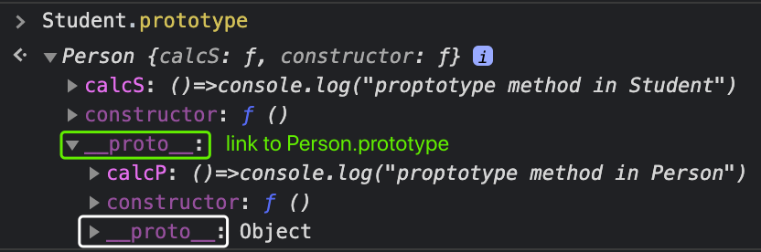
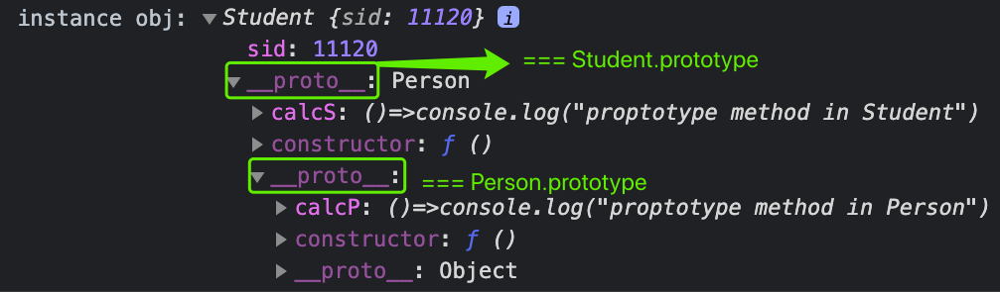
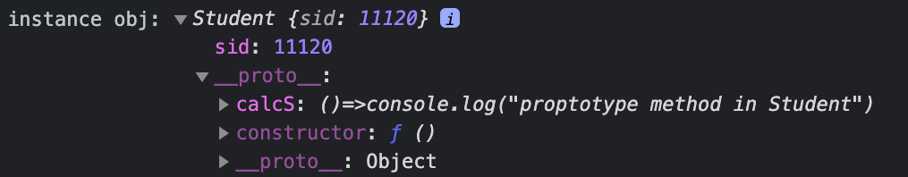
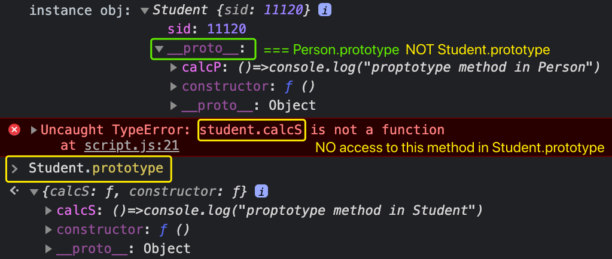
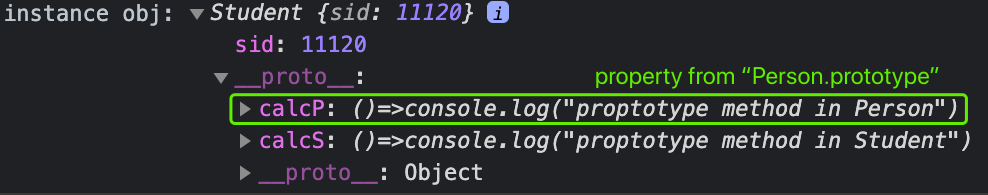
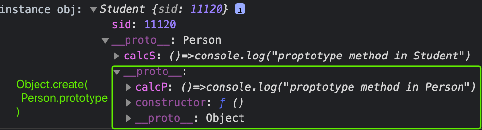

## Prototype Inheritance in ES5 - JavaScript

#### 1. [Object.setPrototypeOf()](#question1)

- [Docs](#q1-1)
- [Syntax](#q1-2)
- [Code Example on Instances](#q1-2)
- [Error Example](#q1-2)
- [setPrototypeOf() on constructor functions](#q1-5)

#### 2. [`setPrototypeOf()` on instances](#question2)

#### 3. [Create from New Prototype Object](#question3)

- [`Object.assign()` to create a new prototype object](#q3-1)
- [`Object.create()` to extend prototype chain](#q3-2)

#### 4. [BFE-53: myExtends in ES5](#question4)

#### 5. [Reference and Links](#question5)

<div id="question1" />

### I. What is the [Object.setPrototypeOf()](https://developer.mozilla.org/en-US/docs/Web/JavaScript/Reference/Statements/function*) ?

<div id="q1-1" />

**1.1 Docs:**
https://developer.mozilla.org/en-US/docs/Web/JavaScript/Reference/Global_Objects/Object/setPrototypeOf

<div id="q1-2" />

**1.2 Syntax:**

```js
Object.setPrototypeOf(obj, prototype);
```

> Note:
> `Object.setPrototypeOf()` is in the ECMAScript 2015 specification. It is generally considered the proper way to set the prototype of an object, vs. the more controversial [`Object.prototype.__proto__`](https://developer.mozilla.org/en-US/docs/Web/JavaScript/Reference/Global_Objects/Object/proto) property.

<div id="q1-3" />

**1.3 Code Example on Instances**
The following two lines are the same, results are also the same:

```js
Object.setPrototypeOf(Student.prototype, Person.prototype);
Student.prototype.__proto__ = Person.prototype;
```

Result of `Student.prototype`:



Result of the **instance** of Student :



<div id="q1-4" />

**1.4 Error Example** --> DON'T do like this:
Nothing happened, you are adding a `__proto__` link on the constructor function ( which is NOT a real object), nothing happens.

```js
Object.setPrototypeOf(Student, Person.prototype);
```

Student canNOT inherits any thing from Person, Student class NOT changes, see the following result:



<div id="q1-5" />

#### 1.5 setPrototypeOf() on constructor functions

Code syntax:

```js
var Person = function () {
  this.name = "x";
  this.age = 20;
};
var Student = function () {
  this.id = 10001;
};
// No impact on instances object, only extends the static methods/static props.
Object.setPrototypeOf(Student, Person);
```

For example:

```js
Person.boo = "abc";
// before the link
Student.boo = "undefined";
Object.setPrototypeOf(Student, Person);
// after
Student.boo = "abc";
```

<div id="question2" />

### II. `setPrototypeOf()` on instances

The following two lines do the same thing, results are also the same:
It means: all the instances of Student inherits the prototype from `Person.prototype`.

```js
var Student = function () {
  this.sid = 1100;
  Object.setPrototypeOf(this, Person.prototype);
  // this.__proto__ = Person.prototype;
};
```

Even we add more things on `Student.prototype.calcS()`, this method is **NOT accessible** from the instance object.

```js
Student.prototype.calcS = () => console.log("proptotype method in Student");
var student = new Student();
student.calcS(); // ERROR!!!
```

**Result:**



<div id="question3" />

### III. Use `Object.assign()` to extend prototype chain

<div id="q3-1" />

#### 3.1 `Object.assign()` to create a new prototype object

**Docs:**
https://developer.mozilla.org/en-US/docs/Web/JavaScript/Reference/Global_Objects/Object/assign

**Syntax:**

```js
Student.prototype = Object.assign({}, Person.prototype, Student.prototype);
```

**Result:**
**DO NOT USE this!!!** it **breaks** the inheritance relationship, **NO extends from Person**, just absorb those prototype in `Person.prototype`, but they are new memory space and new objects in Student class.



<div id="q3-2" />

#### 3.2 `Object.create()` to extend

**Docs:**

- https://developer.mozilla.org/en-US/docs/Web/JavaScript/Inheritance_and_the_prototype_chain#summary_of_methods_for_extending_the_prototype_chain
- https://developer.mozilla.org/en-US/docs/Web/JavaScript/Reference/Global_Objects/Object/create

**Syntax:**

```js
Student.prototype = Object.create(Person.prototype);
Student.prototype.calcS = () => console.log("proptotype method in Student");
```

It works and extends the inheritance `__proto__` link automatically! Also allows the creation of objects without a prototype, using `Object.create(null)`.

**Result:**



<div id="question4" />

### IV.BFE-53: myExtends in ES5

Coding question [BFE 53](https://bigfrontend.dev/problem/write-your-own-extends-in-es5):

```js
const myExtends = (SuperType, SubType) => {
  function Child(...args) {
    SuperType.apply(this, args);
    SubType.apply(this, args);

    // Important to make ALL instances directly from SubType
    // instanceChild.__proto__ === Student.prototype
    this.__proto__ = SubType.prototype;
  }

  // instanceChild.__proto__.__proto__ === Person.prototype
  SubType.prototype.__proto__ = SuperType.prototype;

  // For test case: ExtendedType.prototype should be SuperType
  // NOT needed on creating instances
  // only for edge cases eg: SuperType.boo = 'abc', then Child.boo = 'abc'.
  Child.__proto__ = SuperType;

  return Child;
};
```

<div id="question5" />

### V. Reference and Links

- **setPrototypeOf()** : https://developer.mozilla.org/en-US/docs/Web/JavaScript/Reference/Global_Objects/Object/setPrototypeOf
- **Object.prototype.**proto\*\*\*\* : https://developer.mozilla.org/en-US/docs/Web/JavaScript/Reference/Global_Objects/Object/proto
- **Understanding JS Generators** : https://codeburst.io/understanding-generators-in-es6-javascript-with-examples-6728834016d5
- **Object prototypes** : https://developer.mozilla.org/en-US/docs/Learn/JavaScript/Objects/Object_prototypes
- **Inheritance and the prototype chain** : https://developer.mozilla.org/en-US/docs/Web/JavaScript/Inheritance_and_the_prototype_chain
- [Summary of methods for extending the prototype chain](https://developer.mozilla.org/en-US/docs/Web/JavaScript/Inheritance_and_the_prototype_chain#summary_of_methods_for_extending_the_prototype_chain "Permalink to Summary of methods for extending the prototype chain")
