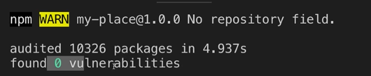

##  Web Security - XSS & XSRF
   
#### I. [Potential Security Holes](#question-1)  

#### II. [XSS - cross site scripting attack (most dangerous)](#question-2)
- [What is XSS ? ](#q2-1)
- [How it attacks?](#q2-2)
- [Example: Unchecked user-generated content](#q2-3)
- [Third party libraries & XSS](#q2-4)
- [Source Code](#q2-5)

#### III. [CSRF attacks (cross site request forgery)](#question-3)

#### IV. [Security Concept: CORS](#question-4)

#### V. [Reference Articles](#question-5)


<div id="question-1" />

### I. Potential Security Holes

Some security details in your code
- JS code can be read by anyone in the browser
- JS is completely visible, security-relevant details can be read.
- attacker may be able to **abuse exposed data**
	- for example: database access **credentials exposed** in code 
	- for example: API key string
	- ...

<div id="question-2" />

### II. XSS - cross site scripting attack (most dangerous)

It's the **most dangerous attack pattern on client side, XSS**.
on server side, there are different attacks, here mainly consider client side attacks.

<div id="q2-1" />

#### 2.1 What is [XSS](https://en.wikipedia.org/wiki/Cross-site_scripting)?

This is an attack pattern where **malicious Javascript code gets injected into your application** and is **executed** there.

<div id="q2-2" />

#### 2.2 How it attacks?

Injected code can do ANYTHING your code could do as well, and execute on behalf of all users on your application.

For example:
- it can **send requests** to certain domains which might allow access by your application with the correct CORS headers
- the code might **read the local browser storage** of the user and send that to some server of the malicious
 user(hackers)
 
 <div id="q2-3" />
 
 #### 2.3 Dangerous example: Unchecked user-generated content
 **Problem:** 
In our DOM, use "innerHTML" from user input:
- Inject with script tag: 
	```html
	<script> alert("XSS attack"); </script>
	```
	But some **modern browsers** already optimize it by **not executing** `<script> tag`  .
- Inject with img tag:
	```html
	
	```
	Result: this "onerror()" will execute because we have an empty `src attribute` for this ` tag`.


	

**Solution:** 
- use "textContent" instead of "innerHTML" in your javascript
- use 3rd party library to sanitize your code:   [sanitize-html](https://www.npmjs.com/package/sanitize-html)
	 - sanitize on the server ( when send date to database)
	 - sanitize on client
	 - Usage code example:
		```js
		import sanitizeHtml from 'sanitize-html';
		
		const html = "<strong>hello world</strong>";
		console.log(sanitizeHtml(html));
		console.log(sanitizeHtml(""));
		console.log(sanitizeHtml("console.log('hello world')"));
		console.log(sanitizeHtml("<script>alert('hello world')</script>"));
		```

<div id="q2-4" />

#### 2.4 Third party libraries & XSS
Even after sanitize, still other possibilities to inject and execute bad code.
- when we download third party library source code, it  also can be hacked and if they are, the malicious code that's injected.
	```html
	<head>
		<script src="https://xxx.com/api/....." defer></script>
	</head>
	```
- when you run `npm install`, there also some hints about the vulnerabilities, potential holes in dependency packages.

	

<div id="q2-5" />

#### 2.5 Source Code: 
[codepen link](https://codepen.io/jellyhan27/pen/GRNmvqO)

<div id="question-3" />

### III. CSRF attacks (cross site request forgery)

#### 3.1 What is [CSRF](https://en.wikipedia.org/wiki/Cross-site_request_forgery) ?
- **Request forgery** is that people trick you into clicking on a link that leads to a prepared page where they **abuse your local cookies** to then send a request to the page you would normally talk to as well, for example: your online banking backend.

- Happens more on **server side.**
- Example: malicious image URL, XSS

#### 3.2 How it attacks?


<div id="question-4" />

### IV. Security Concept: CORS

#### 4.1 what is [CORS](https://developer.mozilla.org/en-US/docs/Web/HTTP/CORS)?
- Cross-Origin Resource Sharing (cors)
- how browsers by default work with web pages:
	**Requests are only allowed from same origin (domain).** 

#### 4.2 Solution for CORS

- control **only via server side response headers** whether this request is allowed and  send back a valid response or not.
- with server side headers, we can override this on browser, and can send request to other domains.
 - Example: JS-Module (import from same origin)
 - Example: a simple CORS headers: [mdn-link](https://developer.mozilla.org/en-US/docs/Web/HTTP/CORS#simple_requests)
	```js
	// request header
	Accept text/html
	Content-Type text/plain
	Origin http://yourDomain.com 
	
	// response header
	Access-Control-Allow-Origin: http://yourDomain.com
	Access-Control-Allow-Methods: GET, POST, PUT
	Access-Control-Allow-Headers: Content-Type
	```

<div id="question-5" />

### V. Reference Articles

article:  [Security of JavaScript Applications](https://dhtmlx.medium.com/security-of-javascript-applications-1c95cd2ce533)