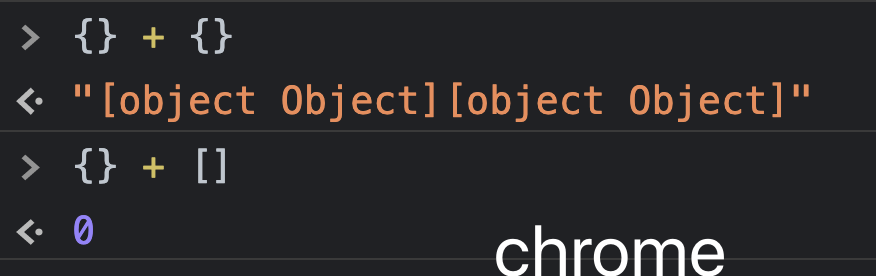
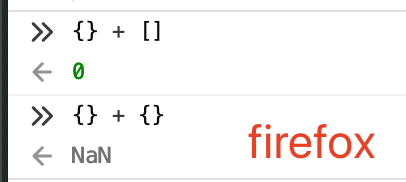

## JavaScript Type Coercion in Detail

#### I. [Implicit vs. Explicit coercion](#question-1)

#### II. [Type Coercion: Primitives ](#question-2)
- [ToBoolean](#p2-1)
- [ToNumber](#p2-2)
- [ToString](#p2-3)

#### III. [Type Coercion: Object - ToPrimitive()](#question-3)
- [Parameters Options](#p3-1)
- [Steps & Rules it converts](#p3-2)
- [Examples: object's primitive value](#p3-3)

#### IV. [The  Addition operator (+)](#question-4)
- [4.1 Basic Rules](#p4-1)
- [4.2 Normal Examples - Add Primitives](#p4-2)
- [4.3 Normal Examples - Add Object](#p4-3)
- [4.4 Weird use-case: starting with {}](#p4-4)
- [4.5 Weird use-case: Unary + Sign](#p4-5)
- [4.6 Weird use-case: Complicated expressions](#p4-6)

#### V. [Other -, *, /, % operators](#question-5)

#### VI. [Abstract Equlity Comparison (==)](#question-6)

<div id="question-1"/>

### Implicit vs. Explicit coercion
- Explicit coercion / type Casting
	devs write the code to tell how to convert between types, eg: `Number(myValue)`.
- Implicit coercion
	JS is a weakly-typed language, values can be converted automatically, eg: 
	- when you apply operators `+, -, * , /, % ....`
	- or the `if( myValue )` block will covert to boolean.

<div id="question-2"/>

### II. Type Coercion: Primitives

Convert Primitive Values - 3 types
- to boolean: [$9.2 - ECMA](https://262.ecma-international.org/5.1/#sec-9.2)
- to number: [$9.3 - ECMA](https://262.ecma-international.org/5.1/#sec-9.3)
- to string: [$9.3 - ECMA](https://262.ecma-international.org/5.1/#sec-9.3)

<div id="p2-1" />

#### 2.1  **ToBoolean:**

| Argument Type | Result |
|--|--|
| Undefined | false |
| Null | false |
| Boolean | no conversion |
| Number | The result is **false** if the argument is **+0**, **−0**, or **NaN**; otherwise the result is **true**. |
| String | The result is **false** if the argument is the empty String (its length is zero); otherwise the result is **true**. |
| Object | true |

```js
Boolean(undefined); // false
Boolean(null); // false
Boolean(myBoolean); // no conversion
// Number: except 0, -0, NaN
Boolean(0); 
Boolean(-0); 
Boolean(NaN); 
// String: except empty string
Boolean(''); 
// Object: always true
Boolean([]); 
Boolean({}); 
```

<div id="p2-2" />

#### 2.2  **ToNumber**

| Argument Type | Result |
|--|--|
| Undefined | NaN |
| Null | +0 |
| Boolean | **true** -> **1**, **false** -> **0** |
| Number | no conversion |
| String | first **trims** leading and trailing whitespace, `\n`, `\t` characters, returning `NaN` if the trimmed string does NOT represent a valid number. If string is empty, it returns `0`. |
| Object | Apply the following steps: <br> &nbsp;&nbsp;&nbsp;&nbsp; 1. Let  _primValue_  be  [ToPrimitive](https://262.ecma-international.org/5.1/#sec-9.1)(_input argument_, hint Number). <br> &nbsp;&nbsp;&nbsp;&nbsp; 2. Return ToNumber(_primValue_).  |

For example:
```js
Number(undefined)              // NaN
Number(null)                   // 0
Number(true)                   // 1
Number(false)                  // 0
Number(" 0012 ")               // 12
Number("\n")                   // 0
Number(" 12sss ")              // NaN

// ToPrimitive(new Date(0), Number) -> 0
// then ToNumber(result) -> 0
Number(new Date(0))            // 0
```

**Special Rules: null, undefined**
- When converting to Number, null and undefined are handled differently: **null becomes 0**, whereas **undefined becomes NaN**.
- When applying `==` to `null` or `undefined`, numeric conversion does not happen. null equals only to null or undefined, and does not equal to anything else.
    ```js
    null == 0               // false, null is not converted to 0
    null == null            // true
    undefined == undefined  // true
    null == undefined       // true
    ```
-  NaN does not equal to anything even itself:
    ```js
    if (value !== value) { console.log("we're dealing with NaN here") }
    ```

<div id="p2-3" />

#### 2.3  **ToString**

All primitive values are converted to strings naturally as you might expect:

| Argument Type | Result |
|--|--|
| Undefined | "undefined" |
| Null | "null" |
| Boolean | **"true"** or **"false"** |
| Number | See docs on [9.8.1](https://262.ecma-international.org/5.1/#sec-9.8.1). |
| String | no conversion |
| Object | Apply the following steps: <br> &nbsp;&nbsp;&nbsp;&nbsp; 1. Let  _primValue_  be  [ToPrimitive](https://262.ecma-international.org/5.1/#sec-9.1)(_input argument_, hint **String**). <br> &nbsp;&nbsp;&nbsp;&nbsp; 2. Return ToString(_primValue_).  |
| Symbol | Special: Only type casting (toString()), [**NO implicit string concatenation**](https://developer.mozilla.org/en-US/docs/Web/JavaScript/Reference/Global_Objects/Symbol/toString) (will throw error) |

For example:
```js
String(undefined)             // 'undefined'
String(null)                  // 'null'
String(true)                  // 'true'
String(false)                 // 'false'
String(123)                   // '123'
String(-12.3)                 // '-12.3'

// ToPrimitive(new Date(0), String) 
// -> "Sun May 16 2021 13:50:08 GMT-0700 (Pacific Daylight Time)"
String(new Date(0))            // "Sun May 16 2021 13:50:08 GMT-0700 (Pacific Daylight Time)"

// Symbol
Symbol('desc').toString()    // "Symbol(desc)"
Symbol('foo') + 'bar'        // TypeError: Can't convert symbol to string
```

<div id="question-3"/>

### III. Type Coercion: Object

<div id="p3-1" />

#### 3.1  Parameters Options

The internal operation ToPrimitive() has the following signature, see doc here [$ 9.1 - ECMA](https://262.ecma-international.org/5.1/#sec-9.1):
```js
ToPrimitive(input, PreferredType?)
```
The optional parameter PreferredType is either **Number or String.** 

The behaviour of the **DefaultValue**  is defined by this specification for all native ECMAScript objects in [$ 8.12.8](https://262.ecma-international.org/5.1/#sec-8.12.8).
- "**String**" for instances of **Date**, eg: `new Date(0)` 
- and "**Number**" for all other values. 

<div id="p3-2" />

#### 3.2  Steps & Rules it converts

- If  input  is primitive, return it as is.
- Otherwise,  input  is an object. Call  **obj.valueOf()** (see ECMA specs). If the result is primitive, return it.
- Otherwise, call  obj.toString(). If the result is a primitive, return it.
- Otherwise, throw a  TypeError.

**Note: Object.prototype.valueOf()**
- DO NOT follow [valueOf - MDN](https://developer.mozilla.org/en-US/docs/Web/JavaScript/Reference/Global_Objects/Object/valueOf) here, it's NOT the same as `"Unary Plus sign"`
- it internally invokes `ToObject()` - see [ES2020-valueOf](https://tc39.es/ecma262/#sec-object.prototype.valueof), and see [ES2O20-ToObject](https://tc39.es/ecma262/#sec-toobject)

<div id="p3-3" />

#### 3.3 Examples: object's primitive value

```js
var a = [];
a.valueOf(); // []
a.toString(); // ""

var b = {};
b.valueOf(); // {}
b.toString(); // "[object Object]"
```

<div id="question-4"/>

### IV. The  Addition operator (+)

<div id="p4-1" />

#### 4.1 Basic Rules
See [ES2020-spec](https://tc39.es/ecma262/#sec-applystringornumericbinaryoperator), and [$11.6.1 - ES2011](https://262.ecma-international.org/5.1/#sec-11.6.1)

Given the following addition.

    value1 + value2

- Convert both operands to primitives (mathematical notation, not JavaScript):
    
        prim1 := ToPrimitive(value1)
        prim2 := ToPrimitive(value2)
    
    PreferredType  is omitted and thus  Number  for non-dates,  String  for dates.
- If either  `prim1`  or  `prim2`  is a **string** then convert both to strings: `ToString(prim1), ToString(prim2)`; and return the concatenation of the results.
- Otherwise, convert both  prim1  and  prim2  to **numbers**: `ToNumber(prim1), ToNumber(prim2)`; and return the sum of the results.

<div id="p4-2" />

#### 4.2 Normal Examples - Add Primitives

**Eg1: 1 + undefined**

```
prim1 = ToPrimitive(1) = 1
prim2 = ToPrimitive(undefined) = undefined
None of them is string, then convert to number
return  ToNumber(1) + ToNumber(undefined)
= return 1 + NaN
= NaN
```

**Eg2: '1' + undefined**

```
prim1 = ToPrimitive('1') = '1'
prim2 = ToPrimitive(undefined) = undefined
One of them is string, then convert to string
return  ToString('1') + ToString(NaN)
= return '1' + 'NaN'
= '1NaN'
```

### Eg3: '1' + +undefined

Unary: **+undefined** = NaN

```
prim1 = ToPrimitive('1') = '1'
prim2 = ToPrimitive(+undefined) ->(Unary)-> = ToPrimitive(NaN) = NaN
One of them is string, then convert to string
return  ToString('1') + ToString(NaN)
= return '1' + 'NaN'
= '1NaN'
```

**Eg4: '1' + +null**

Unary: **+null** = 0

```
prim1 = ToPrimitive('1') = '1'
prim2 = ToPrimitive(+null) ->(Unary)-> = ToPrimitive(0) =0
One of them is string, then convert to string
return  ToString('1') + ToString(0)
= return '1' + '0'
= '10'
```

<div id="p4-3" />

#### 4.3 Normal Examples - Add Objects 

Basic Values of object `[]` and `{}`:
```js
// To String
[].toString(); // ""
{}.toString(); // "[object Object]"
// To Number:
Number([]); // 0
Number({}); // NaN
```

Eg1:  `[] + {}`
```
prim1: "", prim2: "[object Object]"
since either of them is string type, ToString and concat:
ToString("") + ToString("[[object Object]")
= '[object Object]'
```

Eg2: `[] + []`
```
prim1: "", prim2: ""
since either of them is string type, ToString and concat:
ToString("") + ToString("")
= ''
```

Eg3: `5 + new Date(7)`
```
prim1: 5
prim2: default toString() = "Wed Dec 31 1969 16:00:00 GMT-0800 (Pacific Standard Time)"
since one of them is string type, ToString and concat:
ToString(5) + ToString(prim2)
= "5Wed Dec 31 1969 16:00:00 GMT-0800 (Pacific Standard Time)"
```

Eg4: `5 + new Number(7)`
```
prim1: 5
prim2: new Number(7).valueOf() = 7
since both of them is number type, ToNumber and add:
ToNumber(5) + ToNumber(7)
= 12
```

<div id="p4-4" />

#### 4.4 Weird use-case: starting with {}
if the first operand of + is an empty object literal (results as seen on the **Firefox** console. The problem is that JavaScript interprets the `first {}` as an **empty code block and ignores** it.
```
{} + {}; // NaN
```

**Chrome** handles it differently:
```
{} + {}; // "[object Object][object Object]"
```

**Another example:** `{} + []` 
**Both Chrome and Firefox** will have `0`, because JS ignores the first `{}` block, then it equals to all the following expressions:
```js
{} + []; 
+[]; // Unary Plus
Number([]); // ToNumber
Number([].toString());
Number("");
// all = 0
```

**Results:**

<p float="left">
  
   
</p>

<div id="p4-5" />

#### 4.5 Weird use-case: Unary + Sign

Docs: [Unary Plus Sign +](https://developer.mozilla.org/en-US/docs/Web/JavaScript/Reference/Operators/Unary_plus)

its operand and evaluates to its operand but attempts to convert it into a number, if it isn't already.

For example:
```js
+[]; // 0
+{}; // NaN
+new Date(7); // 7
// equals to Number(objValue);
```

<div id="p4-6" />

#### 4.6 Weird use-case: Complicated expressions

Example1: `{}+[]+{}+[1]`
```
= +[] + {} + [1]
=  Unary(+[]) + ToPrimitive({}) + ToPrimitive([1])
= Unary(+[]) + {}.toString() + [1].toString()
= 0 + '[object Object]' + '1'
= "0[object Object]1"
```

Example2: `[]+{}+[1]`
```
= ToPrimitive([]) + ToPrimitive({}) + ToPrimitive([1])
=  [].toString() + {}.toString() + [1].toString()
= '' + '[object Object]' + '1'
= "[object Object]1"
```

<div id="question-5"/>

### V. Other -, *, /, % operators

#### 5.1 **Addictive Operator:** `+`, `-` 
`-`:
 ONLY trigger Number() conversion on each value, see the spec here: [ES2020 - operator](https://tc39.es/ecma262/#sec-applystringornumericbinaryoperator), [$11.6.2 subtraction operator (-)](https://262.ecma-international.org/5.1/#sec-11.6.2)

#### 5.2  Multiplicative Operators

See the spec here: [$ 11.5 - ES2011](https://262.ecma-international.org/5.1/#sec-11.5)

- `/`
-  `*`
- `%`

Left * Right Only trigger **"ToNumber()"** conversion:

For example:
```js
2 / '2'; // 1

's' / 2 ; // NaN
// = Number('s') = NaN

2 / new Date(7);  // 0.2857142857142857
// = 2 / Number(new Date(7)) = 2 / 7 = 0.2857142857142857
```

<div id="question-6"/>

### VI. Abstract Equlity Comparison (==)

[BFE - quiz 10 link](https://bigfrontend.dev/quiz/Equal-1)

I read the [ECMA2020-$7.2.14](https://tc39.es/ecma262/#sec-abstract-equality-comparison) here to finish this quiz

Rules summary:
- Number & String: convert to Number in priority
- Boolean & other: convert boolean to Number, then compare
-String & other Object: convert Object ToPrimitive(), then compare
- undefined, null is special, just remember rules 

```js
console.log(0 == false)  // ToNumber(false) = 0 -> 0 == 0 -> true
console.log('' == false)  // "" == 0 -> ToNumber("") == 0 -> true
console.log([] == false)  // [] == 0 -> ToNumber([]) == 0 -> 0 == 0 -> true
console.log(undefined == false) // false
console.log(null == false)  // null is not converted to 0 here, false
console.log('1' == true)  // "1" == 1 -> ToNumber("1") == 1 -> 1 == 1 -> true
console.log(1n == true)  // 1n == 1 -> ToNumber(1n) == 1 -> 1== 1 -> true
console.log(' 1     ' == true)  // "1    " == 1 -> ToNumber("1      ")  == 1 -> true
```