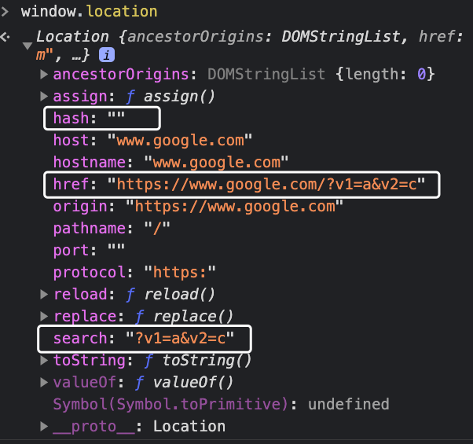
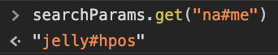

## How to parse URL Query Params?

#### 0. [where can we get current url & params?](#chapter0)

#### I. [Web APIs: URLSearchParams()](#chapter1)

#### II. [Structure of an URI ](#chapter2)

#### III. [RegExp solution](#chapter3)

#### IV. [BruteForce - string operation](#chapter4)

<div id="chapter0" />

### 0. Where can we get current url & params?

```js
var curURL = window.location.href;
```

Then lets look at the window.location object in detail:



**How to get search Params?**

```js
var params = window.location.search;
// "?v1=a&v2=c"
```

<div id="chapter1" />

### I. Web APIs: URLSearchParams()
**Docs:**  [URLSearchParams](https://developer.mozilla.org/en-US/docs/Web/API/URLSearchParams)

Constructor:
```js
var paramsString = "?name=jelly&age=18";
var searchParams = new URLSearchParams(paramsString);
```

**Iterate the search parameters:**
```js

for (let pair of searchParams) {
  console.log(pair);
}
for (const [key, value] of mySearchParams) {}
for (const [key, value] of mySearchParams.entries()) {}
```

Other method:
[`URLSearchParams.forEach()`](https://developer.mozilla.org/en-US/docs/Web/API/URLSearchParams/forEach)
[`URLSearchParams.get()`](https://developer.mozilla.org/en-US/docs/Web/API/URLSearchParams/get)
[`URLSearchParams.has()`](https://developer.mozilla.org/en-US/docs/Web/API/URLSearchParams/has)
[`URLSearchParams.keys()`](https://developer.mozilla.org/en-US/docs/Web/API/URLSearchParams/keys)


**Cons/Weakness:**
Cannot detect the first `#` hash tag as the ending URI fragment.

For example:
```js
var paramsString = "?age=29&na#me=jelly#hpos";
var searchParams = new URLSearchParams(paramsString);
```

**Result:**



**Issues:**
- the ending `#` sign treated as value as well
- correct result will be `na#me`  and `jelly`


<div id="chapter2" />

### II. Structure of an URI

Referenced answer:  [stackoverflow](https://stackoverflow.com/questions/10850781/multiple-hash-signs-in-url/62939423)

[RFC 3986 - Section 3](https://tools.ietf.org/html/rfc3986#section-3) defines the structure of an URI as follows:

```
     foo://example.com:8042/over/there?name=ferret#nose
     \_/   \______________/\_________/ \_________/ \__/
      |           |            |            |        |
   scheme     authority       path        query   fragment
```

When we look at different parts:
-   The  [scheme](https://tools.ietf.org/html/rfc3986#section-3.1)  may not contain a hash sign (only  `ALPHA *( ALPHA / DIGIT / "+" / "-" / "."`)
-   The  [autority](https://tools.ietf.org/html/rfc3986#section-3.2)  may not contain a hash (I don't go into detail here) and is even 'terminated by the next slash ("/"), question mark ("?"), or number sign ("#")'.
-   The  [path](https://tools.ietf.org/html/rfc3986#section-3.3)  'consists of a sequence of path segments separated by a slash ("/") character.' The path segments in turn can only consist of pchars, see e.g.  [this answer](https://stackoverflow.com/a/26119120/1415574). So no hashes here! It will also be terminated 'by the first question mark ("?") or number sign ("#"), or by the end of the URI'.
-   The  [query](https://tools.ietf.org/html/rfc3986#section-3.4)  part (indicated by the first "?") may only consist of pchar, "/" or "?" and will be 'terminated by a number sign ("#") character or by the end of the URI.'

So, **no hashes allowed so far except for terminating the URI,** which is not what we want, if would like to use at least one hash ;-)

Finally:

-   The  [fragment](https://tools.ietf.org/html/rfc3986#section-3.5)  is 'indicated by the presence of a number sign ("#")' and also consists only of pchar, "/" or "?". It is 'terminated by the end of the URI'.

For example:
```js
http://www.example.com/hey#foo#bar
// which is the same  `window.location.hash`  for
http://www.example.com/hey#foo%23bar
```

<div id="chapter3" />

### III. RegExp solution

Docs: [Javascript -RegExp](https://developer.mozilla.org/en-US/docs/Web/JavaScript/Guide/Regular_Expressions)

#### 3.1 constructor
use `/` slash or  `RegExp` object:
```js
let re = /ab+c/; 
let re = new RegExp('ab+c');
```

#### 3.2 Write the RegExp to parse URL
```js
var  regex = /[?&]([^=#]+)=([^&#]*)/g;
```
1 ) no `#` sign in key and value
2 ) using grouping `()` to get our parts of key and value
3 ) `g` flag or modifier means search multiple matched string in whole string
4 ) `[^...]` mean any char except those inside of the `[^...]` 


#### 3.3 execute this regex

Docs: [RegExp.prototype.exec()](https://developer.mozilla.org/en-US/docs/Web/JavaScript/Reference/Global_Objects/RegExp/exec)

```js
var  url = "www.domain.com/?age=29&na#me=jelly#hpos";
var  params = {};
var  match;
while (match = regex.exec(url)) {
	params[match[1]] = match[2];
}
console.log(params); // {age: 29}
```

<div id="chapter4" />

### IV. BruteForce - string operation

- trim the beginning until the first `?` sign
- trim the ending if  from the first  `#` in whole string

```js
function  parseURL(s) {
	if (s.indexOf('?') < 0) {
		return  null;
	}
	// trim start and end
	var  start = s.indexOf('?');
	s = s.slice(start + 1, s.length);
	var  end = s.indexOf('#');
	if (end >= 0) {
		s = s.slice(0, end);
	}
	// get queries by '&'
	var  queries = s.split("&");
	params = {};
	for (var  query  of  queries) {
		// split at the first `=`
		var  index = query.indexOf('=');
		var  key = query.slice(0, index);
		var  value = query.slice(index + 1, query.length);
		params[key] = value;
	}
	return  params;
}
```

**Test and result:**
```js
var  url = "www.domain.com/?age=29&na#me=jelly#hpos";
parseURL(url);// {age: "29", name: "je=lly"}
```