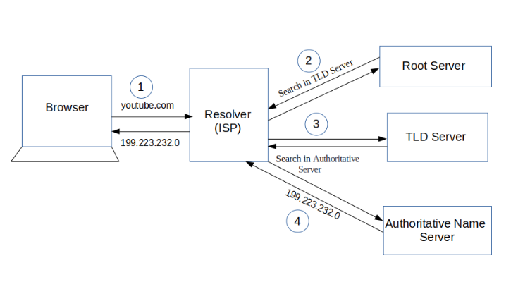

### What happens after type URL in browser?

1.  [service worker](https://developer.mozilla.org/en-US/docs/Web/API/Service_Worker_API) init --> service worker fetch event: they essentially act as proxy servers that sit between web applications, the browser, and the network (when available).

- 复习: [web worker API](https://developer.mozilla.org/en-US/docs/Web/API/Web_Workers_API)

2.  HTTP Cache
3.  DNS: look up the location of the server hosting the website ([DNS find the IP address](https://www.freecodecamp.org/news/what-happens-when-you-hit-url-in-your-browser/)), it runs a DNS **Query**:

    - check local browser cache or Mac OS cache
    - Recursive Resolver Server (is your ISP, internet service provider). then it runs in ISP cache.
    - ISP send to `Root name server`: which respond you the domain name(eg: `.com, .org`)'s `TLD(top level domain)` server to reach to next.
    - ISP send to `Top level domain` server: which respond you the `Authorative name server`, eg: `myspace.io`.
    - ISP send to the `Authorative name server`: final source of truth to respond the IP address.
    - ISP cache will store it
    - browser cache will store it

    

4.  TCP: browser will make the connection to the server: TCP 3 handshake
    client sever
    --SYN-->
    <--SYN+ACK--
    --ACK-->

5.  send a request to get the specific page
6.  handle the response from the server and
7.  how it renders the page so you, the viewer, can interact with the website
