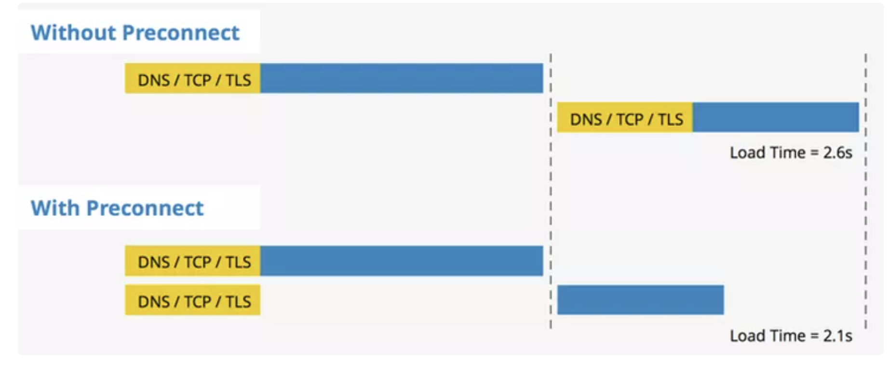

https://nitropack.io/blog/post/early-hints

0. 复习基础知识：

1. `<link>` ([mdn doc](https://developer.mozilla.org/en-US/docs/Web/HTML/Element/link)): The External Resource Link element - it specifies relationships between the current document and an external resource.

- This element is most commonly used to link to stylesheets

  ```html
  <link href="/media/examples/link-element-example.css" rel="stylesheet" />
  ```

- but is also used to establish site icons (both "favicon" style icons and icons for the home screen and apps on mobile devices) among other things.
  ```html
  <link rel="icon" type="image/x-icon" href="/images/favicon.ico" />
  ```

2. browser resource hints
   References: [article with charts](https://www.keycdn.com/blog/resource-hints)

- `rel=preload`: [Preload](https://developer.mozilla.org/en-US/docs/Web/HTML/Attributes/rel/preload) is an early fetch instruction to the browser to request a resource needed for a page (key scripts, Web Fonts, hero images).

  - It is also important to note that preload does `NOT` block the window's onload event.
  - it focuses on fetching a resource for the current navigation
  - Both preload and prefetched resources are stored in the HTTP cache.
  - use [as](https://developer.mozilla.org/en-US/docs/Web/HTML/Element/link#as) to specify the type of content to be preloaded allows the browser to:
    - Store in the cache for future requests, reusing the - resource if appropriate.
    - Apply the correct content security policy to the resource.
    - Set the correct [Accept](https://developer.mozilla.org/en-US/docs/Web/HTTP/Headers/Accept) request headers for it.

- `rel=prefetch`: [prefetch](https://developer.mozilla.org/en-US/docs/Web/HTML/Attributes/rel/prefetch) focuses on fetching a resource for the next navigation.

  - `<link rel="prefetch">` is functionally equivalent to a `fetch()` call with a priority: `"low"` option set on it
  - and it will have a [Sec-Purpose: prefetch](https://developer.mozilla.org/en-US/docs/Web/HTTP/Headers/Sec-Purpose) header set on the request.
  - Drawback1: for example certain Cache-Control headers could block prefetching (for example no-cache or no-store).
  - Drawback2: [The effects of cache partitioning](https://developer.mozilla.org/en-US/docs/Web/HTML/Attributes/rel/prefetch#the_effects_of_cache_partitioning) - Many browsers now implement some form of [cache partitioning](https://developer.chrome.com/en/blog/http-cache-partitioning/), which makes `<link rel="prefetch">` **useless** for resources intended for use by different top-level sites. This includes the main document when navigating cross-site.

- `rel=preconnect`([mdn doc](https://developer.mozilla.org/en-US/docs/Web/HTML/Attributes/rel/preconnect)): a hint to browsers that the user is likely to need resources from the target resource's origin. [Preconnecting](https://developer.mozilla.org/en-US/docs/Web/HTML/Attributes/rel/preconnect) speeds up future loads from a given origin by preemptively performing part or all of the handshake (`DNS+TCP` for HTTP, and `DNS+TCP+TLS` for HTTPS origins).

  - it will provide a benefit to **any future cross-origin HTTP request**, navigation or subresource. It has **no benefit on same-origin requests** because the connection is already open.

  

3. Chrome has four `caches`: the HTTP cache, memory cache, Service Worker cache & Push cache.

I. Implementing Early Hints on Your Website - [doc](https://nitropack.io/blog/post/early-hints)
103 Early Hints is the new HTTP status code that helps browsers decide what content to preload before the page has even started to arrive. eg: `shopify.com`

Step 0: Consider using link rel=preload or link rel=preconnect instead of Early Hints
Step 1: Identify your top pages
Step 2: Identify the critical origins and sub-resources that contribute the most to the key performance metrics

- You can identify them by running your website through a testing tool such as [WebPageTest](https://www.webpagetest.org/) and checking the waterfall chart. All render-blocking resources would have an “X” in front of them.

II. Enabling Early Hints Using Your Cloudflare Account
Early Hints is currently only supported over HTTP/2 and HTTP/3.
