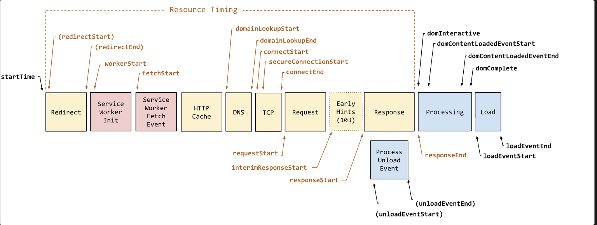
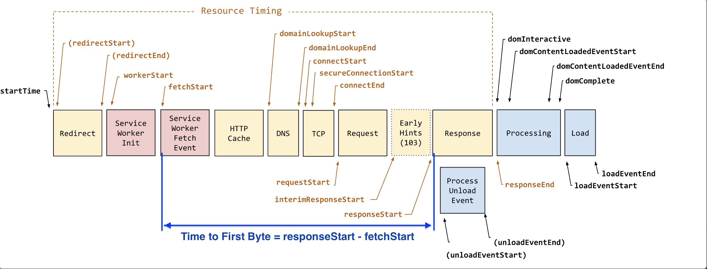

## Performance Resource Timing

mdn doc: [link](https://developer.mozilla.org/en-US/docs/Web/API/PerformanceResourceTiming)

> The PerformanceResourceTiming interface enables retrieval and analysis of detailed network timing data regarding the loading of an application's resources. An application can use the timing metrics to determine, for example, the length of time it takes to fetch a specific resource, such as an [XMLHttpRequest](https://developer.mozilla.org/en-US/docs/Web/API/XMLHttpRequest), [`<SVG>`](https://developer.mozilla.org/en-US/docs/Web/SVG/Element/svg), image, or script.

### 0. 复习基础知识

1. [a typical HTTP session](https://developer.mozilla.org/en-US/docs/Web/HTTP/Session)

   - The client establishes a TCP connection (or the appropriate connection if the transport layer is not TCP). 复习：`vs. UDP` - TCP is connection-based and provide reliable services, while **UDP is stateless and not realiable** delievery.
   - The client sends its request, and waits for the answer.
   - The server processes the request, sending back its answer, providing a status code and appropriate data.

2. <s>Performance Timing (Deprecated)</s>: use [PerformanceNavigationTiming](https://developer.mozilla.org/en-US/docs/Web/API/PerformanceNavigationTiming) instead. It provides methods & props to **store and retrieve metrics regarding the browser's document navigation events**. For example, this interface can be used to determine how much time it takes to **load or unload** a document.
   ```
   // object inheritence
   PerformanceNavigationTiming --> PerformanceResourceTiming -> PerformanceEnty
   ```
3. The following diagram shows all of the timestamp properties defined in PerformanceNavigationTiming.
   

### I. Typical resource timing metrics - [doc](https://developer.mozilla.org/en-US/docs/Web/API/PerformanceResourceTiming#typical_resource_timing_metrics)

- Measuring TCP handshake time (`connectEnd` - `connectStart`)
- Measuring DNS lookup time (`domainLookupEnd` - `domainLookupStart`)
- Measuring redirection time (`redirectEnd` - `redirectStart`)
- Measuring interim request time (`firstInterimResponseStart` - `requestStart`)
- Measuring request time (`responseStart` - `requestStart`)
- Measuring TLS negotiation time (`requestStart` - `secureConnectionStart`)
- [TTFB](https://developer.mozilla.org/en-US/docs/Glossary/Time_to_first_byte): Time to First Byte (TTFB) refers to the time between the browser requesting a page and when it receives the first byte of information from the server. `TTFB = responseStart -` <s>navigationStart</s>`fetchStart`.
  
- Measuring **time to fetch (without redirects)** (`responseEnd` - `fetchStart`)
- Measuring ServiceWorker processing time (`fetchStart` - `workerStart`)
- Checking if content was compressed (`decodedBodySize` should not be `encodedBodySize`)
- Checking if local caches were hit (`transferSize` should be `0`)
- Checking if modern and fast protocols are used (`nextHopProtocol` should be HTTP/2 or HTTP/3)
- Checking if the correct resources are render-blocking (`renderBlockingStatus`)
