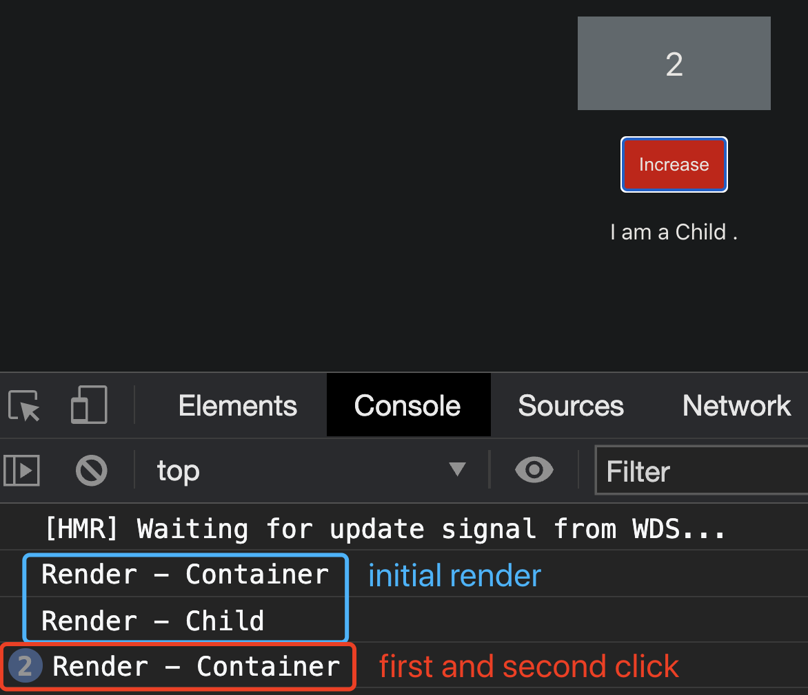

## React Day02 - How to Avoid Unnecessary re-Renders

I. [Render Behavior](#p1)

II. [Solution 1 : Parent - Children](#p2)

- [1. Use case](#p2-1)
- [2. Solution](#p2-2)
- [3. Optimized Result](#p2-3)
- [4. Source Code](#p2-4)

III. [Solution 2 : PureComponent - Class based](#p3)

- [1. Use case](#p3-1)
- [2. Results](#p3-2)
- [3. Solution](#p3-3)
- [4. Optimized Result](#p3-4)
- [5. Source Code](#p3-5)

IV. [Solution 3 : React.memo - Functional based](#p4)

- [1. Use case](#p4-1)
- [2. Solution](#p4-2)
- [3. Optimized Result](#p4-3)
- [4. Source Code](#p4-4)

V. [Solution 4 : Hooks - useCallback()](#p5)

- [1. Use case](#p5-1)
- [2. Results](#p5-2)
- [3. Solution](#p5-3)
- [4. Optimized Result](#p5-4)
- [5. Source Code](#p5-5)

VI. [Solution 5 : Hooks - useMemo()](#p6)

- [1. Use case](#p6-1)
- [2. Results](#p6-2)
- [3. Solution](#p6-3)
- [4. Optimized Result](#p6-4)
- [5. Source Code](#p6-5)

<div id="p1" />

### I. Render Behavior

- renders can be expensive
- rendering is not the same as updating the DOM
- render the component and updating the DOM is two separate steps
- components can re-render without updating the DOM, eg: [`component.forceupdate()`](https://reactjs.org/docs/react-component.html#forceupdate)
- avoid unnecessary renders, improve performance

<div id="p2" />

### II. Solution 1 : Parent - Children

<div id="p2-1" />

#### 2.1 Use case

when container element has some stateful variables that might cause re-render, if we put child element inside the parent element, it will cause always re-render the child component every-time re-render the container.

For example:
Everytime click the increase button, which will cause **Container component's re-render**, it will also cause the **Child component re-render**.

```jsx
export function Container(props) {
  const [count, setCount] = useState(0);
  const incHandler = () => {
    setCount(count + 1);
  };
  console.log("Render - Container");
  return (
    <div className="Container">
      <p>{count}</p>
      <button className="Button" onClick={incHandler}>
        Increase
      </button>

      <Child />
    </div>
  );
}
```


<div id="p2-2" />

#### 2.2 Solution

- use `props.children` as same element reference
- prevent re-renders in expensive child elements

```jsx
/* in App.jsx*/
<Container>
	<Child  />
</Container>

/* in Container.jsx */
<div  className="Container">
	<p>{count}</p>
	<button  className="Button"  onClick={incHandler}>Increase</button>
	{  props.children }
</div>
```

<div id="p2-3" />

#### 2.3 Optimized Results

Only the **initial render** will render both, in later update's Container component's stateful variable **won't cause render of the Child component.**


<div id="p2-4" />

#### 2.4 Source Code

[Parent-Children example](https://github.com/jialihan/React-features/tree/main/02-rendering/01-parent-children)

<div id="p3" />

### III. Solution 2 : PureComponent - Class based

**[Purecomponent:](https://reactjs.org/docs/react-api.html#reactpurecomponent)**

- used on class-based component
- implements it with a **shallow comparison** of prop and state.
- Don't use PureComponent everywhere, since it will slow down your app.
- Better to use to **avoid unnecessary re-render on Child** component when parent component will re-render, there will be a quick comparison to decide whether the Child component should also re-render, so that improves the performance.

<div id="p3-1" />

#### 1. Use case

Container component has two stateful variables: `count and message`. Whenever click the button will change the `count` but not the message. In original code, every re-render will do:

- Render-container;
- Render-child;

<div id="p3-2" />

#### 2. Results


**Tip:**
ESLint warinings: [Useless constructor no-useless-constructor](https://eslint.org/docs/rules/no-useless-constructor)

For example:

```
// wrong
constructor(props) {
	super(props)
}
```

<div id="p3-3" />

#### 3. Solution: use PureComponent on Child element

The pure component will shallow compare the props and state, so only when child component really changes, the child element will re-render. So that we avoid a lot re-render on parent Container element.

Code:

```jsx
export default class Child extends PureComponent {
  render() {
    console.log("Render - Child");
    return <div className="Child">{this.props.message}</div>;
  }
}
```

<div id="p3-4" />

#### 4. Optimized Results


<div id="p3-5" />

#### 5. Source Code

[github link](https://github.com/jialihan/React-features/tree/main/02-rendering/02-purecomponent)

<div id="p4" />

### IV. Solution 3 : React.memo - Functional based

- Docs: [**React.memo()**](https://reactjs.org/docs/react-api.html#reactmemo)
- a higher order component to wrap functional components
- only shallowly compare objects in the **props**.
- can have custom comparison function as second argument

```
export default React.memo(MyComponent, function(prevProps, nextProps){
/**
	return true: render the same props;
	return false: render the different props;
*/
});
```

<div id="p4-1" />

#### 1. Use Case

Original Code is the normal Container has a Child component. Every time click the button will change the stateful variable of Container component, but it will also **cause unnecessary re-renders** of Child components, because **Child only depends on "message" variable, which is not changing.**

```jsx
export function Container(props) {
  const [count, setCount] = useState(0);
  const [message, setMessage] = useState("I am a Child .");
  const incHandler = () => {
    setCount(count + 1);
  };
  console.log("Render - Container");
  return (
    <div className="Container">
      <p>{count}</p>
      <button className="Button" onClick={incHandler}>
        Increase
      </button>
      /* Child only depends on "message state" */
      <Child message={message} />
    </div>
  );
}
```

<div id="p4-2" />

#### 2. Solution

improve with `React.memo` on Child component
Code:

```jsx
import React from "react";
function Child({ message }) {
  console.log("Render - Child");
  return <div className="Child">{message}</div>;
}
export default React.memo(Child);
```

<div id="p4-3" />

#### 3. Optimized Results

Container's partial updates won't affect Child to re-render, because Child's props is not changing.



<div id="p4-4" />

#### 4. Complete Source code

[github link](https://github.com/jialihan/React-features/tree/main/02-rendering/03-react_memo)

<div id="p5" />

### V. Solution 4 : Hooks - useCallback()

- [useCallback](https://reactjs.org/docs/hooks-reference.html#usecallback) to wrap the entire function
- prevent the function to be created every render so that cause other unnecessary components also to re-render.

<div id="p5-1" />

#### 1. Use case

When Child component has another props with a handler function (eg: `clearMessageHandler`), Container's re-render will create a new handler function, which cause Child component to change/update.

Key Code changes:

```jsx
export function Container(props) {
  // ...
  const clearMessageHandler = () => {
    setMessage("");
  };
  return (
    <div className="Container">
      // ...
      <Child message={message} onClear={clearMessageHandler} />
    </div>
  );
}
/* still memo Child component */
export default React.memo(Child);
```

<div id="p5-2" />

#### 2. Results

Child component still re-renders every time we click the unrelated button in Container component, because the "clearMessageHandler" gets created again.


<div id="p5-3" />

#### 3. Solution: useCallback() to improve

```jsx
const clearMessageHandler = useCallback(() => {
  setMessage("");
}, []);
```

Important:

- **add the square bracket** even if has no dependency
- If you don't have a `[]`, it will always render in every render cycle.
- here we only depends on "setMessage()" function, this is ensured by react itself won't change, so we don't need to write it into the `[]` as dependency.

**Tip:**
`useCallback(fn, deps)` is equivalent to `useMemo(() => fn, deps)`.
So here for example:

```jsx
const clearMessageHandlerMemo = useMemo(() => clearMessageHandler, []);
```

<div id="p5-4" />

##### 4. Optimized Result


<div id="p5-5" />

##### 5. Source Code

[github link](https://github.com/jialihan/React-features/tree/main/02-rendering/04-use-callback)

<div id="p6" />

### VI. Solution 5 - useMemo()

- [useMemo()](https://reactjs.org/docs/hooks-reference.html#usememo) as a performance optimization, not for side effect.
- can memorize any values and function
- avoid expensive calculations on every render

<div id="p6-1" />

#### 1. Use Case

when we render a complex data "colorList", and we don't want to cause extra re-render when other parts of parent Container component updates/re-renders.

Code:
The colorList dependent on our `colors` stateful variable and `deleteColorHandler` function.

```js
export function Container(props) {
  // ...
  const initalColors = [
    { name: "blue", id: 1 },
    { name: "green", id: 2 },
    { name: "yellow", id: 3 }
  ];
  const [colors, setColors] = useState(initialColors);
  const deleteColorHandler = (colorId) => {
    setColors(colors.filter((el) => el.id !== colorId));
  };
  const colorList = colors.map((el) => (
    <Child color={el.name} onDelete={deleteColorHandler} key={el.id} />
  ));
  console.log("Render - Container");

  return (
    <div className="Container">
      // ...
      {colorList}
    </div>
  );
}
```

<div id="p6-2" />

#### 2. Result

Every click the button, will cause re-render unrelated Child items as well.


<div id="p6-3" />

#### 3.Solution: useMemo to improve

- colorList depends on "colors" stateful variable
- colorList depends on "deleteColorHandler" function

Step 1: wrap our color list with "**useMemo**()"

```js
const colorList = useMemo(() => {
  return colors.map((el) => (
    <Child color={el.name} onDelete={deleteColorHandler} key={el.id} />
  ));
}, [colors, deleteColorHandler]);
```

Step2: since we have a function as dependency, we have to wrap that function with "**useCallback**"

```jsx
const deleteColorHandler = useCallback((colorId) => {
  setColors(colors.filter((el) => el.id !== colorId));
}, []);
```

<div id="p6-4" />

#### 4. Optimized Result

No child render anymore when only click the counter.


<div id="p6-5" />

#### 5. Source Code

[github link](https://github.com/jialihan/React-features/tree/main/02-rendering/05-use-memo)
