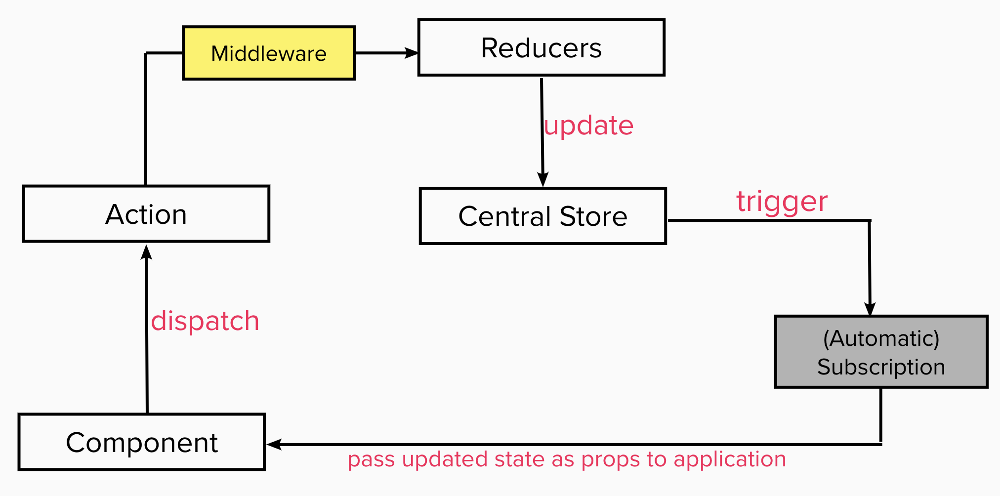

## React day05 - Redux: Advanced (Action Creator & Async)

#### I. [Adding Midlleware](#question-1)

#### II. [Use Redux Dev-tools in chrome extension](#question-2)

#### III. [Action Creators](#question-3)

- [Create an Action Creator](#q3-1)
- [Use this action creator](#q3-2)
- [Pass other data to Action Creator](#q3-3)
- [Multiple Action Creators: Clean Way](#q3-4)

#### IV. [Handling Async Code](#question-4)

- [Add middleware: redux-thunk](#q4-1)
- [Add Async code in Action Creator](#q4-2)
- [Reconstruct and Clean the Action Folder](#q4-3)
- [Add Data Transforming logic](#q4-4)
- [use "getState" parameter in redux-thunk](#q4-5)
- [Using Utility Functions](#q4-6)

<div id="question-1"/>

### I. Adding Middleware

Add middleware between the Action and Reducer.  
Why use middleware?

- The most common use case for middleware is to support asynchronous actions without much boilerplate code or a dependency on a library like [Rx](https://github.com/Reactive-Extensions/RxJS).
- It does so by letting you dispatch [async actions](https://redux.js.org/understanding/thinking-in-redux/glossary#async-action) in addition to normal actions.



#### 1.1 Syntax

[applymiddleware()](https://redux.js.org/api/applymiddleware)

import:

```
import { applyMiddleware } from 'redux';
```

Usage: when initialize the store, pass to the ["enhancer parameter"](https://redux.js.org/api/createstore).

```js
const store = createStore(rootReducer, applyMiddleware(myMiddleware));
```

1.2 Customized Logger Middleware example

Create and define the logger middle ware:

```js
const logger = (store) => {
  return (next) => {
    console.log("[Midlleware Logger] Dispatching", action);
    // call the next dispatch method
    const result = next(action);
    console.log("[Midlleware Logger] state after dispatch", store.getState());
    return result;
  };
};
```

Add this logger middleware into the store:

```js
const store = createStore(rootReducer, applyMiddleware(logger));
```

<div id="question-2"/>

### II. Use Redux Dev-tools in chrome extension

install this extension: [link](https://chrome.google.com/webstore/detail/redux-devtools/lmhkpmbekcpmknklioeibfkpmmfibljd?hl=en)

More instructions about how to use this tool: [github link](https://github.com/zalmoxisus/redux-devtools-extension)

Connect browser extension to the javascript running into the code:

```js
import { createStore, applyMiddleware, compose } from "redux";
// use the dev-tool
const composeEnhancers = window.__REDUX_DEVTOOLS_EXTENSION_COMPOSE__ || compose;
const store = createStore(reducer, composeEnhancers(applyMiddleware(logger)));
```

<div id="question-3"/>

### III. Action Creators

Docs: [action creator](https://redux.js.org/recipes/reducing-boilerplate#action-creators)

It's just a function which returns an action or which creates an action, hence the name.

<div id="q3-1"/>

#### 3.1 Create an action creator (a function)

```js
// action.js
export const increment = () => {
  return {
    type: "INC"
  };
};
```

<div id="q3-2"/>

#### 3.2 Use this action creator

Dispatch with an action creator:

```js
// reducer.js
import { increment } from "../action.js";
/* ... */
dispatch(increment());
```

<div id="q3-3"/>

#### 3.3 Pass other data to Action Creator

For example:

```js
// action.js
export const increment = (value) => {
  return {
    type: "INC",
    val: value
  };
};
```

Use this action creator:

```js
// reducer.js
dispatch(increment(data));
```

<div id="q3-4"/>

#### 3.4 Multiple Action Creators: Clean Way

import all action creators:

```js
import * as actionCreators from "../action.js";
// usage
dispatch(actionCreators.increment(data));
```

<div id="question-4"/>

### IV. Execute Async Code

<div id="q4-1"/>

#### 4.1 Add middleware: redux-thunk

**Docs**: https://github.com/reduxjs/redux-thunk

**Install: command line**

```bash
npm install --save redux-thunk
```

**Import :**

```
import thunk from 'redux-thunk';
```

**Usage:**

```js
// Note: this API requires redux@>=3.1.0
const store = createStore(rootReducer, applyMiddleware(thunk));
```

<div id="q4-2"/>

#### 4.2 Add Async code in Action Creator

When we create the creator function, we can add some async code here. Async code happens when:
**dispatch an action ---> async code --> reaches the reducer**
**Template:**
redux-thunk allows to return a function with "dispatch" method, and in this block, we can add async functions:

```js
// actions.js
function increaseCountActionCreator(value) {
  // We can invert control here by returning a function - the "thunk".
  // When this function is passed to `dispatch`, the thunk middleware will intercept it,
  // and call it with `dispatch` and `getState` as arguments.
  return function (dispatch, getState) {
    // async code
  };
}
```

For example:

```js
// action.js
// sync
export const incrementSync = (value) => {
  return {
    type: "INC",
    val: value
  };
};
// async
export const incrementAsync = (value) => {
  return function (dispatch) {
    // async code
    setTimeout(() => {
      // actual places dispatch sync actions
      dispatch(incrementSync(value));
    }, 2000);
  };
};
```

<div id="q4-3"/>

#### 4.3 Reconstruct and Clean the Action Folder

Folder structures and summary:

- actions(folder)
  - actionTypes.js - all constant string defined here
  - separate action.js file for each part
    - sync action creators
    - async functions
  - index.js - export all actionCreators here

<div id="q4-4"/>

#### 4.4 Add Data Transforming logic

- in the pure dry Action Creator (sync), where only process the data, for example:
  ```js
  // action.js
  // sync
  export const incrementSync = (value) => {
    // data transform
    const updatedValue = value * 2;
    return {
      type: "INC",
      val: updatedValue
    };
  };
  ```
- in reducer: before return the new state
  ```js
  // reducer.js
  case 'INCREASE':
  	// change data
  	const updatedValue = value * 2;
  	return {
  		...state,
  		results: updatedValue
  	}
  ```

Comparison of these two places to put the transform logic:
|Action Creators | Reducer |
|--|--|
| Can run Async Code | Pure, Sync Code Only|
| shouldn't prepare the state update too much | Core Redux Concept: Reducers update the State|

<div id="q4-5"/>

#### 4.5 use "getState" parameter in redux-thunk

In redux-thunk, we can pass two parameters `dispatch` and `getState` when creating the async function for Action Creator.

Use "getState" the 2nd parameter, can access the old state in our async code in Action Creator.

Code example:

```js
// action.js
// async
export const incrementAsync = (value) => {
  return function (dispatch, getState) {
    setTimeout(() => {
      // acess old state by this function
      const oldValue = getState().count;
      console.log("old count state:", oldValue);
      dispatch(incrementSync(value));
    }, 2000);
  };
};
```

<div id="q4-6"/>

#### 4.6 Using Utility Functions

It's a good practice, but not a must to do thing, optional. It will help clean the code in reducer switch-case to use this function.

- Use the utility function to updating the object.
  Since there are a lot of places to use this function in our reducer, to update an object.
  Template code:
  ```
  export const updateObject = (oldObject, updatedValues) => {
  	return {
  		...oldObject,
  		...updatedValues
  	}
  }
  ```
  Usage: use this util function:
  ```js
  import { updateObject } form '../utility.js';
  /* ... */
  case 'INCREASE':
  	return updateObject(
  		state,
  		{count: state.count + 1}
  	);
  ```
- create "**index.js**" file for both actions and reducer folder
