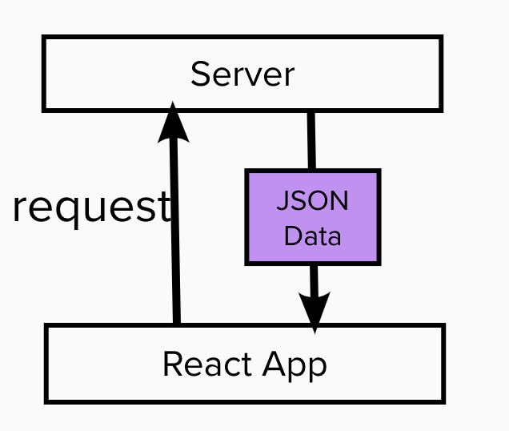
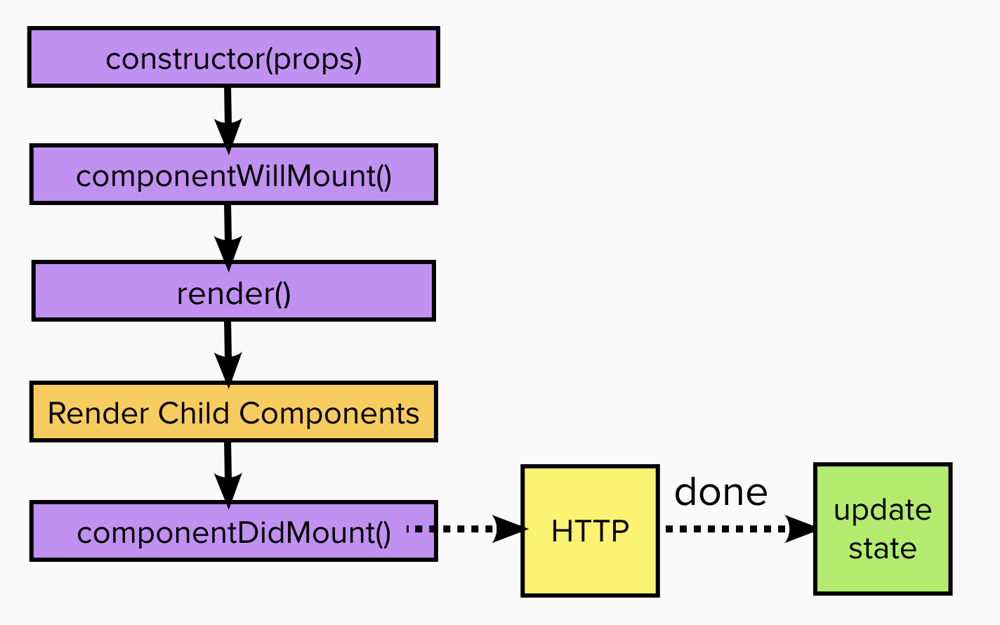

## React day06 - Network Call in React: Http & Ajax

#### I. [Reaching out to the web network call](#question-1)

#### II. [Where to make Http request?](#question-2)

#### III. [Write a simple Get request](#question-3)

- [fetch example: ( GET request)](#q3-1)
- [axios example: ( GET request )](#q3-2)
- [Transforming Data](#q3-3)
- [Fetch data when component Update](#q3-4)

#### IV. [POST data to sever](#question-4)

- [ PUT/POST request with fetch api](#q4-1)
- [POST request with axios api](#q4-2)

#### V. [Send Delete Request to sever](#question-5)

- [delete request with fetch api](#q5-1)
- [delete request with axios api](#q5-2)

#### VI. [Handle Error locally](#question-6)

#### VII. [More features about Axios](#question-7)

- [Adding interceptors to Execute Code Globally](#q7-1)
- [Remove an interceptor in axios](#q7-2)
- [Set up a Default Global Configuration for Axios](#q7-3)
- [ Create different axios instances](#q7-4)

<div id="question-1"/>

### I. Reaching out to the web network call

In react, handling network part, the following image shows the basic flow.



React Official Docs: [Ajax & APIs](https://reactjs.org/docs/faq-ajax.html)

**Options:**

- XMLHttpRequest (native javascript way to the web): [template source code reference](https://github.com/jialihan/JavaScript-Onboarding/blob/master/AJAX_Javascript/script.js)
- [fetch()](https://developer.mozilla.org/en-US/docs/Web/API/Fetch_API/Using_Fetch)
- [axios](https://github.com/axios/axios#installing): third party library/package
  Install:
  ```bash
  npm install axios
  ```

<div id="question-2"/>

### II. Where to make Http request?

Http request will cause side effect, due to the component life-cycle in `componentDidMount()` (class-based). Only after the http request and **after we get response back**, then we can **update the state**, otherwise, it will cause re-render.



<div id="question-3"/>

### III. Write a simple Get request

Code Structure:

- fetch the URL
- get the promise as response
- processing data in response
- **Optional**: handling error code block

<div id="q3-1"/>

#### 3.1 fetch example: ( GET request)

```js
componentDidMount() {
	const url = "https://some-url.com/data.json";
	fetch(url)
	  .then(resp => resp.json())
	  .then(data => {
		  // process data
		  console.log(data)
	  });
}
```

<div id="q3-2"/>

#### 3.2 axios example: ( GET request )

Note:
Advantage to use "**axios**": in axios responses are already served as javascript object, **no need to parse**, simply get response and access data.

```js
import axios from  'axios';
componentDidMount() {
	const url = "https://some-url.com/data.json";
	axios.get(url)
	  .then(resp => {
		  // process data and setState()
		  this.setState({data: resp.data})
	  });
}
```

<div id="q3-3"/>

#### 3.3 transforming data

**Where:** After we got the response, the same place we process the data.

**Example:**

```js
axios.get(url)
	  .then(resp => {
		  // transform the data
		  let updatedData = resp.data.slice(0,4);
		  updatedData = updatedData.map(el=>{...el, author: "jelly"});
		  this.setState({data: updatedData})
	  });
```

<div id="q3-4"/>

#### 3.4 Fetch data when component Update

Updating Life Cycle:

- [`static getDerivedStateFromProps()`](https://reactjs.org/docs/react-component.html#static-getderivedstatefromprops)
- [`shouldComponentUpdate()`](https://reactjs.org/docs/react-component.html#shouldcomponentupdate)
- [**`render()`**](https://reactjs.org/docs/react-component.html#render)
- [`getSnapshotBeforeUpdate(prevProps, prevState)`](https://reactjs.org/docs/react-component.html#getsnapshotbeforeupdate)
- [**`componentDidUpdate()`**](https://reactjs.org/docs/react-component.html#componentdidupdate)

**Note:** two legacy methods in Updating life cycle, need to avoid using them. (~~**don't use these two legacy methods**~~)

- [`UNSAFE_componentWillUpdate()`](https://reactjs.org/docs/react-component.html#unsafe_componentwillupdate)
- [`UNSAFE_componentWillReceiveProps()`](https://reactjs.org/docs/react-component.html#unsafe_componentwillreceiveprops)

Where and When to fetch data when component update?
**Use case:**
for example, when we click the component, and we will fetch the item by id, sending a new http request.
**Where:**

```js
componentDidUpdate() {
	if(this.props.id)
	{
		fetch("https://some-url.com/items/"+this.props.id)
		.then(resp=>resp.json())
		.then(resp=>{
			// handle new data
			console.log(resp);
		});
	}
}
```

<div id="question-4"/>

### IV. POST data to sever

<div id="q4-1"/>

#### 4.1 PUT/POST request with fetch api

More complicated, we need more parameters.

- url
- request options: headers, body, method
  For example: [uploading json data ( PUT + fetch )](https://developer.mozilla.org/en-US/docs/Web/API/Fetch_API/Using_Fetch#Uploading_JSON_data)
  ```js
  const options = {
    method: "POST", // or 'PUT'
    headers: {
      "Content-Type": "application/json"
    },
    body: JSON.stringify({ title: "hello world!" })
  };
  ```

**Example:**
Simple PUT request with a JSON body using fetch

```javascript
const requestOptions = {
    method: 'PUT',
    headers: { 'Content-Type': 'application/json' },
    body: JSON.stringify({ title: 'Hello world!' })
};
    fetch('https://jsonplaceholder.typicode.com/posts/1', requestOptions)
    .then(response => response.json())
    .then(data => this.setState({ postId: data.id }));
}
```

<div id="q4-2"/>

#### 4.2 POST request with [axios api](https://github.com/axios/axios#axios-api)

Much simpler, we need the url and the data object we want to send. Don't need to [JSON.stringify()](https://developer.mozilla.org/en-US/docs/Web/JavaScript/Reference/Global_Objects/JSON/stringify), axios will do it for us automatically.

**Docs:** [HTTP Post headers example - mdn](https://developer.mozilla.org/en-US/docs/Web/HTTP/Methods/POST)

Code example:

```js
const postDataHandler = () => {
  const data = {
    title: "hello",
    body: "default content",
    author: "jelly"
  };
  axios.post("https://some-url.com/", data).then((resp) => {
    // handle data
    console.log(resp);
  });
};
```

<div id="question-5"/>

### V. send Delete Request to sever

<div id="q5-1"/>

#### 5.1 delete request with fetch api

```javascript
const deletePostHandler = () => {
  // Simple DELETE request with fetch
  fetch("https://some-url.com/item/1", { method: "DELETE" })
    .then((resp) => resp.json())
    .then((resp) => {
      // handle delete success
      console.log(resp);
      this.setState({ isDeleted: true });
    });
};
```

<div id="q5-2"/>

#### 5.2 delete request with axios api

**Syntax:**
[axios.delete()](https://github.com/axios/axios#axiosdeleteurl-config)

For example:

```js
const deletePostHandler = ()=> {
	axios.delete('https://some-url.com/'+ this.props.id)
	.then(resp=>{
		// handle data
		console.log(resp);
})
```

<div id="question-6"/>

### VI. Handle Error locally

Syntax 1: **catch()**

```js
.then()
.catch(err => {
	// handle error
	console.log(err)
})
```

Syntax 2: **try, catch**

```js
async function httpRequest() {
  try {
    const resp = await fetch("https://some-url.com/data.json");
  } catch (err) {
    // handle error
  }
}
```

<div id="question-7"/>

### VII. More features about Axios

<div id="q7-1"/>

#### 7.1 adding interceptors to Execute Code Globally

Docs: [interceptors](https://github.com/axios/axios#interceptors)

Syntax:

- add a request interceptor
  We can have two functions as parameters:
  ```js
  axios.interceptors.request.use(
    (request) => {
      // Do something before request is sent
      return request;
    },
    (error) => {
      // Do something with request error
      return Promise.reject(error);
    }
  );
  ```
- add a response interceptor
  ```js
  axios.interceptors.response.use(
    (response) => {
      // Do something with response data
      return response;
    },
    (error) => {
      // Do something with response error
      return Promise.reject(error);
    }
  );
  ```

<div id="q7-2"/>

#### 7.2 remove an interceptor in axios

```js
const myInterceptor = axios.interceptors.request.use(function () {
  /*...*/
});
axios.interceptors.request.eject(myInterceptor);
```

<div id="q7-3"/>

#### 7.3 set up a Default Global Configuration for Axios

**Use case 1:**

- set the default base url, might be helpful to reuse

```js
// index.js
axios.defaults.baseURL = "https://some-url.com/";

// usage: MyComponent.jsx
axios.get("/items/1").then(/* ... */);
axios.post("/items").then(/* ... */);
```

**Use case 2:**
set some common headers globally to reduce duplicated code:

```js
axios.defaults.headers.common["Authorization"] = "auth token";
axios.defaults.headers.common["ContentT-ype"] = "application/json";
```

<div id="q7-4"/>

#### 7.4 Create different axios instances

When we want to use different or multiple base-url, then we need different axios instances.

Syntax:

```js
const instance1 = axios.create({
  baseURL: "https://some-url.com/"
});
instance1.headers.common["Authorization"] = "auth token from instance1";
export default instance1;
```

Usage:

```js
import axios from '../axios.js';
axios.get(...);
axios.post(...)
```
