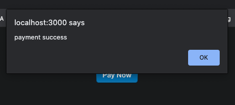

## React Day13 - Stripe Integration with React App

#### I. [Stripe API Intro](#question-1)
  
#### II. [Build Stripe Payment Button Component](#question-2)

#### III. [Source Code](#question-3)
 
<div  id="question-1"  />

### I. Stripe API Intro

**Docs:**   [react-stripe-checkout](https://github.com/azmenak/react-stripe-checkout)

**Install:**
```bash
npm install react-stripe-checkout
```

Key Component to use:
```jsx
<StripeCheckout />
```

Important properties:
- `label`: text inside the Stripe button
- `name`:  the pop-in header title, eg: company's name
- `image` : the pop-in header image (default none)
- `description`
- `panelLabel`:  prepended to the amount in the bottom pay button
- `amount`:  unit in cents
- `currency`
- `shippingAddress`
- `billingAddress`
	 Note: Enabling either address option will give the user the ability to fill out both. Addresses are sent as a second parameter in the token callback.
- token: submit callback
- stripeKey: your developer account's publishableKey

<div  id="question-2"  />

### II. Build Stripe Payment Button Component

**Code Example:**
```jsx
const  StripeCheckoutButton = ({ price }) => {
	const  priceForStripe = price * 100; // unit in cent
	const  publishableKey = 'your_developer_account_publishable_key';
	const  onToken = (token) => {
		console.log(token);
		alert("payment success");
		// TODO: callback to your backend after paymnet
	}

	return (
	<StripeCheckout
		label="Pay Now"  // text inside the Stripe button
		name="Jelly's Clothing Ltd."  // the pop-in header title
		image="https://stripe.com/img/documentation/checkout/marketplace.png"  // the pop-in header image (default none)
		description={`your total is ${price}`}
		panelLabel="Pay Now"  // prepended to the amount in the bottom pay button
		amount={priceForStripe}  // cents
		currency="USD"
		// Note: Enabling either address option will give the user the ability to
		// fill out both. Addresses are sent as a second parameter in the token callback.
		shippingAddress
		billingAddress
		token={onToken}  // submit callback
		stripeKey={publishableKey}
	/>)
}
export  default  StripeCheckoutButton;
```
**Credit Card for Testing**: 
[docs](https://stripe.com/docs/testing)

**Payment Success:**


**Token Object we get:**
- card
- client_ip
- created
- email
- id
- livemode
- object
- type
- used


  
<div  id="question-3"  />
 
### III. Source Code

[github link](https://github.com/jialihan/React-features/blob/main/08-react-stripe-example/stripe-checkout-example/src/components/StripeCheckoutButton.jsx)