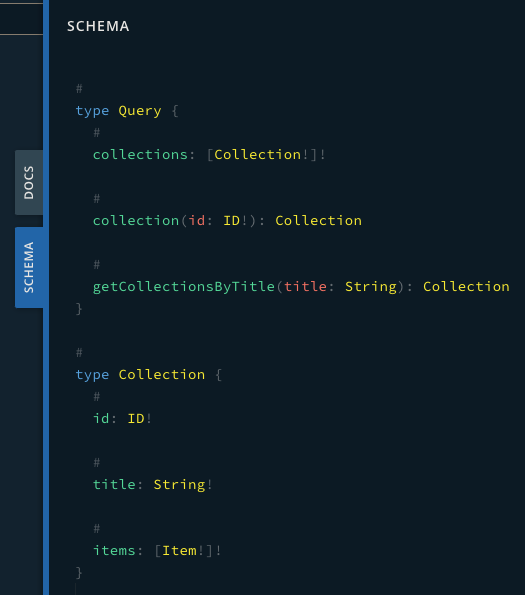
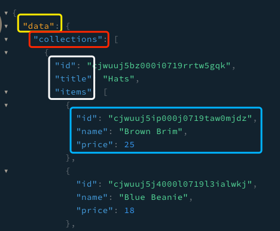

## React Day15 - GraphQL

#### I. [Introduction to GraphQL](#question-1)
  
#### II. [GraphQL Playground](#question-2)
- [Basics in this Playground](#q2-1)
- [Handy features in this Playground](#q2-2)

#### III. [GraphQL Backend Part Introduction](#question-3)
 
#### IV. [Introduction to Apollo](#question-4)
- [ Install](#q4-1)
- [create a client object](#q4-2)
- [Connect Apollo Client to React](#q4-3)

#### V. [Apollo Client Example](#question-5)
- [ Setup a Simple Client](#q5-1)
- [Request Data - useQuery Hook](#q5-2)
- [Attention: data will be undefined if loading](#q5-3)
- [ Query with Variables](#q5-4)
- [Source Code](#q5-5)

#### VI. [Apollo vs. Redux](#question-6)

#### VII. [Mutations on the client](#question-7)
- [useMutation hook](#q7-1)
- [Updating a single existing entity](#q7-2)
- [Manually updates cache](#q7-3)

<div  id="question-1"  />

### I. Introduction to GraphQL
#### 1.1 What is GraphQL?
- **a server language** wraps around the server or server database that you can make request in a different way
- Docs: [graphql](https://graphql.org/)

#### 1.2 What problem it attempts to solve
- Over fetching data, which most of them we don't need
- Expensive solution to have multiple requests 
	For exmaple: in order to request `posts/:postId/comments`, we need totally 3 requests on different 3 endpoints:
	- `users/`: find the user ID in all users
	- `users/:userId/posts`: find the posts on this userId
	- `posts/:postId/comments`: find the comments on this postId

#### 1.3 How a front-end developer need to look out for GraphQL
- use GraphQL server instead of a Rest server
- expose **one single endpoint**: `/graphql`
- pass a Query or Mutation, structure similar to a JSON object to the endpoints to Get or Update data.

Advantages:
- front-end don't need to know all the different endpoints in order to get any date we need
- whenever endpoint changes, we don't need to update or modify on front-end anymore, just care about front-end request parameters.
	For example: in order to get `/posts/:postId/comments`, we only need one Query similar to the belowing:
	```graphql
	post(userId){
		id,
		...
		comments{
			id
		}
	}
	```

#### 1.4 What GraphQL brings to the development work

<div  id="question-2"  />

### II. GraphQL Playground

<div  id="q2-1"  />

#### 2.1 Basics in this Playground

**URL:**  [graphql-playground](https://crwn-clothing.com/)

**Types:**
- Query - get some data
- Mutation - modify some data

**Schema:**
- There is a Schema Tab in the playground for you to know which properties you can request in each Object.
- **[Prisma](https://www.prisma.io/)** tool to help front-end to visualize the data
- `id:ID!`:  `!` on the property means this field will always be in this type of object.

- 

Code Example:
Note: the order of the sub properties we request only affects the property's showing order in response Json object. Eg: here inside item object, the response will also be the order of `id, name, price`. 
```graphql
query {
	collections {
		id
		title
		items {
			id
			name
			price
		}
	}
}
```
response with a "data" property:



<div  id="q2-2"  />

#### 2.2 Handy features in this Playground
- Docs Tab in playground

	
- Query with arguments
	query code example, here is a fake ID:
	```graphql
	query {
		collection (id: "xxxxabcd010101_exampleID") {
			title
		}
	}
	```
	Response is like this:
	```graphql
	{
	  "data": {
	    "collection": {
	      "title": "Hats"
	    }
	  }
	}
	```
* **Null object**
	If data not existed, it will always gets back **`null` object**, eg: null response:
	```graphql
	{
	  "data": {
		  "collection": {
		     "title": null
		  }
	  }
	}
	```
* query param is not case sensitive, we can use small cases.


<div  id="question-3"  />

### III. GraphQL Backend Part Introduction
  
- [**Prisma**](https://www.prisma.io/) 
- [**Hasura**](https://hasura.io/)
- [**Apollo Server**](https://www.apollographql.com/docs/apollo-server/)
- Quick way to build a GraphQL server: [graphql-yoga](https://github.com/prisma/graphql-yoga)
- Apollo: [A quick step by step guide on how to set up your own GraphQL server](https://www.apollographql.com/docs/tutorial/introduction/)
  
<div  id="question-4"  />
 
### IV. Introduction to Apollo

Docs: [Apollo Client (library)](https://www.apollographql.com/docs/react/get-started/)

<div  id="q4-1"  />

#### 4.1 Install:
`@apollo/client`: 
- this single package contains virtually everything you need to set up Apollo Client
-  and it provides built-in integration with React.
- and this client will make sure to **cache the data** everytime we make request to GraphQL server.
```bash
npm install @apollo/client graphql
```

<div  id="q4-2"  />

#### 4.2 Create a Client Object
Code example:
```js
import { ApolloClient, InMemoryCache } from '@apollo/client'; 

const client = new ApolloClient({
	uri: 'https://48p1r2roz4.sse.codesandbox.io', 
	cache: new InMemoryCache() 
});
```

<div  id="q4-3"  />

#### 4.3 Connect Apollo Client to React

In `index.js`, let's wrap our React app with an `ApolloProvider`. We suggest putting the `ApolloProvider` somewhere high in your app, above any component that might need to access GraphQL data.

Code Example:
```jsx
// index.js
import { ApolloProvider } from '@apollo/client';

ReactDOM.render(
	<ApolloProvider  client={client}>
		<App  />
	</ApolloProvider>,
	document.getElementById('root')
);
```

<div  id="question-5"  />
 
### V. Introduction to Apollo

<div  id="q5-1"  />

#### 5.1 Setup a Simple Client
Docs: [create a client](https://www.apollographql.com/docs/react/get-started/#create-a-client)

**Install:**
```bash
npm install @apollo/client graphql
```

**Create a client:** in `index.js`
- uri
- cache
```js
import { ApolloClient, InMemoryCache } from '@apollo/client'; 

const client = new ApolloClient({
	uri: 'https://48p1r2roz4.sse.codesandbox.io', 
	cache: new InMemoryCache() 
});
```

**Create the 	query:**
```js
client
.query({
	query:  gql`
	{
		getCollectionsByTitle(title: "hats") {
			id
			title
			items {
				id
				name
				price
				imageUrl
			}
		}
	}
	`
})

.then(result  =>  console.log("resutl:", result));
```

**Connect to React App:**
you connect Apollo Client to React with the `ApolloProvider` component. In `index.js`, wrap this provider at the root level:
```js
ReactDOM.render(
	<ApolloProvider  client={client}>
		<App  />
	</ApolloProvider>,
	document.getElementById('root')
);
```

<div  id="q5-2"  />

#### 5.2 Request Data - useQuery Hook
**Docs:**
`useQuery` is a React hook that use the [Hooks API](https://reactjs.org/docs/hooks-intro.html) to share GraphQL data with your UI.

**Syntax:**
```jsx
import { useQuery, gql } from  '@apollo/client';

// just for example
const MY_QUERY = gql`
	query GetExchangeRates {
	    rates(currency: "USD") {
	      currency
	      rate
	    }
	}
`;
 const { loading, error, data } = useQuery(MY_QUERY);
```

A result object is returned that contains  `loading`,  `error`, and  `data`  **properties**:

-   Apollo Client tracks error and loading state for you, which are reflected in the  `loading`  and  `error`  properties.
-   When the result of your query comes back, it's attached to the  `data`  property.

**Component Example:**
```jsx
export  const  CollectionsComponent = () => {
const { loading, error, data } = useQuery(HATS_COLLECTION);

if (loading) return  <p>Loading...</p>;
if (error) return  <p>Error :(</p>;

return (
	<div>
	// Render data 
	{ data && 
	  data.rates.map(({ currency, rate }) => (
	    <div key={currency}>
	      <p>
	        {currency}: {rate}
	      </p>
	    </div>
	  ))
	}
	</div>
)}
```

<div  id="q5-3"  />

#### 5.3 Attention: data will be undefined if loading

- However as of 3.1.3 this is no longer possible as `data` will be `undefined` if `loading` is true.
-  Before this, it would return an empty object `{}` which allowed us to do our destructure for `getCollectionsByTitle` even if the data was not yet loaded.
 - only after we know that `loading` is false, we can write destructure code.

```js
const { getCollectionsByTitle = {} } = data;
```

<div  id="q5-4"  />

#### 5.4 Query with Variables

when we define the query, we will create a variable inside which we will later pass in. variable with `$` sign.

**Docs:**  `useQuery` hooks accepts [options](https://www.apollographql.com/docs/react/data/queries/#options).

**Define a query** with variables:
```js
const  MY_COLLECTION_2 = gql`
	query getCollectionsByTitle ($title: String!) {
		getCollectionsByTitle(title: $title) {
			id
			title
			items {
				id
				name
				price
				imageUrl
			}
		}
	}
`;
```

use options: `variables` 

```js
const { loading, error, data } = useQuery(MY_COLLECTION_2,
	{
		variables: { title:  "hats" },
	}
);
```

<div  id="q5-5"  />

#### 5.5 Source Code

github link: [component make graphql request](https://github.com/jialihan/React-features/blob/main/09-graphql-apollo/apollo-graphql-example/src/components/QueryComponent.jsx)

<div  id="question-6"  />

### VI. Apollo vs. Redux

why don't want to mix redux and apollo together?
- want data to be unified because of the uni-directional data flow
- wanna a single source of truth
- **Bad example:** when some parts of data in redux get changed, that data will be different with the backend data.

<div  id="question-7"  />

### VII. Mutations on the client

Doc: [useMuation API](https://www.apollographql.com/docs/react/data/mutations/#usemutation-api)

Note: Apollo-client : The cache is the local storage.

<!---
#### 7.1 Syntax:
```graphql
client.writeData({
	data: {
		prop1: ''
	}
})
```

#### 7.2 create a "resolvers.js"

- `resolvers.js`:  going to actually define the type i.e. the schema that this local side is going to use and get access to.
- `extend` keyword: extend the already existing **type** in backend

1 ) create the type definitions
```js
export const typeDefs = gql`
	extend type Mutation {
		ToggleHiddenValue: Boolean!
	}
`;
```

2 ) create the resolvers
Note: type definition starts with Capital letter ( `ToggleHiddenValue` ), here is the method/function name. starts with small letter (`toggleHiddenValue`) . 

4 arguments of this mutation function:
- `_root`:  the top level object that holds the actual type
- `_args`: variables we passed into the query
- `_context`: apollo client has access to, **including the cache** as well as the client itself, eg: `const {cache} = _context;`.
- `_info`: info about our query, **~~not frequently used~~**.
```js
const YOUR_QUERY = gql`
{
	hiddenValue @client
}
`;
export const resolvers = {
//	Mutation: {
//		toggleHiddenValue: (_root, _args, //_context, _info) =>{
//		}
//	}
	Mutation: {
		toggleHiddenValue: (_root, _args, {cache}) =>{
			const { hiddenValue } = cache.readQuery({
				query: YOUR_QUERY,
				variables: {}
			});
			cache.writeQuery({
				query: YOUR_QUERY,
				data: {hiddenValue: !hiddenValue}
			});
			// return the reversed hidden value
			return !hiddenValue;
		}
	}
};
```

3 ) add typeDefs and resolvers into our client config
```js
const client = new ApolloClient({
	linkt: "your_httpLink",
	cache,
	typeDefs,
	resolvers
})
```
-->

<div  id="q7-1"  />

#### 7.1 `useMutation` hook

The `useMutation`  [React hook](https://reactjs.org/docs/hooks-intro.html) is the primary API for executing mutations in an Apollo application. To run a mutation, you first call `useMutation` within a React component and pass it a GraphQL string that represents the mutation.

It returns a tuple that includes:
-   A  **mutate function**  that you can call at any time to execute the mutation
-   An object with fields that represent the current status of the mutation's execution

**Code example**: execute a Mutation
```jsx
const [addTodo, {loading,error,data }] = useMutation(ADD_TODO);
// usage
addTodo({ variables: { type: input.value } });

```
Here the function to execute is `addTodo()`.

<div  id="q7-2"  />

#### [7.2 Updating a single existing entity](https://www.apollographql.com/docs/react/data/mutations/#updating-a-single-existing-entity)
-  Apollo Client can **automatically update that entity's value in its cache** when the mutation returns. 
- To do so, the mutation must return the `id` of the modified entity, along with the **values of the fields** that were modified

**Code example:**
```jsx
// define the mutation
const UPDATE_TODO = gql`
  mutation UpdateTodo($id: String!, $type: String!) {
    updateTodo(id: $id, type: $type) {
      id
      type
    }
  }
`;
// use the hook
const [updateTodo] = useMutation(UPDATE_TODO);

// usage
updateTodo({ variables: { id, type: input.value } });
```

<div  id="q7-3"  />

#### [7.3 Manually updates cache](https://www.apollographql.com/docs/react/data/mutations/#making-all-other-cache-updates)
**When to use?**
- If a mutation modifies multiple entities, 
- or if it creates or deletes entities, 
- The Apollo Client cache is _not_ automatically updated to reflect the result of the mutation

**Docs:** [read & write data to Cache](https://www.apollographql.com/docs/react/caching/cache-interaction/#cachemodify)
- cache.readQuery
- cache.writeQuery
- cache.modify

**Syntax & How to use:**
- The **update function** is _also_ passed an object with a **`data`** property that contains the result of the mutation. You can use this value to update the cache with `cache.writeQuery`, `cache.writeFragment` or `cache.modify`.

**Code Example**:  
call to `modify` that modifies a `name` field to convert its value to upper case:
```jsx
const [addTodo] = useMutation(ADD_TODO, {
    update(cache, { data: { addTodo } }) {
		cache.modify({
		  id: cache.identify(myObject),
		  fields: {
		    name(cachedName) {
		      return cachedName.toUpperCase();
		    },
		  },
		  /* broadcast: false // Include this to prevent automatic query refresh */
		});
    }
  });
```

