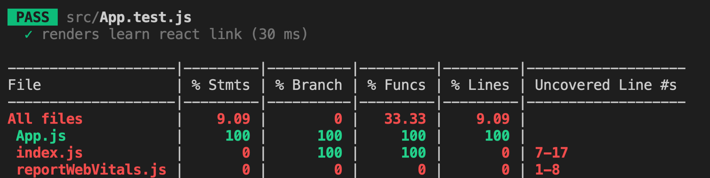

## React day17 - Unit Test Jest & Enzyme

I. [create react app - Jest test](#p1)

II. [Test Component - React Testing Library](#p2)

III. [Initialize Test Env and global setup](#p3)

IV. [Focusing and Excluding Tests](#p4)

V. [Coverage Reporting](#p5)

VI. [Jest Snapshot Test](#p6)

VII. [Component Test - Enzyme](#p7)

- [7.1 install dependencies](#q7-1)
- [7.2 set up enzyme in code](#q7-2)
- [7.3 More on Enzyme APIs](#q7-3)
- [7.4 Difference between shallow and mount](#q7-4)

VIII. [React Testing Library with/without Jest](#p8)

<div id="p1" />

### I. create react app - Jest test

Docs:
https://create-react-app.dev/docs/running-tests/

Key concepts:

- Create React App uses [Jest](https://jestjs.io/) as its test runner.
- Jest is a Node-based runner, and the tests always run in a Node environment and not in a real browser.
- While Jest provides browser globals such as `window` thanks to [jsdom](https://github.com/tmpvar/jsdom), they are only approximations of the real browser behavior.
- Jest is intended to be used for **unit tests** of your logic and your components rather than the DOM quirks.

#### 1.2 Test File Name Conventions

Jest will look for test files with any of the following popular naming conventions:

- Files with `.js` suffix in `__tests__` folders.
- Files with `.test.js` suffix.
- Files with `.spec.js` suffix.

**Good Practice:**
We recommend to put the test files (or `__tests__` folders) next to the code they are testing so that relative imports appear shorter.

#### 1.3 Writing test - Syntax

To create tests, add `it()` (or `test()`) blocks with the name of the test and its code. You may optionally wrap them in `describe()` blocks for logical grouping but this is neither required nor recommended.

```js
import sum from "./sum";
it("sums numbers", () => {
  expect(sum(1, 2)).toEqual(3);
  expect(sum(2, 2)).toEqual(4);
});
```

<div id="p2" />

### II. Test Component - React Testing Library

If you’d like to test components in isolation from the child components they render, we recommend using [`react-testing-library`](https://github.com/testing-library/react-testing-library).

It works more directly with DOM nodes, and therefore it's recommended to use with [`jest-dom`](https://github.com/testing-library/jest-dom) for improved assertions.

**Install:**

```bash
npm install --save @testing-library/react @testing-library/jest-dom
```

**Test Example:**

```js
import React from "react";
import { render, screen } from "@testing-library/react";
import App from "./App";

it("renders welcome message", () => {
  render(<App />);
  expect(screen.getByText("Learn React")).toBeInTheDocument();
});
```

<div id="p3" />

### III. Initialize Test Env and global setup

> Note: this feature is available with `react-scripts@0.4.0` and higher.

If your app uses a browser API that you need to mock in your tests or if you need a global setup before running your tests, add a `src/setupTests.js` to your project.

**It will be automatically executed before running your tests.**

For example: [`src/setupTests.js`](https://create-react-app.dev/docs/running-tests/#srcsetuptestsjs "Direct link to heading")

```js
const localStorageMock = {
  getItem: jest.fn(),
  setItem: jest.fn(),
  removeItem: jest.fn(),
  clear: jest.fn()
};
global.localStorage = localStorageMock;
```

<div id="p4" />

### IV. [Focusing and Excluding Tests](https://create-react-app.dev/docs/running-tests/#focusing-and-excluding-tests "Direct link to heading")

You can replace `it()` with `xit()` to temporarily exclude a test from being executed.
Similarly, `fit()` lets you focus on a specific test without running any other tests.

<div id="p5" />

### V. [Coverage Reporting](https://create-react-app.dev/docs/running-tests/#coverage-reporting "Direct link to heading")

Jest has an integrated coverage reporter that works well with ES6 and requires no configuration.

Run `npm test -- --coverage` (note extra `--` in the middle) to include a coverage report like this:



<div id="p6" />

### VI. Jest Snapshot Test

Snapshot testing is a feature of Jest that automatically generates text snapshots of your components and saves them on the disk so if the UI output changes, NOT need manually write test code.
Docs:

- [Jest 14.0: React Tree SnapShot Testing](https://jestjs.io/blog/2016/07/27/jest-14)
- [Jest snapshot test with enzyme react](https://www.asapdevelopers.com/jest-snapshot-testing-enzyme-react/)

  ```js
  const wrapper = shallow(<MyComponent />);

  describe("Component should render", () => {
    it("should match snapshot", () => expect(wrapper).toMatchSnapshot());
  });
  ```

<div id="p7" />

### VII. Component Test - [Enzyme](https://enzymejs.github.io/enzyme/docs/installation/)

<div id="q7-1" />

#### 7.1 install as dev dependency

- ["enzyme"](https://enzymejs.github.io/enzyme/docs/installation/)
  ```bash
  npm i --save-dev enzyme
  ```
- "react-adapter" package:
  - ["enzyme-adapter-react-16"](https://www.npmjs.com/package/enzyme-adapter-react-16): official package to work with React 16
  - ["@wojtekmaj/enzyme-adapter-react-17"](https://www.npmjs.com/package/@wojtekmaj/enzyme-adapter-react-17) : but if you wanna work on "React 17", official package is not released, use this unofficial package.

<div id="q7-2" />

#### 7.2 set up enzyme in code

Configure Adapter in test code in ES6, in `setupTests.js` file:

```js
// setup file
import { configure } from "enzyme";
import Adapter from "enzyme-adapter-react-16";

configure({ adapter: new Adapter() });
```

**A simple test code example:**

```js
import { shallow } from "enzyme";
import App from "./App";

const wrapper = shallow(<App />);
describe("Component should render", () => {
  it("should match snapshot", () => expect(wrapper).toMatchSnapshot());
});
```

<div id="q7-3" />

#### 7.3 [More on Enzyme APIs](https://enzymejs.github.io/enzyme/docs/api/)

- [Shallow Rendering](https://enzymejs.github.io/enzyme/docs/api/shallow.html)
  ```js
  import { shallow } from "enzyme";
  const wrapper = shallow(<MyComponent />);
  // ...
  ```
- [Full Rendering](https://enzymejs.github.io/enzyme/docs/api/mount.html)
  ```js
  import { mount } from "enzyme";
  const wrapper = mount(<MyComponent />);
  // ...
  ```
- [Static Rendering](https://enzymejs.github.io/enzyme/docs/api/render.html)
  ```js
  import { render } from "enzyme";
  const wrapper = render(<MyComponent />);
  // ...
  ```

<div id="q7-4" />

#### 7.4 Difference between shallow and mount

**Docs:**

- [Difference between Shallow, Mount and render of Enzyme](https://gist.github.com/fokusferit/e4558d384e4e9cab95d04e5f35d4f913)
- [When should you use render and shallow in Enzyme / React tests?](https://stackoverflow.com/questions/38710309/when-should-you-use-render-and-shallow-in-enzyme-react-tests)

| shallow                                                                                                                                                                                                                    | mount                                                                                                                                                                                                     |
| -------------------------------------------------------------------------------------------------------------------------------------------------------------------------------------------------------------------------- | --------------------------------------------------------------------------------------------------------------------------------------------------------------------------------------------------------- |
| Calls: <br> &nbsp;&nbsp;&nbsp;&nbsp; - constructor <br> &nbsp;&nbsp;&nbsp;&nbsp; - render                                                                                                                                  | Calls: <br> &nbsp;&nbsp;&nbsp;&nbsp; - constructor <br> &nbsp;&nbsp;&nbsp;&nbsp; - render <br> &nbsp;&nbsp;&nbsp;&nbsp; - componentDidMount                                                               |
| Use-cae: <br> Full DOM rendering is ideal for use cases where you have components that may interact with **DOM apis**, or may require the full lifecycle in order to fully test the component (ie, componentDidMount etc.) | Use-cae: <br> Shallow rendering is useful to constrain yourself to **testing a component as a unit**, and to ensure that your tests are **NOT** indirectly asserting **on behavior of child components**. |

<div id="p8" />

### VIII. React Testing Library with/without Jest

Reference: https://testing-library.com/docs/react-testing-library/intro
