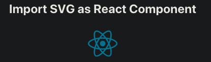

## React day18 - How to use SVG in React?

#### I. [What is SVG image?](#p1)

#### II. [Default SVG loader using in create-react-app](#p2)

#### III. [Using `` tag for static SVG files](#p3)

#### IV. [Import SVG as a React Component](#p4)

#### V. [Manually created Component using SVG tag](#p5)

#### VI. [Use inline SVG in React](#p6)

#### VII. [Override Webpack.config.js to use other loaders for SVG](#p7)

- [7.1 How to override default webpack.config without ejecting ?](#q7-1)
- [7.2 ](#q7-2)
- [7.3 ](#q7-3)
- [7.4 ](#q7-4)

#### VIII. [Reference and Useful Links](#p8)

<div id="p1" />

### I. What is SVG image?

**Docs:**

- [SVG: Scalable Vector Graphics - MDN](https://developer.mozilla.org/en-US/docs/Web/SVG)
- [How to use SVGs in React](https://blog.logrocket.com/how-to-use-svgs-in-react/)

SVG is a vector graphics image format based on [XML](https://en.wikipedia.org/wiki/XML). SVG stands for Scalable Vector Graphics.

It was developed in the late 1990s and [was poorly supported](https://www.sitepoint.com/svg-101-what-is-svg/) until around 2016.

Today a huge percentage of icon libraries such as Flaticon, Font Awesome, Material Icon, etc., have full support for SVG.

<div id="p2" />

### II. Default SVG loader using in create-react-app

**Rules:**

- The [Create-React-App](https://github.com/facebook/create-react-app/issues/99#issuecomment-234657710) states that we are not allowed to override webpack specific configurations.
- **Webpack config used by "create-react-app"** is here: [react-scripts/config/webpack.config.js](https://github.com/facebook/create-react-app/blob/master/packages/react-scripts/config/webpack.config.js)
- the default tool used for SVG: ["@svgr/webpack"](https://www.npmjs.com/package/@svgr/webpack)

<div id="p3" />

### III. Using `` tag for static SVG files

**Code Example:**

```js
import logo from "./logo.svg";
;
```

Adjust **sizes** on your SVG, eg: "width", "height", etc..

```js
import logo from "./logo.svg";
;
```

**UI Result:**


<div id="p4" />

### IV. Import SVG as a React Component

```js
import { ReactComponent as ReactLogo } from "../logo.svg";
const LogoSvgReactComponent = () => <ReactLogo width="100" />;
```

**UI Result:**



<div id="p5" />

### V. Manually created Component using SVG tag

**Code Implementation:**


> Note: passing props to `<svg {...props} >` tag to expand props, which can adjust styles and attributes on SVG image, eg: width, height, etc..

**UI Result:**


<div id="p6" />

### VI. Use inline SVG in React

#### 6.1 Why use inline SVG?

**Docs:**

- https://www.jotform.com/blog/why-you-should-embed-svg-inline-98570/
- https://stackoverflow.com/questions/23210126/inline-svg-vs-svg-file-performance

**Pros for inline:**

- Fewer http requests;
- You can use css fill property and change the color;
- Svg is part of the content, so it is clickable and you can insert text;

**Pros for Separate File:**

- Svg files can be cached;
- You don't see multiple lines of irelevant code in your files;
- If you need to change it later then you just change one file;

#### 6.2 Use inline SVG in React

This tool mgiht help: ["svg-inline-react"](https://github.com/sairion/svg-inline-react) package.

```bash
npm install svg-inline-react
```

Usage Example in React Code:

```js
import InlineSVG from "svg-inline-react";

function App() {
  // Use without loader
  const svgSource = `<svg width="100" "xmlns="http:.......></svg>`;
  return <InlineSVG src={svgSource} className="App-logo" />;
}
```

#### 6.3 UI result


<div id="p7" />

### VII. Override Webpack.config.js to use other loaders for SVG

- `svgr + file-loader`: https://www.npmjs.com/package/@svgr/webpack
- [SVGO Loader](https://github.com/rpominov/svgo-loader) : A loader for webpack to pass your SVG files through [svgo](https://github.com/svg/svgo) optimizer. It needs to work with either [`file-loader`](https://github.com/webpack-contrib/file-loader) or [`url-loader`](https://github.com/webpack-contrib/url-loader).
- [Using Various SVG Loaders](https://wpack.io/tutorials/using-various-svg-loader/)

<div id="q7-1" />

#### 7.1 How to override default webpack.config without ejecting ?

**Docs:**
// TODO:

- https://stackoverflow.com/questions/47078964/create-react-app-with-react-svg-loader-without-ejecting-fails-when-trying-to-min
- https://stackoverflow.com/questions/63280109/how-to-update-webpack-config-for-a-react-project-created-using-create-react-app

<div id="p8" />

### VIII. Reference and Useful Links

- React source code: ["react-scripts/config/webpack.config.js"](https://github.com/facebook/create-react-app/blob/master/packages/react-scripts/config/webpack.config.js)
- How to use SVGs in React: https://blog.logrocket.com/how-to-use-svgs-in-react/
- "@svgr/webpack": https://www.npmjs.com/package/@svgr/webpack
