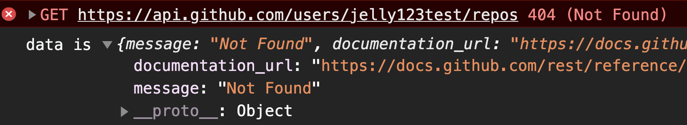

## Using fetch API - Disadvantages

#### I. [Why not use fetch() ?](#question-1)

#### II. [HTTP Status Code Summary](#question-2)

#### III. [Handle Http Errors in Fetch Api](#question-3)

#### IV. [Use await in Async function - fetch() ](#question-4)

#### V. [Axios Error Handling](#question-5)

<div id="question-1"/>

### I. Why not use fetch() api ?

- need extra code to parse json data
- bad at error handling
  - The default `.catch()` block won’t get http status code errors.
  - Basically `fetch()` will only reject a promise if the **user is offline (`failed request`)**, or some unlikely **networking error** occurs, such a **DNS lookup failure**.

<div id="question-2"/>

### II. HTTP Status Code Summary

1xx：Informational 临时响应信息  
2xx：Successful 成功
3xx：Redirection 重定向
4xx：Client Error 客户端错误  
5xx：Server Error 服务器错

Note:

- fetch api **won’t reject on HTTP error status** from `400 <= code < 600`. Instead, it will resolve normally (with `ok` status set to false).
- example fetch api response when http error happens:

  

  response object: `ok = false`

<div id="question-3"/>

### III. Handle Http Errors in Fetch Api

Code Example:

- parse json
- add extra code to reject HTTP status error
  - reject by response.ok (false)
  - reject by custom status code 400 <= code < 600, even you can parse the exact code value.

**Example 1:** reject by `response.ok`

```js
fetch("some-url")
  .then((response) => {
    if (!response.ok) {
      // handle error
      return Promise.reject("something went wrong!");
    }
    return response.json();
  })
  .then((data) => console.log(data))
  .catch((error) => console.log(error));
```

**Example 2:** reject by specific `error status code`

```js
fetch("some-url")
  .then((response) => {
    if (response.status >= 400 && response.status < 600) {
      // handle error
      throw new Error("something went wrong!");
    }
    return response.json();
  })
  .then((data) => console.log(data));
```

<div id="question-4"/>

### IV. Use await in Async function - fetch()

**Docs:** [await keyword](https://developer.mozilla.org/en-US/docs/Learn/JavaScript/Asynchronous/Async_await#the_await_keyword)

**Syntax:**

```js
async function boo() {
  try {
    // async function using await keyword
    const resp = await Promise.reject("wrong");
  } catch (err) {
    // handle error
  }
}
```

**Rewrite** fetch() using `await`:

```js
async function myFetch() {
  try {
    let response = await fetch("some-url");
    if (!response.ok) {
      throw new Error(`HTTP error! status: ${response.status}`);
    }
    response = await response.json();

    // process data
    console.log(response);

    return response;
  } catch (err) {
    console.log(err);
  }
}
```

<div id="question-5"/>

### V.Catching axios errors

**Docs:**

- [axios-github-error-handling](https://github.com/axios/axios#handling-errors)
- [How to handle API errors in your web app using axios -2020](https://www.intricatecloud.io/2020/03/how-to-handle-api-errors-in-your-web-app-using-axios/)

#### 5.1 Code Syntax

```js
axios
  .post(url, data)
  .then((res) => {
    // do good things
  })
  .catch((err) => {
    if (err.response) {
      // client received an error response (5xx, 4xx)
    } else if (err.request) {
      // client never received a response, or request never left
    } else {
      // anything else
    }
  });
```

#### 5.2 Checking error.response

If your error object contains a response field, that means your **server** responded with a **4xx/5xx** error. Usually this is the error we're most familiar with, and is most straightforward to handle.

Do things like a show a "404 Not Found" page/error message if your API returns a 404. Show a different error message if your backend is returning a 5xx or not returning anything at all. You might think your well-architected backend won't throw errors - but its a matter of when, not if.

#### 5.3 Checking error.request

The second class of errors is where you don't have a response but there's a request field attached to the error. When does this happen? This happens when the browser was able to make a request, but for some reason, it didn't see a response.

This can happen if:

- you're in a spotty network (think underground subway, or a building wireless network)
- if your backend is hanging on each request and not returning a response on time
- if you are making cross-domain requests and you're not authorized to make the request
- if you're making cross-domain requests and you are authorized, but the backend API returns an error
