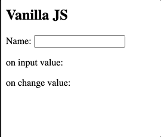
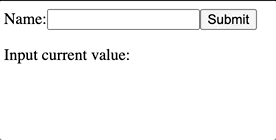

## OnInput and OnChange event in JavaScript and React

#### I. [Input vs. Change event in JavaScript](#question-1)

#### II. [onChange attribute in React](#question-2)

#### III. [Reference](#question-3)

<div id="question-1" />

### I. Input vs. Change event in JavaScript

- [`oninput`](https://developer.mozilla.org/en-US/docs/Web/API/GlobalEventHandlers/oninput): on each alternation in the input field
- [`onchange`](onchange): `change` events fire when the user commits a value change to a form control, eg: **outside clicke(`blur()`) or submit**, etc..

**Syntax 1: in JS**

```js
inputEL.oninput = showInputResult; // points to function ref
function showInputResult() {
  result.textContent = inputEL.value;
}
```

**Syntax 2: in HTML**
in HTML `<input>` tag, use a string of the function name.

```html
<input type="text" id="myInput" oninput="showChangeResult()" />
```

**Results:**



**Source Code:**
[codepen-link](https://codepen.io/jellyhan27/pen/BaWbgoj)

<div id="question-2" />

### II. onChange attribute in React

**React Docs:** [onChange](https://reactjs.org/docs/dom-elements.html#onchange)

> We intentionally do not use the existing browser behavior because `onChange` is a misnomer for its behavior and React relies on this event to handle user input in real time.

**Syntax in React:**
points to the method ref.

```html
<input type="text" value="{this.state.value}" onChange="{this.handleChange}" />
```

Handler and binding to React state variable:

```js
handleChange(event) {
	this.setState({value: event.target.value});
}
```

**React onChange demo exmaple:**



**Source Code:**
[codesandbox-link](https://codesandbox.io/s/distracted-wozniak-1tzps?file=/src/Form.jsx)

<div id="question-3" />

### III. Reference

- [How onChange Differs Between React and Vanilla JavaScript](https://betterprogramming.pub/how-onchange-differs-between-react-and-vanilla-javascript-90b56d6a340a)
- [React Froms](https://reactjs.org/docs/forms.html#controlled-components)
