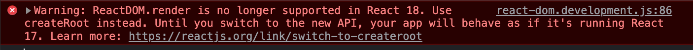

## React 18 migration

### 1. how to upgrade my code base to react 18?

If you create your react app with the `npx create-react-app <your app name>` , you will get the latest 18 version already.

Or you can manually upgrade on your existing react app through npm package for `react` and `react-dom` in 18 version above.

```bash
npm install react@18 react-dom@18
```

How to fix the console warning?



Original code:

```jsx
import ReactDOM from "react-dom";

ReactDOM.render(
  <React.StrictMode>
    <App />
  </React.StrictMode>,
  document.getElementById("root"),
);
```

Change to:

```jsx
import ReactDOM from "react-dom/client";

const root = ReactDOM.createRoot(document.getElementById("root"));
root.render(
  <React.StrictMode>
    <App />
  </React.StrictMode>,
);
```

### 2. What are new features in React 18?

Official doc link: [What's New in React 18](https://reactjs.org/blog/2022/03/29/react-v18.html#whats-new-in-react-18)

#### 2.1 Automatic Batching

When you call the `setXXX()`, it won't re-render immediately, it **only re-render once** at the end of the function of this event handler.
For example:

```js
function handleClick() {
  setIsFetching(false);
  setError(null);
  setFormStatus("success");
  // re-render 1 times
}
```

Before React18: state updates outside of event handlers are NOT batched, eg:

```js
fetch("/something").then(() => {
  setIsFetching(false);
  setError(null);
  setFormStatus("success");
  // re-render 3 times
});
```

#### 2.2 Suspense - SSR in React

React Conf 2021 talk: [Streaming Server Rendering with Suspense](https://www.youtube.com/watch?v=pj5N-Khihgc&list=PLNG_1j3cPCaZZ7etkzWA7JfdmKWT0pMsa&index=3)

What is server rendering?

- server --- HTML --> client (non-interactive)
  - Fetch data
  - Render as HTML
  - Load JS
  - Hydrate: attach event handlers on the HTML, then the page is interactive.
- then JS bundles loading ---> page is interactive

Benefit: you can add Suspense on some slow components, which not slow down the whole page, user can see the whole page and other important parts earlier.

- Streaming HTML
- Selective Hydration

```jsx
<Suspense fallback={<Spinner />}>
  <Comments />
</Suspense>
```

### 2.3 New APIs(concurrent features) for Apps

- `startTransition()`
- `useTransition()`: see in section 2.3.2
- `useDeferredValue()`: It helps you give visual feedback to the user for an urgent update, and helps you `defer` the re-render of the component that is not urgent.
  - No: `debounce` will happen everytime
  - `defer` only when the slow computer, if it's fast, deferred value won't kick in.

#### 2.3.1 New APIs for library devs

- `useId()`
- `useSyncExternalStore()`

#### 2.3.2 useTransition ([doc](https://react.dev/reference/react/useTransition))

Call `useTransition` at the top level of your component to mark state updates as non-blocking Transitions.

```js
import { useState, useTransition } from "react";

function TabContainer() {
  const [isPending, startTransition] = useTransition();
  // ...`
}
```

`useTransition` returns an array with exactly two items:

- The `isPending` flag that tells you whether there is a pending Transition.
- The `startTransition` function that lets you mark a state update as a Transition.
  For example: set state like below:

  ```js
  function TabContainer() {
    const [isPending, startTransition] = useTransition();
    const [tab, setTab] = useState("about");

    function selectTab(nextTab) {
      startTransition(() => {
        setTab(nextTab);
      });
    }
    // ...
  }
  ```

**Note**: difference from Suspense (https://react.dev/reference/react/useTransition#preventing-unwanted-loading-indicators)

> Transitions will only “wait” long enough to avoid hiding already revealed content (like the tab container). If the Posts tab had a nested <Suspense> boundary, the Transition would not “wait” for it.

### 2.4 Re-introducing Relay

#### 2.4.1 what is Relay?

A framework for fetching and managing GraphQL data. Every component can be reasoned about in isolation.

- Reason locally
- Optimize globally

#### graphql and useFragment

- [Fragment](https://graphql.org/learn/queries/#fragments): That’s why GraphQL includes reusable units called fragments. Fragments let you construct sets of fields, and then include them in queries where you need to.
- [useFragment](https://relay.dev/docs/api-reference/use-fragment/) in react-relay: GraphQL fragment specified using a graphql template literal. It **returns** an Object that contains data which has been read out from the Relay store; the object matches the shape of specified fragment.

### 2.5 Server Components (still in development) - [doc](https://react.dev/blog/2020/12/21/data-fetching-with-react-server-components)

#### 2.5.1 Please see this [demo](https://youtu.be/TQQPAU21ZUw) from react team

A few Question and Learnings found during the demo:

- `react-fetch` is sync call on server side code, don't need to await. But in their RFC they added `async / await` support for server components [here](https://github.com/reactjs/rfcs/pull/229).
- in dev-tools in browser's `Source tab`, you can see the webpack folder the server side components are not in the JS bundle.
- must pass `serializable` props over the network http request, eg: `json, jsx,...`. But the wrong example is: ❌ `func={()=>{}}` which is not seriablizable, react will throw error.
- server components does not render into HTML, they render into a special format that can stream down to clients.

**Key points:**

- Server components have zero effect on the bundle sizse, eg: `Note.server.js`, dependencies like `date-fns` won't be in the webpack's bundle.
- Server components let you access the backend resources directly, eg: `react-fs` read from file system, `./db` read from DB.
- React IO Libraries:
  - `react-fs`: Filesystem
  - `react-pg`: PostgreSQL
  - `react-fetch`: Fetch
  - ...
- Server components read GraphQL queries on the server, won't replace GraphQL. But server components gives the option to integrate GraphQL endpoint later.
- Server components let you only load the code that is necessary. On demand downloading the client component if it's needed ,server side only send the instructions to download the bundle if needed.
  - webpack bundler collaborate to support server components
  - next.js to collaborate with server components
  - Parcel
- server components let you decide the tradeoff for every concrete case. If interactive conentent needes, better to render on client. But if some articles or static content, better to render on server side.
- server components is `Opt-in`, react client is NOT going away
- server components are still in research and in development

#### 2.5.2 Github Demo source code

[Clone the demo](https://github.com/reactjs/server-components-demo) to play with React Server Components on your computer.

#### 2.5.3 RFC of server components

Read the [RFC (with FAQ at the end)](https://github.com/reactjs/rfcs/pull/188) for a deeper technical breakdown and to provide feedback.
