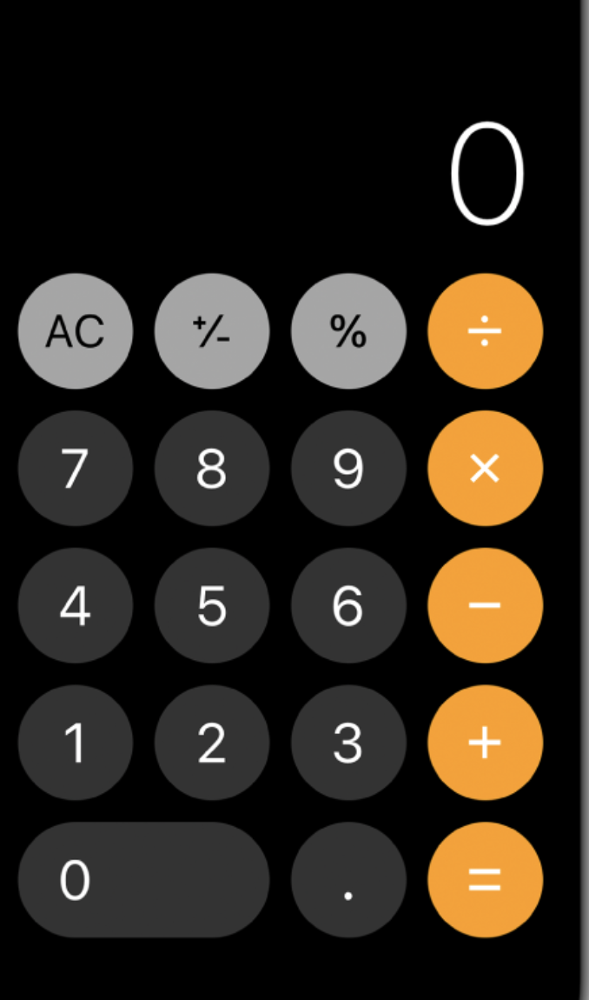
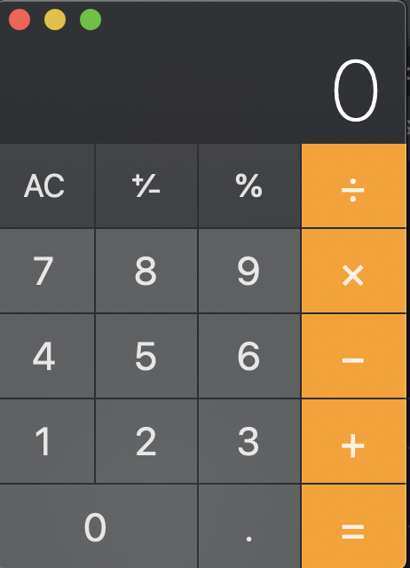
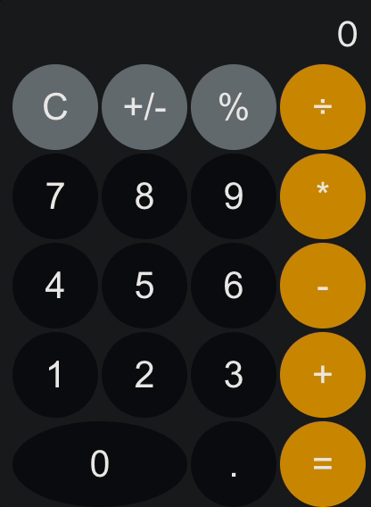

## React Simple Calculator App

#### I. [UI Design](#chapter1)

#### II. [Setup the HTML & CSS](#chapter2)

#### III. [Implement Calculate Logics - JavaScript](#chapter3)

- [3.1 code skeleton - logics ](#ch3-1)
- [3.2 Clear current text input](#ch3-2)
- [3.3 Toggle `+ / -` sign](#ch3-3)
- [3.4 append number ](#ch3-4)
- [3.5 is New Number trick](#ch3-5)
- [3.6 add a sign to handle minus operator](#ch3-6)
- [3.7 handle equal operator](#ch3-7)
- [3.8 handle complicated `*` and `/` operator](#ch3-8)
- [3.9 Percentage Button Handler](#ch3-9)

#### IV. [Bugs & To Be Fixed](#chapter4)

- [4.1 the toggle `"+/-"` button - fixed](#ch4-1)
- [4.2 None operator should NOT change result - not fixed](#ch4-2)

#### V. [Demo: finished features](#chapter5)

#### VI. [Source Code](#chapter6)

<div id="chapter1" />

### I. UI Design

After reference to multiple chat app layouts:

- iphone's calculator UI

  

- mac's calculator UI

  

<div id="chapter2" />

### II. Setup the HTML & CSS

#### 2.1 Build HTML

```html
<div className="grid-container">
  <div className="results">
    {/*
    <p>1111888888222222222</p>
    */}
    <p>{textInput ? textInput : '0'}</p>
  </div>
  <button value="C" type="tool" clicked="{onClickHandler}" />
  <button value="+/-" type="tool" clicked="{onClickHandler}" />
  <button value="%" type="tool" clicked="{onClickHandler}" />
  <button value="÷" type="op" clicked="{onClickHandler}" />
  <button value="7" clicked="{onClickHandler}" />
  <button value="8" clicked="{onClickHandler}" />
  <button value="9" clicked="{onClickHandler}" />
  <button value="*" type="op" clicked="{onClickHandler}" />
  <button value="4" clicked="{onClickHandler}" />
  <button value="5" clicked="{onClickHandler}" />
  <button value="6" clicked="{onClickHandler}" />
  <button value="-" type="op" clicked="{onClickHandler}" />
  <button value="1" clicked="{onClickHandler}" />
  <button value="2" clicked="{onClickHandler}" />
  <button value="3" clicked="{onClickHandler}" />
  <button value="+" type="op" clicked="{onClickHandler}" />
  <button type="zero" value="0" clicked="{onClickHandler}" />
  <button value="." clicked="{onClickHandler}" />
  <button value="=" type="op" clicked="{onClickHandler}" />
</div>
```

**Important Notes:**

- use CSS-GRID, then put every element inside the `"grid-container"`
- here we only have ONE result display block, mock the real Iphone's displaying feature.
- use some fake text number to test the **"overflow text"** issue

#### 2.2 Add CSS - use Grid

Set up the grid layout, here we need **6** rows:

- the first full-length row to display results
- same repeated 5 rows for buttons

**Reference Docs:**

- my detailed article to learn Grid-CSS: https://jialihan.github.io/blog/#/html_css/grid?id=basic
- ["grid-template-columns"](https://developer.mozilla.org/en-US/docs/Web/CSS/grid-template-columns)
- ["grid-template-rows"](https://developer.mozilla.org/en-US/docs/Web/CSS/grid-template-rows)

**CSS code:**

```css
.grid-container {
  display: grid;
  grid-template-columns: repeat(4, 100px);
  grid-template-rows: minmax(100px, auto) repeat(5, 100px);
}
```

**Issue: how to layout some special child element?**

- the **"zero" button** takes **2 cells** of the grid
  ```css
  .zero {
    grid-column: span 2;
  }
  ```
- the **"result" displaying row** takes the whole row
  ```css
  .results {
    grid-column: 1/-1;
  }
  ```
- how to handle the **overflow input text** ?
  Reference:

  - https://stackoverflow.com/questions/62308301/if-i-press-too-much-numbers-in-my-javascript-calculator-the-numbers-go-outside-t#comment110203378_62308395
  - ["text-overflow"](https://developer.mozilla.org/en-US/docs/Web/CSS/text-overflow): here we set it to "clip", the real app is like this, but you can also try some "ellipsis" on UI to see the difference.

    

    

    **CSS solution:**

    ```css
    .results p {
      margin: 0;
      text-align: right;
      vertical-align: bottom;
      /* text-overflow: ellipsis; */
      text-overflow: clip;
      overflow: hidden;
    }
    ```

<div id="chapter3" />

### III. Implement Calculate Logics - JavaScript

<div id="ch3-1" />

#### 3.1 code skeleton - logics

```js
const clearHandler = () => {};
const toggleSignHandler = () => {};
const appendNumber = (num) => {};
const compute = () => {};
const updateResult = () => {};
const percentageHanlder = () => {};
```

<div id="ch3-2" />

#### 3.2 Clear current text input

```js
const clearHandler = () => {
  setTextInput("");
};
```

<div id="ch3-3" />

#### 3.3 Toggle `+ / -` sign

UI demo this toggle feature:


**Bug:**
Toggle has a lot of tricky edge cases, for example:

- toggle then press "="
- toggle then press a new number, just append to current Number
- toggle then press `"+,-,*,/"` then continue to compute

Use a stateful variable to mark this special state, which make us easier to compute the number result:

```js
const [isToggled, setIsToggled] = useState(false);
```

**Part of the Full JS Code:**

```js
const toggleSignHandler = () => {
  if (textInput === "") {
    return;
  }
  if (textInput[0] === "-") {
    setTextInput(textInput.slice(1, textInput.length));
  } else {
    setTextInput("-" + textInput);
  }
  setIsNewNum(false); // because now we have a newNum
  setIsToggled(true);
  // ...
};
```

<div id="ch3-4" />

#### 3.4 append number

Be careful when handling the `"."` dot character, error example:


JS Code:

```js
const appendNumber = (num) => {
  if (num === "." && textInput.indexOf(".") >= 0) {
    return;
  }
  setTextInput(textInput + num);
};
```

UI HTML Code:

> Note: initial text is always '0' when there is no input.

```html
<div className="results">
  <p>{textInput ? textInput : '0'}</p>
</div>
```

<div id="ch3-5" />

#### 3.5 is New Number trick

Add a stateful variable to indicate **"is it a new number on input?"**

- "appendNumber": when `isNewNum === true`, clear it and start the current number with the new input, **after the number input**, remember to set the `isNewNum = false`
  ```js
  const appendNumber = (num) => {
    if (isNewNum) {
      setTextInput("" + num);
    } else {
      // append number
    }
    setIsNewNum(false);
  };
  ```
- when any **"operator"** pressed, after compute current result, must set the **"isNewNumber"** to be "_true_".
  Code example:
  ```js
  else  if(val === '+')
  {
  	if(!isNewNum)
  	{
  		compute();
  	}
  	setIsNewNum(true);
  }
  ```

<div id="ch3-6" />

#### 3.6 add a sign to handle minus operator

when compute the result, we need to know previous operator, eg: `+` or `-` to compute the previous sum:

```text
newSum = sum +/-(sign) currentInputNumber
```

Code example:

```js
const [sign, setSign] = useState("+");
const compute = () => {
  // ...
  if (sign === "-") {
    curNum = -curNum;
  }
  const newSum = sum + curNum;
  setSum(newSum);
};
```

<div id="ch3-7" />

#### 3.7 handle equal operator

Feature:

- keep current result as sum, for future calculation, this result can be **accumulated and computed in future.**
- clear previous input ( eg: `/` 0r `*` operations), since this is a ending result when pressed the `"+"` button.

Code example:

```js
else  if(val === '=')
{
	compute();
	setPrevInput('');
	setIsNewNum(true);
}
```

<div id="ch3-8" />

#### 3.8 handle complicated `*` and `/` (multiply and divide) operator

Use case:

```text
1 + 2 * 3 / 2
= 1 + 6 / 2
= 1 + 3
= 4
```

Solution:

```text
1(sum) + [2 *](prevInput) 3(current Input) /(current operator)
when prev op "*" pressed, can NOT compute
when current op "/" pressed, we need to compute the prevInput, but NOT sum:
1(sum) + [6 /](prevInput)
then wait next user input...
```

<div id="ch3-9" />

#### 3.9 Percentage Button Handler

the feature of "percentage" button (`%`) works like the following UI:


Code Example:

```js
const percentageHanlder = () => {
  let newNum = parseFloat(displayResult) / 100;
  setTextInput(newNum);
  setDisplayResult(newNum);
};
```

<div id="chapter4" />

### IV. Bugs & To Be Fixed

<div id="ch4-1" />

#### 4.1 the toggle `"+/-"` button

there are many edge cases that I cannot fully undertand its inner roles, for exmaple:
**Edge case 1:**

```text
1 - 6 = -5 --> press toggle ---> Output 5 --> press equal("=") --> Output -1
										  --> press equal("=") --> Output -7
										  --> press equal("=") --> Output -13
										  --> press equal("=") --> Output -19
```

**Edge case 2:**

```text
4 - 9 = -5 --> press toggle ---> Output 5  --> press equal("=") --> Output -4
						                   --> press equal("=") --> Output -13
										   --> press equal("=") --> Output -22
										   --> press equal("=") --> Output -31
```

**Fixed!**

<div id="ch4-2" />

#### 4.2 None operator should NOT change result

Use case:
when NONE of the operators are pressed, only one number and the `"="(equal)` button, result should never change!

Bug example:



To Be Fixed!

<div id="chapter5" />

### V. Demo: finished features

**Completed Features:**

- Basic single operator: `+, - * /`
- Multiple operator: `+, -` and `*, /`
  ```text
  example in the demo:
  1 + 2 * 6 / 3 - 2
  = 1 + 4 - 2
  = 3
  ```
- percentage button
- clear button

**TODO: bugs**

- the toggle `+/-` current button, has a few edge cases
- the bug mentioned in [section 4.2](#p4-2), need to stop accumulate sum when only one number used

**Demo:**


<div id="chapter6" />

### VI. Source Code

- Github link [react-calculator](https://github.com/jialihan/react-calculator)
