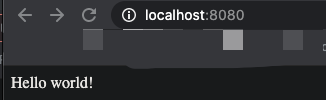
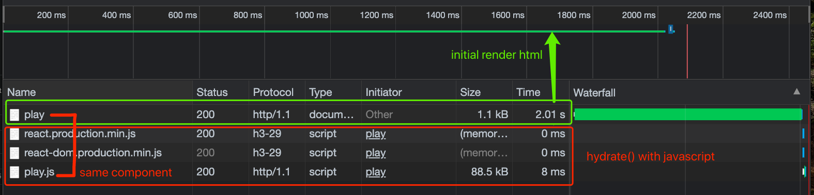

## Server Side Rendering with React

#### I. [Project Setup](#chapter1)

#### II. [Render with React](#chapter2)

#### III. [Render Interactive Content](#chapter3)

#### IV. [Source code](#chapter4)

<div id="chapter1" />

### I. Project Setup

#### 1.1 install
```js
npm init --y
```
You can also use `-y`/`--yes` to skip the questionnaire altogether.

#### 1.2 add Express.js
**What is Express.js?**
Express is a minimal and flexible **Node.js server side** web application **framework**.
Doc: [get-started](https://expressjs.com/en/starter/hello-world.html)
```js
npm install --save express
```

#### 1.3 How to deliver html file?

ExpressJS provides  **[sendFile()](http://expressjs.com/en/5x/api.html#res.sendFile)**  function which will basically send HTML files to browser which then automatically interpreted by browser. All we need to do is in every route to deliver an appropriate HTML file.

For example:
When user hit main URL deliver index.html :
```js
const express = require('express')
const app = express()

app.get('/',function(req,res)  {  
	res.sendFile('index.html');  
});
```

#### 1.4 Run Locally
Doc: [link](https://expressjs.com/en/starter/hello-world.html)
```js
app.listen("8080", function () {
	console.log("server running on 8080...");
});
```




<div id="chapter2" />

### II. Render with React

#### 2.1 connect to React
**Install:**
- react
- react-dom

**Require:**
- `'react-dom/server'`: [docs](https://reactjs.org/docs/react-dom-server.html)
- `'react'`: use the method [`React.createElement(type, props, children)`](https://reactjs.org/docs/react-api.html#createelement)

**Render methods:**
The following methods can be used in both the server and browser environments:

-   [`renderToString()`](https://reactjs.org/docs/react-dom-server.html#rendertostring)
-   [`renderToStaticMarkup()`](https://reactjs.org/docs/react-dom-server.html#rendertostaticmarkup) -- do NOT use, this is React use internally.

For example:
```js
// react server render
const  React = require('react');
const  ReactDOMServer = require('react-dom/server');
const  mainComponent = require('./components/main');
// send response
app.get("/main", async  function (req, res) {
	const  html = ReactDOMServer.renderToString(React.createElement(mainComponent));
	res.send(html);
});
```

#### 2.2 Mock data fetch as initial props
Define a method in component, and exports the component:
```js
Main.getProps = async () => {
	// mock data api fetch
	return  await  new  Promise((resolve) => {
		setTimeout(() => {
		resolve({ value:  1000 });
		}, 2000);
	});
}
module.exports = Main;
```

Render with props in response:
```js
app.get("/main", async  function (req, res) {
	const  props = await  MainComponent.getProps();
	const  html = ReactDOMServer.renderToString(React.createElement(MainComponent, props));
	res.send(html);
});
```


<div id="chapter3" />

### III. Render Interactive Content

#### 3.1 What is hydrate() in React?

**Docs**: [hydrate()](https://reactjs.org/docs/react-dom.html#hydrate)

The entire process of putting functionality back into the HTML that was already rendered in server side React is called hydration.

**Official Docs:**
Same as  `render()`, but is used to hydrate a container whose HTML contents were rendered by  [`ReactDOMServer`](https://reactjs.org/docs/react-dom-server.html). React will attempt to attach event listeners to the existing markup.

React expects that the rendered content is identical between the server and the client. It can patch up differences in text content, but you should treat mismatches as bugs and fix them.

**Reference examples & answers:** https://stackoverflow.com/questions/46516395/whats-the-difference-between-hydrate-and-render-in-react-16

#### 3.2 prepare hydrate HTML
- initial render: `<div id="root"> + your component + </div>`;
- after initial render: eg: `window.onload()`, we add the script
	```js
	// hydrate
	res.write(`<script>
	const props = ${JSON.stringify(props)};
	ReactDOM.hydrate(React.createElement(${PlayComponent}, props),
		document.getElementById('root')
	);
	</script>`);
	```

#### 3.3 prepare your server side code
in your `server.js`, be sure to send js scripts:
- react : production min.js: [reference link](https://reactjs.org/docs/cdn-links.html)
- react-dom: production min.js : [reference link](https://reactjs.org/docs/cdn-links.html)
- make sure send your "**component.js file**"
	```js
	app.get("/components/play.js", async  function (req, res) {
	res.sendFile(__dirname + "/components/bundle.js");
	});
	```
	
Finally client side network tab: (in browser)



	
#### 3.4 Problem: CommonJS `require()` keyword is not available in ES6 modules
**Solution:**
 fix your code also valid when loaded on client side: [stackoverflow-require-not-defined](https://stackoverflow.com/questions/19059580/client-on-node-js-uncaught-referenceerror-require-is-not-defined),  [browserify-npm-github](https://github.com/browserify/browserify)

Use **browserify**:
```js
sudo npm install browserify -g
browserify ./src/components/play.js > ./src/components/bundle.js
```
Use the generated `bundle.js` to send back to client side, instead of the original code `play.js`:
```js
// NOT '/components/play.js'
res.sendFile(__dirname + "/components/bundle.js");
```

<div id="chapter4" />

### IV. Source code

Github link [react-ssr-example](https://github.com/jialihan/JavaScript-Onboarding/tree/master/SSR)
