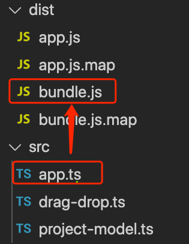

## TypeScript Day10 - Code Split: Modules and Namespaces

#### I. [Code splitting - two options](#p1)

#### II. [Working with Namespaces in TS](#p2)

#### III. [Use ES6 Modules in modern browsers](#p3)

#### IV. [Different import & export Syntax in ES6 Modules](#p4)

- [4.1 grouping the imports](#p4-1)
- [4.2 alias name while import ](#p4-2)
- [4.3 use default export](#p4-3)

#### V. [How does code Execute in Modules?](#p5)

#### VI. [Compare When to use Which Code Split strategy](#p6)

#### VII. [References & Useful Links](#p7)

<div id="p1" />

### I. Code splitting - two options

- Namespaces & File bundling
- more popular: modern ES6 imports & Exports

<div id="p2" />

### II. Working with Namespaces in TS

**Docs:** [ts - namespaces](https://www.typescriptlang.org/docs/handbook/namespaces.html)

> **Note:** "namespace" keyword is NOT existed in JS.

- all code is valid and scoped only inside of the namespace block `namespace Foo{ ... }`
- you should **"export"** something if you want to use it **outside of the namespace block**.

Syntax:

```js
namespace  Foo {
	export  enum  Boo { A, B }
	export  class  Project {
		constructor() {}
	}
	export interface Person {
		age: number;
		firstName: string;
		lastName: string;
	}
}
```

#### 2.1 use namespace in the same file

Usage Example:

```js
namespace Foo {...}
let a : Boo = Boo.A;
const proj = new Foo.Project();
let p : <Partial>Foo.Person = {};
```

#### 2.2 share same namespace in multi-files

- same namespace "name"
- use TS syntax: `/// <reference path="=your_fileName.ts" />`, three slashes and a `<reference>` tag, only valid in TS file.
- since you have multiple referenced files, need to **let TS compile into one single JS file**, use `"outFile": "./dist/bundle.js"` compiler options in TS.
  > Note: Only 'amd' and 'system' modules are supported alongside --outFile. Then use { "module": "amd" } in tsconfig.json file as compiler options.

**Code Example:**

```js
/// <reference  path="components/project-input.ts"  />
/// <reference  path="components/project-list.ts"  />
namespace  App {
	new  ProjectInput();
	new  ProjectList('active');
	new  ProjectList('finished');
}
```

**Compile Result:**
Multiple files are connected by TS and compiled ONLY into one single file as the `--outFile` options.



<div id="p3" />

### III. Use ES6 Modules in modern browsers

**Docs:** [ts - modules](https://www.typescriptlang.org/docs/handbook/modules.html)
Modern browsers support them natively where the browser will then basically download all dependencies files **when it executes** but types all the supports them and then gets the additional type support.

**Syntax:**

```js
import {...} from './Foo.js';
import {...} from './Boo';
export abstract class Component {...};
export const foo = 'test';
```

> Note: Don't forget you are importing ".js" files, you can use either a ".js" suffix or omit the suffix

In `tsconfig.json` file:

```json
"compilerOptions": {
	"target": "es6",
	"module": "es2015",
}
```

<div id="p4" />

### IV. Different import & export Syntax in ES6 Modules

<div id="p4-1" />

#### 4.1 grouping the imports

instead of importing separately from one file using `{}`, you can group them into **one Object**:

```js
import * as Foo from "Foo.js";
```

**Usage:**

```js
Foo.method1();
Foo.method2();
```

<div id="p4-2" />

#### 4.2 alias name while import

This can be another nice feature to avoid name clashes, using `as` keyword.

```js
import { validate as Validate } from "./Validate.js";
```

<div id="p4-3" />

#### 4.3 use default export

You can only have ONE default export in one file.

```js
export default class Foo {...};
```

**Usage:** you can use another/any name when you import.

```js
import F from "./Foo.js";
import Test from "./Foo.js";
```

<div id="p5" />

### V. How does code Execute in ES6 Modules?

There might be many imports the **same file** cross many other files, but the code **execute only once** when the project **first import this file**.

<div id="p6" />

### VI. Compare When to use Which Code Split strategy

- Recommended: **ES6 Modules** for larger application, more safe with imports in each file.
- When to use namespace?
  - if your project is small, or you have some reason to use namespace
  - if you can NOT use ES6 in some conditions
- For old browsers: use some tools (eg: webpack) to bundle into only ONE bundled JS file.

<div id="p7" />

### VII. References & Useful Links

- JavaScript Modules (Overview): [https://medium.com/computed-comparisons/commonjs-vs-amd-vs-requirejs-vs-es6-modules-2e814b114a0b](https://medium.com/computed-comparisons/commonjs-vs-amd-vs-requirejs-vs-es6-modules-2e814b114a0b)
- More on ES Modules: [https://developer.mozilla.org/en-US/docs/Web/JavaScript/Guide/Modules](https://developer.mozilla.org/en-US/docs/Web/JavaScript/Guide/Modules)
