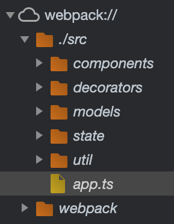

## Day11 - TypeScript & Webpack

#### I. [What is webpack and why?](#p1)

#### II. [ Install & important dependencies](#p2)

#### III. [Add Entry & Output Configuration](#p3)

#### IV. [Add TypeScript Support with "ts-loader"](#p4)

#### V. [Use "webpack-dev-server"](#p5)

#### VI. [add Production Workflow](#p6)

#### VII. [References & Useful Links](#p7)

<div id="p1" />

### I. What is webpack and why?

What is [webpack](https://webpack.js.org/)?

- a bundling & "build Orchestration" Tool

| "normal" setup                               | with Webpack                          |
| -------------------------------------------- | ------------------------------------- |
| multiple .ts files & imports (http requests) | code bundles, less imports required   |
| unoptimized code (not as small as possible)  | optimized code, less code to download |
| "external" development server needed         | more build steps can be added easily  |

<div id="p2" />

### II. Install & important dependencies

**Docs:**
[webpack - get started](https://webpack.js.org/guides/getting-started/)
[webpack- TS](https://webpack.js.org/guides/typescript/)

**Basic setup:**

```bash
npm install --save-dev webpack webpack-cli webpack-dev-server
npm install --save-dev typescript ts-loader
```

Dependencies:

- "webpack": output one bundle file
- "webpack-cli" - run webpack command in projects
- "[webpack-dev-server](https://github.com/webpack/webpack-dev-server#readme)": to have built in **development server,** which starts Webpack under the hood, which watches our files for changes, automatically triggers webpage to recompile when something changes and which then also serves our page.
- "[ts-loader](https://github.com/TypeStrong/ts-loader)": a package to tells Webpack how to convert Typescript code to JavaScript.

<div id="p3" />

### III. Add Entry & Output Configuration

#### 3.1 create the "webpack.config.js" file

it uses node.js features in this configuration file, and this exported config object will **be automatically picked up by Webpack** to work with.

#### 3.2 add the "[Entry](https://webpack.js.org/concepts/#entry)"

Define an entry, which is **the root entry file for your project**.

**Syntax:**

```js
module.exports = {
  entry: "./src/app.ts"
  // ...
};
```

> Note: webpack will automatically look for the ".js" file, then we don't need to write the ".js" on the suffix of the imports.

Example:

```js
import Foo from "./components/Foo.js"; // WRONG
import Foo from "./components/Foo"; // CORRECT
```

#### 3.2 add the "[Output](https://webpack.js.org/concepts/#output)"

The **output** property tells webpack where to emit the _bundles_ it creates and how to name these files. It defaults to `./dist/main.js` for the main output file and to the `./dist` folder for any other generated file.

**Syntax:**

```js
module.exports = {
  output: {
    filename: "bundle.js",
    path: path.resolve(__dirname, "dist")
  }
};
```

**Explanation:**

- `output.filename` : the name of our bundle
- `output.path` : where we want it to be emitted to, and webpack wants the **absolute path**, then we use node.js "path" module.
  ```js
  const path = require("path");
  ```

<div id="p4" />

### IV. Add TypeScript Support with "ts-loader"

**4.1 Syntax:**

```js
module: {
	rules: [
		{
			test: /\.ts$/,
			use:  'ts-loader',
			exclude: /node_modules/
		}
	]
},
```

#### 4.2 resolve ".ts" extension files

Additional "resolve' field config, to tell webpack which files extension it should look up, here we wanna **both ".ts" and ".js"**, since by **default it's set to only ".js"** files.

```js
resolve: {
  extensions: [".ts", ".js"];
}
```

#### 4.3 sourceMap tool in Webpack

Additional: enable **Webpack also support "sourceMap" in TS**, even though we have bundled files, also let webpack know the generated sourceMaps mapping to JS file in the bundle.

```js
module.exports = {
  // ...
  devtool: "inline-source-map"
};
```

**Usage:**

```js
<script type="module" src="dist/bundle.js"></script>
```

Result in browser: we can debug and add break points in browser.



<div id="p5" />

### V. [Use "webpack-dev-server"](https://webpack.js.org/guides/development/#using-webpack-dev-server)

In the past, we use some other packages to host on server site, for example:

```json
"scripts": {
	"start": "lite-server",
}
```

Add npm script to the `package.json` file:

```js
"scripts": {
	"start": "webpack-dev-server",
}
```

**Issue:**
the bundle.js is not generated to the disk, but it's in memory. Just tell webpack where to find our public assets (the bundled.js).

> **WARNING**: webpack-dev-server doesn't write any output files after compiling. Instead, it keeps bundle files in memory and serves them as if they were real files mounted at the server's root path. If your page expects to find the bundle files on a different path, you can change this with the [`publicPath`](https://webpack.js.org/configuration/dev-server/#devserverpublicpath-) option in the dev server's configuration.

**Fix: in webpack.config.js**

```js
output: {
	// ...
	publicPath:  'dist'
},
```

<div id="p6" />

### VI. add Production Workflow

#### 6.1. Create a file: "webpack.config.prod.js"

- use [development mode](https://webpack.js.org/configuration/mode/#mode-development)
- NOT need "devtool" config
- add "plugins":
  - "[clean-webpack-plugin](https://github.com/johnagan/clean-webpack-plugin)" : we wanna **clean up** dist folder whenever re-build our project
    Config:
    ```js
    const CleanPlugin = require("clean-webpack-plugin");
    module.exports = {
      // ...
      plugins: [new CleanPlugin.CleanWebpackPlugin()]
    };
    ```

#### 6.2 npm build for production

We need to webpack to build and create a bundle.js file for production use.

```js
"scripts": {
	// ...
	"build": "webpack --config webpack.config.prod.js"
},
```

<div id="p7" />

### VII. References & Useful Links

- Official Webpack Docs: [https://webpack.js.org/](https://webpack.js.org/)
