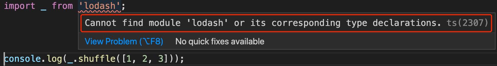

## Day12 - Third Party Libraries & TypeScript

#### I. [Use JavaScript Libraries with TypeScript](#p1)

#### II. [Using "declare" as a "Last Resort"](#p2)

#### III. [No Types Needed: "class-transformer" - for JavaScript](#p3)

#### IV. [use "class-validator" for TypeScript](#p4)

<div id="p1" />

### I. Use JavaScript Libraries with TypeScript

#### 1.1 Example: lodash library

**Docs:** [lodash - github](https://github.com/lodash/lodash), [lodash-docs](https://lodash.com/)

**Installation:**

```js
$ npm i -g npm
$ npm i --save lodash
```

**Syntax:**

```js
import _ from "lodash";
console.log(_.shuffle([1, 2, 3]));
```

**Error:**
it's a library for JS, and when we import it in `.ts` file, TS don't know where it's imported.



**Fix:**
use "[@types/lodash](https://github.com/DefinitelyTyped/DefinitelyTyped#readme)" library.
It's a plain translation from JS to TS for these types.
After installed this helper npm package, the error is gone.

#### 1.2 Example: Jquery library

Another helper translation tools for JS into TS: [@types/jquery](https://www.npmjs.com/package/@types/jquery)

<div id="p2" />

### II. Using "declare" as a "Last Resort"

**Use case:**
when some global scripts in HTML file:

```html
<body>
  <script>
    var GLOBAL = "Hi there!";
  </script>
</body>
```

**Syntax in TS:**

```js
declare var GLOBAL: any;
console.log(GLOBAL);
```

**Docs:**

- [Working with Other JavaScript Libraries in TS](https://www.typescriptlang.org/docs/handbook/namespaces.html#working-with-other-javascript-libraries)
- [Purpose of declare keyword in TS - stackoverflow](https://stackoverflow.com/questions/43335962/purpose-of-declare-keyword-in-typescript)

Common use case: You add a reference to your web page to a JavaScript file that the compiler knows nothing about.

<div id="p3" />

### III. No Types Needed: "class-transformer" - for JavaScript

#### 3.1 Use-case

when we fetch data from server side, we need manually map the data to our real class & type,
for example:

```js
const products = [
  { title: "A Carpet", price: 29.99 },
  { title: "A Book", price: 10.99 }
];
const loadedProducts = products.map((prod) => {
  return new Product(prod.title, prod.price);
});
```

#### 3.2 Fix: use ["class-transformer"](https://github.com/typestack/class-transformer) package

**Install:**

```bash
npm install class-transformer --save
npm install reflect-metadata --save
```

**Usage:**

```js
import "reflect-metadata";
import { plainToClass } from "class-transformer";
const products = [
  { title: "A Carpet", price: 29.99 },
  { title: "A Book", price: 10.99 }
];
const loadedProducts = plainToClass(Product, products);
```

<div id="p4" />

### IV. ["class-validator"](https://github.com/typestack/class-validator) - for TypeScript

**Install:**

```bash
npm install class-validator --save
```

**Usage**:

```js
import { IsNotEmpty, IsNumber, IsPositive } from "class-validator";

export class Product {
  @IsNotEmpty()
  title: string;
  @IsNumber()
  @IsPositive()
  price: number;
  constructor(t: string, p: number) {
    this.title = t;
    this.price = p;
  }
  getInformation() {
    return [this.title, `$${this.price}`];
  }
}
```

> Note: do NOT forget to enable the { "experimentalDecorators": true } in "tsconfig.json" file to use this decorator feature in TypeScript.

**Apply on the concrete instance of the class:**

```js
import { validate } from "class-validator";

const newProd = new Product("", -5.99);
validate(newProd).then((errors) => {
  // always go to then() block
  if (errors.length > 0) {
    console.log("VALIDATION ERRORS!");
  } else {
    console.log(newProd.getInformation());
  }
});
```
