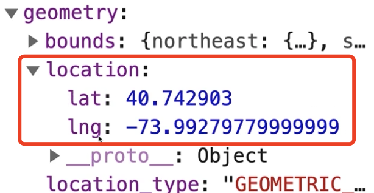

## Day13 - Project - render a Map (Google Maps)

#### I. [Basic Project Setup](#p1)

#### II. [Get User Input](#p2)

#### III. [Setup Google API Key](#p3)

#### IV. [ use "axios" to send HTTP request](#p4)

#### V. [Render a Map with Google Maps (with Types)](#p5)

#### VI. [Working with Google Maps - Free Tools](#p6)

#### VII. [Useful Resources & Links](#p7)

<div id="p1" />

### I. Use JavaScript Libraries with TypeScript

#### 1.1 set up HTML

```html
<body>
  <div id="map">
    <p>Please enter an address!</p>
  </div>
  <form>
    <input type="text" id="address" />
    <button type="submit">SEARCH ADDRESS</button>
  </form>
</body>
```

#### 1.2 Basic UI Result


<div id="p2" />

### II. Get User Input

> Note: here need to call "event.preventDefault()" to stop submit the form, then do our own logic here.

```js
const  form = document.querySelector("form")!;
const  addressInput = document.getElementById("address")! as  HTMLInputElement;
function  searchAddressHandler(event: Event) {
	event.preventDefault();
	// TODO
}
form.addEventListener("submit", searchAddressHandler);
```

<div id="p3" />

### III. Setup Google API Key

**Docs:** [Google Geocoding API](https://developers.google.com/maps/documentation/geocoding/overview)

A Geocoding API request takes the following form:

```
https://maps.googleapis.com/maps/api/geocode/outputFormat?parameters
```

<div id="p4" />

### IV. use "axios" to send HTTP request

Many options:

- fetch api
- **[axios](https://github.com/axios/axios)** - very popular

**4.1 Install:**

```batch
npm install axios
```

**4.2 Usage:**
there is already built in TS translation support, then we can **use TS in "axios" directly.**
Usage in "axios" HTTP request:

```js
import axios from "axios";
axios
  .get(url)
  .then((response) => {
    // TODO
  })
  .catch((err) => {
    // TODO
  });
```

> Note: string param in URL: "[encodeURI()](https://developer.mozilla.org/en-US/docs/Web/JavaScript/Reference/Global_Objects/encodeURI)" - transform string to be a URL compatible string,representing the [UTF-8](https://developer.mozilla.org/en-US/docs/Glossary/UTF-8) encoding of the characters.

**4.3 Handle Location Data in Response**
"get()" is a generic method, we can add Type here:

```js
axios
.get<{results: { geometry: { location: { lat: number; lng: number } } }[]}>(url);
```

**Improved Response Type in TS:**

```js
type GoogleGeocodingResponse = {
  results: { geometry: { location: { lat: number, lng: number } } }[],
  status: "OK" | "ZERO_RESULTS"
};
axios.get < GoogleGeocodingResponse > url;
```

**Handle Response data:**

```js
then((response) => {
  const locCoordinates = response.data.results[0].geometry.location;
});
```



<div id="p5" />

### V. Render a Map with Google Maps (with Types)

**Docs:** [google JS maps](https://developers.google.com/maps/documentation/javascript/overview#maps_map_simple-javascript), [Eg: Integrate Google Map API in HTML](https://jialihan.github.io/blog/#/html_css/googlemap)
Usage:

```js
const map = new google.maps.Map(document.getElementById("map"), {
  center: coordinates,
  zoom: 16
});
```

**Fix TS issue:**
Solution 1: use "declare"

```js
declare var google: any;
```

Solution 2: [create a Marker - TS](https://developers.google.com/maps/documentation/javascript/adding-a-google-map)

```js
new google.maps.Marker({ position: coordinates, map: map });
```

**GoogleMap Types Support - 3rd library:**

- [@types/googlemaps](https://www.npmjs.com/package/@types/googlemaps)
  ```bash
  npm install --save @types/googlemaps
  ```

<div id="p6" />

### VI. Working with Google Maps Free Tools

Using Google Maps unfortunately requires a credit card, even though you got a generous free tier which you very likely wouldn't exceed.

If you got no credit card, you can look into OpenLayers as an alternative (here's how to render a map with it: [https://openlayers.org/en/latest/doc/quickstart.html](https://openlayers.org/en/latest/doc/quickstart.html)).

<div id="p7" />

### VII. Useful Resources & Links

- Google Maps Pricing: [https://cloud.google.com/maps-platform/pricing/sheet/](https://cloud.google.com/maps-platform/pricing/sheet/)
- Google Geocoding API: [https://developers.google.com/maps/documentation/geocoding/start](https://developers.google.com/maps/documentation/geocoding/start)
- Google Maps JS SDK: [https://developers.google.com/maps/documentation/javascript/tutorial](https://developers.google.com/maps/documentation/javascript/tutorial)
