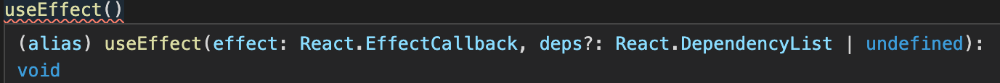
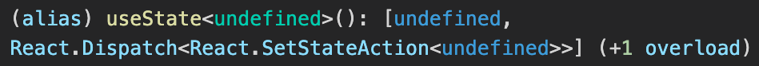

## Day14 - React and TypeScript

#### I. [Setup React and TypeScript in Project](#p1)

#### II. [How do React and TS work together?](#p2)

#### III. [Props and Types for Props](#p3)

#### IV. [ Get user input with "refs"](#p4)

#### V. [Work with State and Types](#p5)

#### VI. [ Types for other React Features (eg: Redux or Router)](#p6)

#### VII. [Useful Resources & Links](#p7)

<div id="p1" />

### I. Setup React and TypeScript in Project

**Docs:** [create react app - add TypeScript](https://create-react-app.dev/docs/adding-typescript/)

#### 1.1 Install

To start a **new** Create React App project with [TypeScript](https://www.typescriptlang.org/), you can run:

```bash
npx create-react-app my-app --template typescript
```

Or add TS to an existing react project:

```bash
npm install --save typescript @types/node @types/react @types/react-dom @types/jest
```

#### 1.2 React Project with TS

**File:** `.tsx` file instead of `.jsx` in the past

**Simple "App.tsx" Example code:**

```js
import React from "react";

const App: React.FC = () => {
  return <div className="App"></div>;
};
export default App;
```

<div id="p2" />

### II. How do React and TS work together?

we have the "[@types/react](https://www.npmjs.com/package/@types/react)" in our "node_modules" folder, and we can use those already imported types in React.
For example:

```js
// types
React.FunctionComponent;
React.FC;
React.ClassicComponent;
```

<div id="p3" />

### III. Props and Types for Props

Add types for props for the component, for example:

```js
interface TodoListProps {
  items: { id: string, text: string }[];
}
```

This means that the props due to the "TodoListProps" interface:

```js
const  TodoList: React.FC<TodoListProps> = props  => {
	return (...);
};
```

<div id="p4" />

### IV. Get user input with "refs"

**Code Example:** [`useRef()`](https://reactjs.org/docs/hooks-reference.html#useref)

```js
import React, { useRef } from "react";
const textInputRef = useRef < HTMLInputElement > null;
<input type="text" id="todo-text" ref={textInputRef} />;
```

**Usage:** get input value from the "ref"

```js
const  value = textInputRef.current!.value;
```

<div id="p5" />

### V. Work with State and Types

**Simple** type:

```js
const [name, setName] = useState < string > null;
```

More **complicated** types in state:

```js
interface Todo {
	id: string;
	text: string;
}
const [todos, setTodos] = useState<Todo[]>([]);
```

**Tip & Note:**
when pass the "handler function" to the component, but it need to be called with the delete_ID, use `bind()` to preset the ID param in the UI element part.

```js
<button  onClick={props.onDeleteTodo.bind(null, todo.id)}>
```

<div id="p6" />

### VI. Types for other React Features (eg: Redux or Router)

Example:

- "useEffect()" types in param
  
- "useState()" types in param
  

**Docs:**

- "redux": [Usage with TypeScript](https://redux.js.org/recipes/usage-with-typescript)
- "react-router": a helper package: "[@types/react-router-dom](https://www.npmjs.com/package/@types/react-router-dom)"

<div id="p7" />

### VII. Useful Resources & Links

- Official React Docs: [https://reactjs.org/docs/getting-started.html](https://reactjs.org/docs/getting-started.html)
- More React Resources: [https://academind.com/learn/react/](https://academind.com/learn/react/)
- create-react-app + TypeScript Docs: [https://create-react-app.dev/docs/adding-typescript/](https://create-react-app.dev/docs/adding-typescript/)
