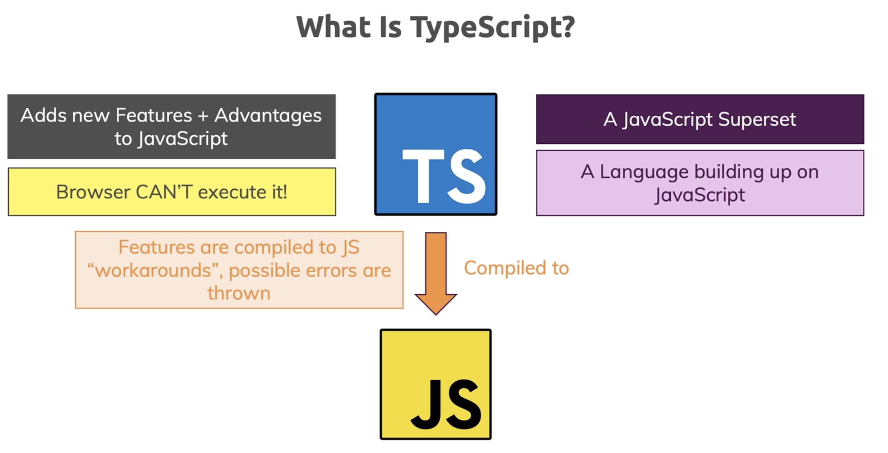
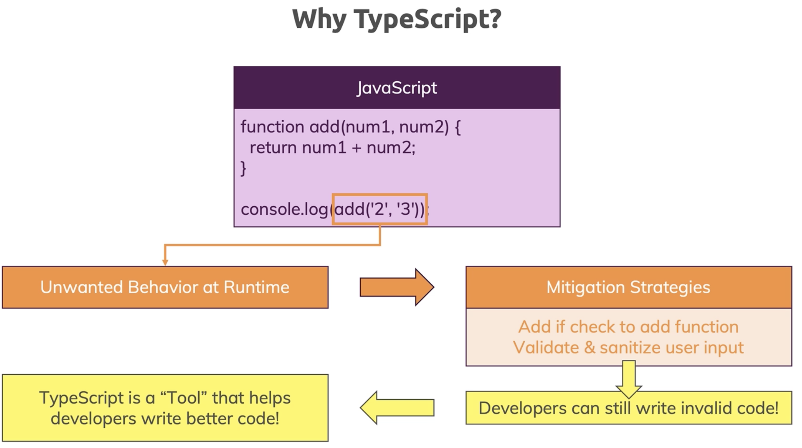
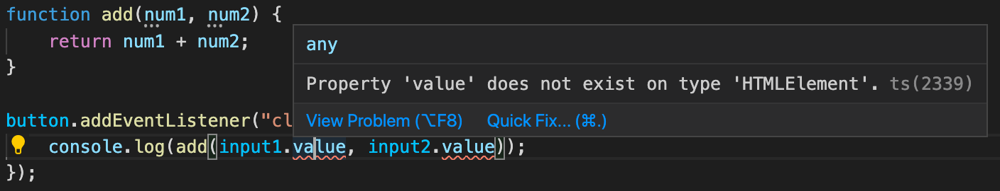
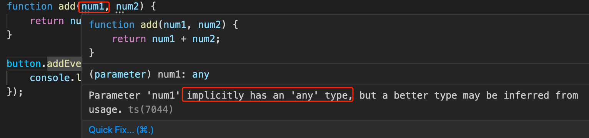

## TypeScript Day1 - Getting Started

#### I. [What is Typescript and Why use it ?](#p1)

- [1.1 JS solution to mitigate type errors](#p1-1)
- [1.2 TS automatically check type errors](#p1-2)
- [1.3 Compile TS file into JS file](#p1-3)

#### II. [Advantages of TS](#p2)

#### III. [setup VSCode extensions](#p3)

#### IV. [setup NPM project - running on local server](#p4)

<div id="p1" />

### I. What is Typescript and Why use it ?



**Why typescript ?**

For example:


**Code compare in ts and js:**

<div id="p1-1" />

#### 1.1 JS solution to mitigate this issue by type checking:

```js
function add(num1, num2) {
  if (typeof num1 === "number" && typeof num2 === "number") {
    return num1 + num2;
  } else {
    return +num1 + +num2;
  }
}
```

<div id="p1-2" />

#### 1.2 Typescript file automatically checks the typs

**Error 1:** Not every HTML element has the `value` attribute



**Fix it:**

```js
const  input1 = document.getElementById("num1")! as  HTMLInputElement;
const  input2 = document.getElementById("num2")! as  HTMLInputElement;
```

**Notes:** [! mark - Non-null assertion operator](https://stackoverflow.com/questions/42273853/in-typescript-what-is-the-exclamation-mark-bang-operator-when-dereferenci)

> A new ! post-fix expression operator may be used to assert that its operand is non-null and non-undefined in contexts where the type checker is unable to conclude that fact. Specifically, the operation x! produces a value of the type of x with null and undefined excluded.

**Error 2:** argument need an type



Fix:

```js
function add(num1: number, num2: number) {
  return num1 + num2;
}
button.addEventListener("click", function () {
  console.log(add(+input1.value, +input2.value)); // toNumber()
});
```

<div id="p1-3" />

#### 1.3 compile the TS file into JS file

Compile into js file:

```bash
tsc using-ts.ts
```

Use it in HTML:
**Always import JS file in HTML!**

```html
<script src="using-ts.js" defer></script>
```

<div id="p2" />

### II. Advantages

- have Types !
- have next-gen JS feature, which also can be compiled down for older browsers, similar like babel's capability
- Non-JS features like interface or Generics
- Meta-Programming features like decorators
- Rich Configuration Options
- Modern tooling that helps even in NON-TypeScript Project

<div id="p3" />

### III. setup VSCode extensions

- ESLint
- TSLint - in future, it will be included in ESLint
- Path Intellisense
- Material Icon Theme
- Prettier - Preferences -> keyboard shortcuts -> search `Format Document`

<div id="p4" />

### IV. setup NPM project - running on local server

#### 4.1 init the NPM project

```bash
npm init -y
```

#### 4.2 [install lite-server](https://www.npmjs.com/package/lite-server)

```bash
npm install --save-dev lite-server
```

#### 4.3. Add npm start script

in `package.json` file, add the script:

```json
"scripts": {
	"start": "lite-server"
}
```

How to refresh page with new changes?

- run `npm start` to host on local
- changes in `.ts` file
- run compile command: `tsc app.ts`
- refresh page, it will show the new changes on browser
