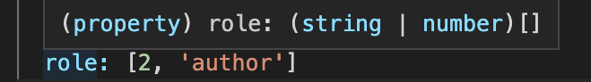

## TypeScript Day2 - Basics and Basic Types

#### I. [Core Types - JS & TS both support](#p1)

#### II. [TS types vs. JS types](#p2)

#### III. [Type Casing - primitives](#p3)

#### IV. [Type Assignment & Type Inference](#p4)

#### V. [Object Types](#p5)

#### VI. [Array Types](#p6)

#### VII. [Working with Tuples](#p7)

#### VIII. [Enum in JS](#p8)

#### IX. [Any](#p9)

#### X. [Union Types](#p10)

#### XI. [Literal Types](#p11)

#### XII. [Type Aliases / Custom Types](#p12)

#### XIII. [Function Types](#p13)

- [Function Return types and "void"](#p13-1)
- [Function as Types](#p13-2)
- [Function Types and callbacks](#p13-3)

#### XIV. [The "unknown" Type](#p14)

#### XV. [The "never" Type](#p15)

- [15.1 What is "never" type?](#p15-1)
- [15.2 "void" vs. "never" in throwable functions](#p15-2)

<div id="p1" />

### I. Core Types - JS & TS both support

| types   | examples               | description                                                        |
| ------- | ---------------------- | ------------------------------------------------------------------ |
| number  | 1, 1.1, -10            | All numbers, no differentiation between integers or floats         |
| string  | 'Hi', "Hi", `` `Hi` `` | All text values                                                    |
| boolean | true, false            | just these two, NO "truthy" or "falsy" values                      |
| object  | { age: 18 }            | JS object, more specific types (type of object) are possible       |
| array   | [1, 2, 3]              | JS array, type can be flexible or strict(due to the element types) |

**New Types Only in TS:**

| types | examples          | description                                                               |
| ----- | ----------------- | ------------------------------------------------------------------------- |
| Tuple | [1, 2]            | Added by TypeScript: fixed-length array                                   |
| Enum  | enum { NEW, OLD } | Added by Typescript: automatically enumerated global constant identifiers |
| Any   | \*                | Any kind of value, no specific type assignment                            |

<div id="p2" />

### II. TS types vs. JS types

#### 2.1 TS check erros in Compile time, NOT Runtime

For example:

```js
function add(n1: number, n2: number) {
  return n1 + n2;
}
const number1 = "5"; // wrong
const number2 = 2.8;
const result = add(number1, number2);
console.log(result);
```


**Fix:**

```js
// const  number1 = "5"; // wrong
const number1 = 5;
```

#### 2.2 JS throw error in Runtime

**JS** is dynamically typed ! it might be a number, but we can change it to be a string.
**TS** is statically typed, it's defined in development, it doesn't suddenly change.

- some error can avoid in dev time, earlier
- TS knows more types than JS, runtime checking is NOT flexible in JS.

```js
function add(n1: number, n2: number) {
  if (typeof n1 !== "number" || typeof n2 !== "number") {
    throw new Error("Incorrect input!");
  }
  return n1 + n2;
}
```

#### 2.3 working with number, string and boolean

For example: more types

```js
function add(n1: number, n2: number, showResult: boolean, phrase: string) {}
```

<div id="p3" />

### III. Type Casing - primitives

In TypeScript, you work with types like `string` or `number` all the times.

**Important**: It is `string` and `number` (etc.), **NOT** `String`, `Number` etc.

**The core primitive types in TypeScript are all lowercase!**

Example: [difference string primitives and String object](https://developer.mozilla.org/en-US/docs/Web/JavaScript/Reference/Global_Objects/String#string_primitives_and_string_objects)

- string - type is **'string'**
- new String(...) - type is **'object'**

<div id="p4" />

### IV. Type Assignment & Type Inference

#### 4.1 Type Assignment

the syntax is use the `:` sign with the following types

```js
let num1: number;
let s: string;
let isValid: boolean;
```

#### 4.2 [Type Inference](https://www.typescriptlang.org/docs/handbook/type-inference.html)

TS knows and can read the type information from its initial value's type when **NO explicit type** annotation assigned.

For example:

```js
const num = 1.0; // type is number, and it never changes.
let str = "hello"; // type is string
```

**Bad Practice:**
Since TS can get the type info from **type inference** in the initial value.

```js
let x = 3; // GOOD
let x: number = 3; // BAD
```

#### 4.3 Error examples in type assignment

When it's already assigned a type to the variable, you cannot change the var to another type in future code.

**Example 1:**

```js
let s = "hello";
s = 5.0; // WRONG !!!
```

Error:

```text
error TS2322: Type 'number' is not assignable to type 'string'.
```

**Example 2:**

```js
let s: string;
s = 5.0; // WRONG !!!
```

Error:

```text
error TS2322: Type 'number' is not assignable to type 'string'.
```

<div id="p5" />

### V. Object Types

#### 5.1 TS can check property NOT existed in object

For example: the following error when access NOT existed prop:

```js
const person = {
  name: "Maximilian",
  age: 30
};
console.log(person.nickName); // undefined
```


#### 5.2 Object has types

NOT K-V pairs, but something like this:


Even though we assign the object with the generic type `object`, TS still can check the property error in detail.


Or we assign the empty type: `{}`, still has an error:


#### 5.3 TS detailed object type

```js
const person2: {
  name: string,
  age: number
} = {
  name: "Maximilian",
  age: 30
};
```

Nested Objects Example:
Of course object types can also be created for **nested objects**.

Let's say you have this JavaScript **object**:

```js
const product = {
  id: "abc1",
  price: 12.99,
  tags: ["great-offer", "hot-and-new"],
  details: {
    title: "Red Carpet",
    description: "A great carpet - almost brand-new!"
  }
};
```

This would be the **type** of such an **object**:

```
{
   id:  string;
   price: number;
   tags:  string[],
   details:  {
	   title:  string;
	   description:  string;
    }
 }
```

So you have an object type in an object type so to say.

<div id="p6" />

### VI. Array Types

#### 6.1 inferred array types in TS

Syntax: `string[]`

For example:


#### 6.2 Explicitly set a type on an array

For example:

```js
let nums: number[];
```

You will get an error when NOT matched type on element inside of the array, eg:

```js
let nums: number[];
nums = [1, "hello"];
```

Then the error will be:


 
<div id="p7" />

### VII. New Type in TS - Tuples

**Docs:**
[ts - Tuple](https://www.typescriptlang.org/docs/handbook/basic-types.html#tuple): an fixed length array

Example:

```js
role: [2, "author"];
```

#### 7.1 Inferred type

Then it's only made of two element, one is `number`, the second is `string`, and the **inferred type** is the following:



TS knows the tuple should an array of element with **string OR number**, then it's valid in the following code:

```js
// role: [2, 'author']
person.role[1] = 10;
```

#### 7.2 Explicit assigned types

`role` is an fixed array with length of 2, and the first element should be a `number`, the second element should be a `string`.

```js
const person: {
  role: [number, string]
} = {
  role: [2, "author"]
};
```

And now we cannot reassign other types which is not matched in that _special array(tuple)_ role anymore.

```js
person.role[1] = 10; // Wrong in TS
```

**Error in TS:**


#### 7.3 change the length of tuple

Reassgin the tuple into another length of array: Wrong !


But an special exception is using the `push()`, **TS canNOT detect this error** !

```js
person.role.push("hello");
```

<div id="p8" />

### VIII. [Enum](https://www.typescriptlang.org/docs/handbook/enums.html) in TS

Enum: these are human readable labels/identifiers in our code.

**8.1 Enum pattern in JavaScript**

```js
// .js
const  ADMIN = 0;
const  READ_ONLY = 1;
const  AUTHOR = 2;
const person = {
	role: ADMIN;
};
```

**8.2 Enum in TypeScript**
it's more easier in TS, use keyword `enum`.
If we wanted, we could leave off the initializers entirely empty.
This auto-incrementing behavior is useful for cases where we might not care about the member values themselves, but do care that each value is distinct from other values in the same enum.

```js
// .ts
enum  Role { ADMIN, READ_ONLY, AUTHOR }; // compiles to value 0, 1, 2
// compiled .js
var  Role;
(function (Role) {
Role[Role["ADMIN"] = 0] = "ADMIN";
Role[Role["READ_ONLY"] = 1] = "READ_ONLY";
Role[Role["AUTHOR"] = 2] = "AUTHOR";
})(Role || (Role = {}));
```

**Example: started with some initial value at the first one**
we have a numeric enum where `ADMIN` is initialized with `5`. All of the following members are auto-incremented from that point on, that means following with `6,7` on later ones.

```js
// .ts
enum  Role { ADMIN=5, READ_ONLY, AUTHOR }; // compiles to value 5, 6, 7
// .js
var  Role;
(function (Role) {
Role[Role["ADMIN"] = 5] = "ADMIN";
Role[Role["READ_ONLY"] = 6] = "READ_ONLY";
Role[Role["AUTHOR"] = 7] = "AUTHOR";
})(Role || (Role = {}));
```

**Example: set some value in the middle enum**
When we assign a value in the `middle` part of the enums, auto-increasing rules are:

- begin at index `0`, increasing sequentially from `0, 1,2,....` before the middle index
- After the middle index, increasing value is **changed and based on the middle value**, then increase from `mid_value, mid_value+1, mid_value+2....`

Eg: compiled value list will be `[0, 5, 6]`.

```js
// .ts
enum  Role { ADMIN, READ_WRITE, WRITE_ONLY, READ_ONLY = 2, AUTHOR }; // compiles to value 0, 1, 2, 2, 3
// .js
var  Role;
(function (Role) {
Role[Role["ADMIN"] = 0] = "ADMIN";
Role[Role["READ_WRITE"] = 1] = "READ_WRITE";
Role[Role["WRITE_ONLY"] = 2] = "WRITE_ONLY";
Role[Role["READ_ONLY"] = 2] = "READ_ONLY"; // intital set value
Role[Role["AUTHOR"] = 3] = "AUTHOR";
})(Role || (Role = {}));
```

<div id="p9" />

### IX. Any type

It's the most flexible type, it doesn't tell TS anything. It won't cause any type checking errrors.
[doc - any](https://www.typescriptlang.org/docs/handbook/2/everyday-types.html#any)

For example:

```js
let test: any;
test = 5; // Correcy
let test1: any[];
test1 = 5; // TS ERROR !
test1 = [5]; // Correct
```

<div id="p10" />

### X. Union Types

**Simple One type example:**

```js
function combine(input1: number, input2: number) {
  const result = input1 + input2;
  return result;
}
```

**Union Type Use-Case:**
when we want multi types on arguments, eg: `number` OR `string`, then we use this [union type](https://www.typescriptlang.org/docs/handbook/unions-and-intersections.html#union-types) expression `|` sign:

```js
function combine(input1: number | string, input2: number | string) {
  let result;
  if (typeof input1 === "number" && typeof input2 === "number") {
    result = input1 + input2;
  } else {
    result = input1.toString() + input2.toString();
  }
  return result;
}
```

<div id="p11" />

### XI. Literal Types

**Doc:** [literal types](https://www.typescriptlang.org/docs/handbook/literal-types.html)

#### 11.1 Single Example to understand

define the literal type for the 3rd argument of the function:

```js
function combine(
  input1: number | string,
  input2: number | string,
  resultConversion: string // then you can pass any string as value here
) {
  if (resultConversion === "as-text") {
  } else {
  }
}
```

**How to use it?**
Since here we allow any string type for the 3rd argument, then we can call this function like:

```js
combine(10, 2, "as-text");
combine(10, 2, "as-number");
```

**More** about allowed values for literal types:
you can also **limit** the values to a set of already defined values:

```js
function combine(
  input1: number | string,
  input2: number | string,
  resultConversion: "as-number" | "as-text" // given some specific value options
) {}

// Usage
combine(10, 2, "as-text"); // Correct
combine(10, 2, "as-boolean"); // Error in TS, this literal value is not allowed
```

#### 11.2 There are three sets of literal types in TS

A literal is a more concrete sub-type of a collective type. What this means is that `"Hello World"` is a `string`, but a `string` is not `"Hello World"` inside the type system.

There are three sets of literal types available in TypeScript today: strings, numbers, and booleans; by using literal types you can allow an exact value which a string, number, or boolean must have.

- String literal types
- Number literal types
- [Boolean literal types](https://www.typescriptlang.org/docs/handbook/literal-types.html#boolean-literal-types)

References: [More Literal types](https://mariusschulz.com/blog/more-literal-types-in-typescript#boolean-literal-types), [Official Docs in TS](https://www.typescriptlang.org/docs/handbook/literal-types.html)

**For example:**

```js
// string
type Easing = "ease-in" | "ease-out" | "ease-in-out";
// number
type Sizing = 8 | 16 | 32;
// boolean
type Valid = true | false;
```

<div id="p12" />

### XII. Type Aliases / Custom Types

#### 12.1 defined your type aliases / custom types

- type keyword is **NOT in JS**
- **type keyword** is used for ["type aliases"](https://www.typescriptlang.org/docs/handbook/2/everyday-types.html#type-aliases)
  `js type Combinable = number | string; type ConversionDescriptor = 'as-number' | 'as-text'; `
  Referenced doc: [What is the “type” reserved word in TypeScript?](https://stackoverflow.com/questions/31364693/what-is-the-type-reserved-word-in-typescript)

#### 12.2 Usage

```js
function combine(
  input1: Combinable,
  input2: Combinable,
  resultConversion: ConversionDescriptor
) {}
```

#### 12.3 More complex - [Object Types](https://www.typescriptlang.org/docs/handbook/2/everyday-types.html#object-types)

_Type aliases_ can be used to _"create"_ your own types. You're not limited to storing union types though - you can also provide an alias to a **(possibly complex) object type**.

**For example:**

```js
type User = { name: string, age: number };
const u1: User = { name: "Max", age: 30 }; // this works!
```

This allows you to avoid unnecessary repetition and manage types centrally.

**For example, you can simplify this code:**
**From:**

```js
function greet(user: { name: string, age: number }) {
  console.log("Hi, I am " + user.name);
}
```

**To:**

```js
type User = { name: string, age: number };
function greet(user: User) {
  console.log("Hi, I am " + user.name);
}
```

**Quiz:**


<br>


<div id="p13" />

### XIII. Function Types

<div id="p13-1" />

#### 13.1 Function Return types and "void"

- **inferred** return type of function
  ```js
  function add(n1: number, n2: number) {
    return n1 + n2; // inferred return type of "number"
  }
  function printResult(num: number) {
    // inferred return type of "void"
    console.log("Result: " + num);
  }
  ```
- **explicit** assigned return type of function
  ```js
  function add(n1: number, n2: number): number {
    return n1 + n2;
  }
  function printResult(num: number): void {
    console.log("Result: " + num);
  }
  ```

**Weird example: "void" vs. "undefined"**

- `void` in TS : when NO return line and nothing is returned.
- `undefined` in JS : it's just a value, eg: `let num = undefined; `
- `undefined` in TS : In [Typescript 2](https://www.typescriptlang.org/docs/handbook/release-notes/typescript-2-0.html) you can use Undefined type to check for undefined values. [stackoverflow - link](https://www.typescriptlang.org/docs/handbook/release-notes/typescript-2-0.html)
  This is really weird and special example:
  ```js
  function weirdExampleInTS(num: number): undefined {
    console.log("Result: " + num);
    return; // because of this additional useless line
  }
  ```

<div id="p13-2" />

#### 13.2 Function as Types

**Docs**: [write the function type](https://www.typescriptlang.org/docs/handbook/functions.html#writing-the-function-type)
"**Function**" itself as a type provided by TS, and we even could have **more precise declaration** how the function should look like.
Simple example:

```js
let combineValues0: Function;
```

Well-defined function structure type with **arrow function**:

```js
let combineValues1: () => number;
let combineValues2: (a: number, b: number) => number;
```

<div id="p13-3" />

#### 13.3 Function Types and Callbacks

The advantage of us defining the callback function here is:

- Inside of the function, we pass in is a _callback_, TS is able to infer that result will be a number, and hence you could do anything with result here.
  ```js
  function addAndHandle(n1: number, n2: number, cb: (num: number) => void) {
    const result = n1 + n2;
    cb(result);
  }
  ```
- we didn't need explicitly defining when we really use/call this function, and pass the callback
  ```js
  addAndHandle(10, 20, (result) => {
    // NOT need type definition here for "result"
    console.log(result);
  });
  ```
  Error usage example 1:
  ```js
  addAndHandle(10, 20, (result, a, b) => {
    // ERROR: a, b is not defined in callback function as arguments
    console.log(result);
  });
  ```
  Special **"void"** return type in callbacks: we ignore / not care about the return type:
  ```js
  // cb: (num: number) =>  void
  addAndHandle(10, 20, (result) => {
    console.log(result);
    return result + 1; // Correct
  });
  ```

<div id="p14" />

### XIV. The "unknown" Type

**Doc:** [unknown - TS2.0](https://www.typescriptlang.org/docs/handbook/2/functions.html#unknown)

#### 14.1 Syntax and Usage

```js
let userInput0: any; // similar but different from "unknown"
let userInput: unknown;
let userName: string;
userInput = "Alice";
```

**Error Example:**

```js
// Error:
userName = userInput; // unknown cannot assign to string
```

**Fix:** manually check the type of userInput (unknown)

```js
// fix
if (typeof userInput === "string") {
  userName = userInput;
}
```

#### 14.2 Another rule about unknown

This is similar to the `any` type, but is safer because it’s not legal to do anything with an `unknown` value:

```js
function f1(a: any) {
  a.b(); // OK
}
function f2(a: unknown) {
  a.b(); // ERROR: Object is of type 'unknown'.
}
```

<div id="p15" />

### XV. The ["never"](https://www.typescriptlang.org/docs/handbook/2/functions.html#never) Type

<div id="p15-1" />

#### 15.1 What is "never" type?

In a return type, this means that the function throws an exception or terminates execution of the program. Meaning: **(function) it never returns.**
For example:

```js
// throw exceptions
function fn1(): never {
  throw "Error!";
}
// code terminates
function fn2(): never {
  while (true) {}
}
```

<div id="p15-2" />

#### 15.2 "void" vs. "never" in throwable functions

- **inferred** type is **"void"**
- but you also can assign **both type "void" & "never" on exception/throwable functions**


