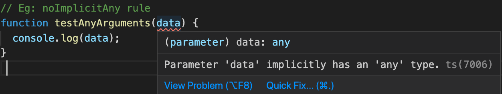

## TypeScript Day3 - Compiler and its Configuration

#### I. [Using Watch Mode](#p1)

#### II. [Compiling the Entire Project / Multiple Files](#p2)

#### III. [Including & Excluding Files](#p3)

#### IV. [Setting a Compilation Target](#p4)

#### V. [TypeScript Core Libs - compilation](#p5)

#### VI. [More Configs & Compile Options](#p6)

#### VII. [Working with Source Maps](#p7)

#### VIII. [rootDir and outDir](#p8)

#### IX. [other compile options: removeComments, noEmit, importHelpers](#p9)

#### X. [Stop Emitting files on Compilation Errors](#p10)

#### XI. [Script Compilation](#p11)

#### XII. [Additional rules for code quality](#p12)

#### XIII. [Debug Inside VSCode](#p13)

#### XIV. [Useful Resources & Links](#p14)

<div id="p1" />

### I. Using Watch Mode

Command:

```bash
tsc app.ts --watch
tsc app.ts -w
```

Disadvantages:

- still need to watch on that single file,

<div id="p2" />

### II. Compiling the Entire Project / Multiple Files

**Problem:**
When have multiple `.ts` files in project, eg:

```html
<script src="app.js" defer></script>
<script src="analytics.js" defer></script>
```

**Command:**
Run it as TS project, everything in this folder init as an TS project, it creates a `tsconfig.json` file to manage this project.

```
tsc --init
tsc  // compile once for any ts file can find in this project
tsc -w // watch mode for all ts files
tsc --watch // watch mode for all ts files
```

Notes: includes any sub folder's `.ts` file, all TS files in project.
The following is the folder structure after `tsc --init`:


**Official TS CLI docs:** [link](https://www.typescriptlang.org/docs/handbook/compiler-options.html)

<div id="p3" />

### III. Including & Excluding Files

In `tsconfig.json` file, we have another two options to control which files should be compiled or not.

- "exclude" : **node_modules** is default excluded.
- "include" : TS will only compile files in this section, if this keyword is set in `tsconfig.json`. So you have to include all your files to compile if you want to use **"include: []"** field.

For example:

```json
{
  "exclude": [
    "sub/app2.ts",
    "*.dev.ts", // any file that ended with dec.ts in any folder
    "node_modules" // automatically excluded as default setting
  ],
  "include": ["app.ts"]
}
```

#### "files" property vs "include property"

**Docs:** [TS - tsconfig.json](https://www.typescriptlang.org/docs/handbook/tsconfig-json.html#examples)

- specify which files you wanna compile. So, basically, `"files"` is used to **specify separate files** directly by their path, while `"include"` and `"exclude"` is used to target collections or groups of files or folders etc.
- stuff in "files" will **never be ruled out by "exclude"** patterns, if you add any, whereas stuff from "include" will.

<div id="p4" />

### IV. Setting a Compilation Target

```json
{
  "compilerOptions": {
    /* Basic Options */
    "target": "es5"
    // ...
  }
}
```

**For example:**

- es3 - more old JS
- es5
- es6 - modern browsers

<div id="p5" />

### V. TypeScript Core Libs - compilation

**Docs:** [tsconfig.json](https://www.typescriptlang.org/docs/handbook/tsconfig-json.html)
"lib" is an option that allows you to specify which **default objects and features** typescript notes.
Eg: like working with the DOM, let's say in integrated HTML, we have a button and on this button we say Click me.

#### 5.1 Default when "lib" is NOT set

- depends on the target compilation, eg: **ES6** will know the Map(), Symbol,.....
- And all DOM APIs are default included.

#### 5.2 When set the "lib" property

You have to manually set all you need, all the default setting goes away.
Eg:

```json
{
  "compilerOptions": {
    "lib": ["dom", "es6", "DOM.Iterable", "ScriptHost"]
  }
}
```

<div id="p6" />

### VI. More Configs & Compile Options

- "[allowJS](https://www.typescriptlang.org/tsconfig#allowJs)" : also allow JS files to be compiled
- "[checkJS](https://www.typescriptlang.org/tsconfig#checkJs)"

<div id="p7" />

### VII. Working with Source Maps

In `tsconfig.json`, compiler options, we can see this property.

- Docs: [link- source maps](https://www.typescriptlang.org/tsconfig#Source_Map_Options_6175)
- Output: `app.js.map`, TS will embed the source map content in the `.js` files.

```json
{
  "sourceMap": true /* Generates corresponding '.map' file. */
}
```

Advantages:
provide rich **debugging** in Dev Tools to `.ts` files, we can debug our TS files


<div id="p8" />

### VIII. rootDir and outDir

#### 8.1 outDir

**Docs:** [tsconfig.json - outDir](https://www.typescriptlang.org/tsconfig#outDir)

- all the js file output folder path
- it respects the original folder structure in "project folder" when run `tsc` command.

Example:

```json
{
  "compilerOptions": {
    "outDir": "dist"
  }
}
```

Folder structure:


#### 8.2 rootDir

**Docs:** [rootDir - tsconfig.json](https://www.typescriptlang.org/tsconfig#rootDir)
**Notes:**

- `rootDir` NOT affect which files become of the compilation. It has no interaction with the `include`, `exclude`, or `files` `tsconfig.json` settings.
- It only enforces the files under "rootDir" path to be output and emitted to the destination folder
- it respects the folder structure

**For example:**
TS file folder structure:

```text
MyProj
├── tsconfig.json
├── src
│   ├── analytics.ts
├── app.ts
```

After compile with `tsc`, and options are:

- "rootDir" = "./src"
- "outDir" = "./dist"

```text
MyProj
├── tsconfig.json
├── dist
│   ├── analytics.js
├── src
│   ├── analytics.ts
├── app.ts
├── app.js
```

Result:

- only rootDir files output in outDir
- other valid ts files still be compiled, eg: `app.js` still in project folder.

<div id="p9" />

### IX. other compile options: removeComments, noEmit, importHelpers

- "removeComments": true, /_ Do not emit comments to output. _/
- "noEmit": true, /_ Do not emit outputs. _/
- "importHelpers": true, /_ Import emit helpers from 'tslib'. _/

<div id="p10" />

### X. Stop Emitting files on Compilation Errors

**Docs:** ["noEmitOnError" - tsconfig.json](https://www.typescriptlang.org/tsconfig#noEmitOnError)

Default value is `false`:

```json
{
  "compilerOptions": {
    "onEmitOnError": false
  }
}
```

**Error Example:**


When we run `tsc` and compile, the `app.js` file **still output and emitted**, which might be an error in TS file.

**Fix:**

```json
"onEmitOnError" : true,
```

<div id="p11" />

### XI. Script Compilation

**Doc:** [strict compile mode](https://www.typescriptlang.org/tsconfig#strict)
If you set `"strict": true`, you will got all the following props set to **"true" by default.**

- "noImplicitAny": true, /_ Raise error on expressions and declarations with an implied 'any' type. _/
- "strictNullChecks": true, /_ Enable strict null checks. _/
- "strictFunctionTypes": true, /_ Enable strict checking of function types. _/
- "strictBindCallApply": true, /_ Enable strict 'bind', 'call', and 'apply' methods on functions. _/
- "strictPropertyInitialization": true, /_ Enable strict checking of property initialization in classes. _/
- "noImplicitThis": true, /_ Raise error on 'this' expressions with an implied 'any' type. _/
- "alwaysStrict": true, /_ Parse in strict mode and emit "use strict" for each source file. _/

#### 11.1 noImplicitAny

Example: no data type can be inferred, it's `any` type, in parameters.



**Fix:**

```js
function testAnyArguments(data: string) {
  console.log(data);
}
```

if you want to **turn off** this rule, use:

```json
{
  "noImplicitAny": false
}
```

#### 11.2 strictNullChecks

Error Example:


**Fix:** 2 solutions

```js
const button = document.querySelector("button")!;
// OR
if(button)
{
	button.addEventListener('click', ())=>{...});
}
```

if you want to **turn off** this rule, use:

```json
{
  "strictNullChecks": false
}
```

#### 11.3 strictBindCallApply

Error Example:


**Fix:** match the params with original function

```js
const clickHandler = (msg: string) => {
  console.log("clicked" + msg);
};
if (button) {
  button.addEventListener("click", clickHandler.bind(null, "message:")); // bind with one string param
}
```

if you want to **turn off** this rule, use:

```json
{
  "strictNullChecks": false
}
```

#### 11.4 alwaysStrict

This property controls that output `.js` file always use **strict** mode.
Example:


if you want to **turn off** this rule, use:

```json
{
  "alwaysStrict": false
}
```

<div id="p12" />

### XII. Additional rules for code quality

- **"noUnusedLocals"** : true, /_ Report errors on unused locals. _/

  

- **"noUnusedParameters"** : true, /_ Report errors on unused parameters. _/

  

- **"noImplicitReturns"** : true, /_ Report error when not all code paths in function return a value. _/

  

- "noFallthroughCasesInSwitch": true, /_ Report errors for fallthrough cases in switch statement. _/

<div id="p13" />

### XIII. Debug Inside VSCode

**Install:** "[extension: Debugger for Chrome](https://marketplace.visualstudio.com/items?itemName=msjsdiag.debugger-for-chrome)"

**Note:** Must **enable "sourceMaps: true"** compiler option!

**Steps:**

1.  enable "**sourceMaps**", and click menu bar **"Run -> start Debugging"**:


2.  Run **"npm start**" and update local URL config in `.launch.json` file


3.  Add break point in vscode, then click menu bar "Run -> start Debugging"


<div id="p14" />

### XIV. Useful Resources & Links

- **tsconfig** Docs: [https://www.typescriptlang.org/docs/handbook/tsconfig-json.html](https://www.typescriptlang.org/docs/handbook/tsconfig-json.html)
- **Compiler Config** Docs: [https://www.typescriptlang.org/docs/handbook/compiler-options.html](https://www.typescriptlang.org/docs/handbook/compiler-options.html)
- **VS Code TS Debugging**: [https://code.visualstudio.com/docs/typescript/typescript-debugging](https://code.visualstudio.com/docs/typescript/typescript-debugging)
