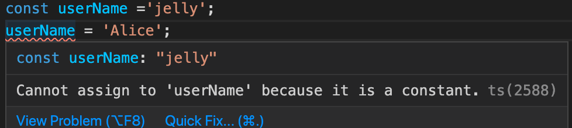
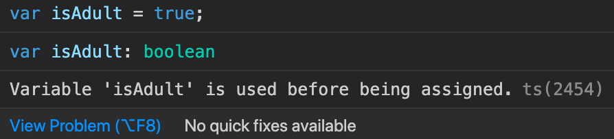

## TypeScript Day4 - Next Generation JS(ES6) & TypeScript

#### I. [Docs](#p1)

#### II. [ "let" and "const"](#p2)

#### III. [Arrow Function](#p3)

#### IV. [ Default Function Parameters](#p4)

#### V. [The Spread Operator (...)](#p5)

#### VI. [Rest Parameters](#p6)

#### VII. [Array & Object Destructuring](#p7)

<div id="p1" />

### I. Docs

Docs: [ES6 Compatibility Table](https://kangax.github.io/compat-table/es6/)

<div id="p2" />

### II. "let" and "const"

Block-based Scope(ES6):

- "const": cannot be changed
- "let": similar to "var", is mutable
  Function-based Scope:
- "var" - ES5 - global & function scope

**Error example:**



**Error example 2 in TS:**
In JS it works, but in TS, it's not a good practice to write the code, TS complains the error.

```
if(age>18) {
	var  isAdult = true;
}

console.log(isAdult);
```



**Error example 3 in TS - block scope:**
use "let" will cause an error, but "var" NOT error.

```js
{
  var a = 1;
  let b = 2;
}
console.log(a); // CORRECT
console.log(b); // WRONG
```

<div id="p3" />

### III. Arrow Function

When you have only one line return, you can use the shorthand in arrow function:
for example:

```js
const add = (a: number, b: number) => a + b;
```

When only have one param, and you can define the type in the variable name:
for example:

```
const  printOutput: (a: number | string) =>  void = output  =>  console.log(output);
```

When you have NO params, use the very short expression:
for example:

```js
() => {};
```

<div id="p4" />

### IV. Default Function Parameters

Default value assigned, then you can omit this param when call it, it won't get an error

```js
const add = (a: number, b: number = 1) => a + b; // b = 1 as default
add(1); // Correct
```

Error Example:

```js
const add2 = (a: number = 1, b: number) => a + b;
add(1); // WRONG, only 1 param, but b has NO default value
```

<div id="p5" />

### V. The Spread Operator (...)

Another memory space, not the same object, copied the value to new memory space.

- spread an array
- spread an Object

```js
// array
const hobbies = ["Sports", "Cooking"];
const activeHobbies = ["Hiking"];
activeHobbies.push(...hobbies);
// Obj
const person = {
  name: "Max",
  age: 30
};
const copiedPerson = { ...person };
```

<div id="p6" />

### VI. Rest Parameters

**Declare the type** when using "Rest Params":

```js
const add = (...numbers: number[]) => {
  return numbers.reduce((acc, cur) => {
    return acc + cur;
  }, 0);
};
```

**Declare the type of Tuples:**
When you know it has a **fixed number args / how many params**, then you can declare **tuple's type**.

```js
const add2 = (...numbers: [number, number, number]) => {
  // tuple
  return numbers.reduce((acc, cur) => {
    return acc + cur;
  }, 0);
};
```

<div id="p7" />

### VII. Array & Object Destructuring

- Array: in order of original array
  ```js
  const [a, b, ...remainings] = arr;
  ```
- Object: any order with same property name, also can rename use JS syntax `{age:myAge}`, the same as JS, nothing changed.
  ```js
  const { firstName: userName, age } = person;
  console.log(userName, age, person);
  ```
