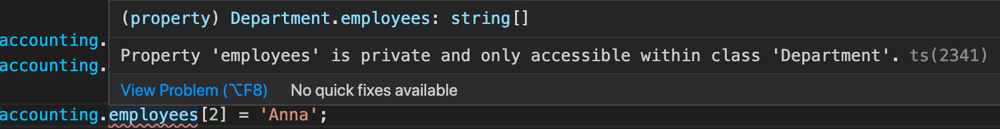

## TypeScript Day5 - Classes & Interfaces

#### I. [What are Classes ?](#p1)

#### II. [Create First Class and Compile to JS](#p2)

#### III. [Constructor Functions and "this" keyword](#p3)

#### IV. [Private & Public Access Modifiers](#p4)

#### V. [Shorthand Initialization](#p5)

#### VI. [Rest Parameters](#p6)

#### VII. [Array & Object Destructuring](#p7)

#### VIII. [Getter and Setter in TS](#p8)

#### IX. [Static Methods & Properties](#p9)

#### X. [Abstract Classes - ONLY in TS](#p10)

#### XI. [Singleton & Private Constructors](#p11)

#### XII. [Interface](#p12)

- [12.1 What is Interface ?](#p12-1)
- [12.2 Use Interface with Classes](#p12-2)
- [12.3 Use Interface with Classes](#p12-3)
- [12.4 Why interface ?](#p12-4)
- [12.5 Read-only property in interface](#p12-5)
- [12.6 extends an interface](#p12-6)
- [12.7 weird rule: interface as Function types](#p12-7)
- [12.8 Optional Parameters & Property](#p12-8)
- [12.9 TS feature interface compile to JS](#p12-9)

#### XIII. [References](#p13)

<div id="p1" />

### I. What are Classes ?

Classes VS. Objects

| Objects                                                           | <pre><----</pre> | Classes                                                              |
| ----------------------------------------------------------------- | ---------------- | -------------------------------------------------------------------- |
| "The things you work with in code"                                |                  | "Blueprints for objects" (theoretical definition)                    |
| Instances of classes (= based on classes)                         |                  | Define how objects look like, which properties and methods they have |
| Class-based creation is an alternative to using object literals ! |                  | Classes make creation of multiple similar objects much easier.       |

<div id="p2" />

### II. Create a First Class

[JS -ES2022](https://tc39.es/ecma262/multipage/#sec-intro)
Create a simple class in TS:

```js
class Department {
  name: string; // ONLY latest JS supports - ES2022
  constructor(n: string) {
    this.name = n;
  }
}
let obj = new Department("Accounting");
console.log(obj);
```

Compiled to **ES6:**

```js
"use strict";
class Department {
  constructor(n) {
    this.name = n;
  }
}
let obj = new Department("jel");
//# sourceMappingURL=app.js.map
```

Compiled to **ES5:**

```js
"use strict";
var Department = (function () {
  function Department(n) {
    this.name = n;
  }
  return Department;
})();
var obj = new Department("jel");
//# sourceMappingURL=app.js.map
```

<div id="p3" />

### III. Constructor Functions and "this" keyword

Basic usage in class method:

```js
class Department {
  name: string;
  constructor(n: string) {
    this.name = n;
  }
  describe() {
    console.log("Department: " + this.name); // access "this" keyword
  }
}
```

**Error example:**
"this" is decided by which object calls it. "accountingCopy" object doesn't have a "this.name" property, it only copies the function's implementation, **NOT the value of "this.name"**.

```js
const accounting = new Department("Accounting");
accounting.describe(); // CORRECT
const accountingCopy = { describe: accounting.describe };
accountingCopy.describe(); // WRONG
```

**Fix:**

```js
const accountingCopy = { name: "DUMMY", describe: accounting.describe };
accountingCopy.describe(); // CORRECT
```

**TypeScript Only Syntax: (Tip of "this")**
To improve your code make it more clear, each method can have a "this" param, but NOT need to call with it.

```js
class Department {
  name: string;
  constructor(n: string) {
    this.name = n;
  }
  describe(this: Department) {
    console.log("Department: " + this.name);
  }
}
```

<div id="p4" />

### IV. Private & Public Access Modifiers

**Docs:** [public class fields - MDN](https://developer.mozilla.org/en-US/docs/Web/JavaScript/Reference/Classes/Public_class_fields)

**"private"**:

- can only access inside the class
- cannot modify through its instances anymore
- canNOT be accessed by inheritance children class.
- **JS ONLY added it recently, very modern JS - ES2022**

Example:

```js
class  Department {
	public  name: string;
	private  employees: string[] = [];
}
```

Public Access Example:

```js
const accounting = new Department("Accounting");
accounting.name = "Jel"; // Correct
```

Error Private Access Example:

```js
accounting.employees[2] = "Anna"; // "employees are private"
```



<div id="p5" />

### V. Shorthand Initialization - ONLY IN TS

Previous init needs two steps:

- declare in public field
- init a value in `constructor()`

Use **"private" and "public"** modifier in **constructor's parameters** as a shorthand, to init. **ONLY IN TS !**

```
class  Department {
	// private id: string;
	// private name: string;
	private  employees: string[] = [];
	constructor(private  id: string, public  name: string) {
		// this.id = id;
		// this.name = n;
	}
}
```

<div id="p6" />

### VI. Read-Only property

this property can only be initialized once, canNOT reassign value again.

```js
class  Department {
	// private readonly id: string;
	private  employees: string[] = [];
	constructor(private  readonly  id: string, public  name: string) {
		this.id = '1'; // Correct
	}
	add() {
		this.id = '2'; // TS ERROR, WRONG !!!
	}
}
```

<div id="p7" />

### VII. Inheritance

#### 7.1 inherit Properties

- override parent's constructor's function using `super()`
- access and override parent's **"public & protected"** fields
  ```js
  class Department {
  	protected  employees: string[] = [];
  }
  ```
- can **NOT access parent's "private" fields**
- can ONLY extends **one class**, not multiple

Simple inheritance Example:

```js
class ITDepartment extends Department {
  admins: string[];
  constructor(id: string, admins: string[]) {
    super(id, "IT");
    this.admins = admins;
  }
}
```

#### 7.2 override class method

If you override parent's class method ( only public and protected), this class will use your new method implementation.

**For example: override method "addEmployee()"**

```js
class Department {;
	private employees: string[] = [];
	constructor(private  readonly  id: string, public  name: string) {
	}
	addEmployee(employee: string) {
		this.employees.push(employee);
	}
}
class  ITDepartment extends Department {
	admins: string[];
	constructor(id: string, admins: string[]) {
		super(id, 'IT');
		this.admins = admins;
	}
	addEmployee(employee: string) { // Override
		this.admins.push(employee);
	}
}
```

<div id="p8" />

### VIII. Getter and Setter in TS

**Docs:** [TS - getter & setter](https://www.typescriptlang.org/docs/handbook/classes.html#accessors)

- Define the getter and setter as **class method**, using **"get, set"** keyword
  ```js
  class Foo {
  	private _age = 18;
  	get age(){
  		return this._age;
  	}
  	set age(value: number)
  	{
  		this._age = value;
  	}
  }
  ```
- Access as property using the method name
  ```js
  const obj = new Foo();
  obj.age; // 18
  obj.age = 20;
  obj.age; // 20
  ```

<div id="p9" />

### IX. Static Methods & Properties

"static" keyword:

- NO "new" keyword to create an instance
- directly call with **className**
- static property can be only accessed from static method

Example:

```js
class Department {
  static fy: number = 2021;
  static createEmployee(name: string) {
    return { name };
  }
}
```

Usage Example:

```js
const emp1 = Department.createEmployee("Jel");
console.log(Department.fy); // 2021
```

<div id="p10" />

### X. Abstract Classes - ONLY in TS

**Docs:** [abstract class - TS](https://www.typescriptlang.org/docs/handbook/classes.html#abstract-classes)

- provide a general method that can apply to all sub-classes
- each version of this method depends on each sub-class
- **abstract class can NOT be instantiated.**
- abstract method:
  - **abstract** method can **NOT have implementation**, just define what does this method look like.
  - **sub-class** **must implement any abstract method**
- abstract property:
  - ONLY declare property in abstract class
  - must init its value in sub-class

For example: abstract class

```js
abstract class Department {
	abstract  desc : string;
	abstract  describe(this: Department): void;
}
```

Sub class example:

```js
class ITDepartment extends Department {
  desc = "IT";
  constructor(id: string) {
    super(id, "IT");
  }
  describe() {
    console.log("IT Department - ID: " + this.id);
  }
}
```

<div id="p11" />

### XI. Singleton & Private Constructors

**Syntax:**

- private constructor canNOT instantiate outside of the class
- provide a static method for outside use: `getInstance()`

```js
class  Singleton {
	private  static  instance: Singleton;
	private  constructor() {
		// todo
	}
	static  getInstance() {
		return  this.instance || (this.instance = new  Singleton());
	}
}
```

**Usage:**

```js
const obj = Singleton.getInstance();
```

<div id="p12" />

### XII. Interface

<div id="p12-1" />

#### 12.1 What is Interface ?

An interface **describes the structure of an object**. We can use it to describe **how an object should look like**.

**Note:** NOT use comma `,`, use semi-colon here in interface - `;`.

Example:

```js
interface Person {
  name: string;
  age: number;
  greet(phrase: string): void;
}
```

Usage: create a object like this:

```js
let user1: Person;
user1 = {
  name: "Max",
  age: 30,
  greet(phrase: string) {
    console.log(phrase + " " + this.name);
  }
};
```

<div id="p12-2" />

#### 12.2 Differences between interface & others

**type vs. interface**
| type | interface |
|--|--|
| describe many things, eg: union type | only describe Object's type structure |
| "custom types" is similar to interface| |

**abstract class vs. interface**
| abstract class | interface |
|--|--|
| can have detailed implementations of method | only describe and declaration, NO implementation |

<div id="p12-3" />

#### 12.3 Use Interface with Classes

Rules:

- use "**implements**" keyword
- one class can **implements multiple interfaces**
- a class **must implement** the values and method in those interfaces
- a class **can expand** other props and methods besides those in interface

**Example:**

```js
class Person implements Greetable {
  name: string; // from interface
  age = 30; // expanded new property
  constructor(n: string) {
    this.name = n;
  }
  greet(phrase: string) {
    // from interface
    console.log(phrase + " " + this.name);
  }
}
```

<div id="p12-4" />

#### 12.4 Why interface ?

- multiple class can have same/similar behaviors
- use-case: we only care and ensure this class must have the structure described in that interface

<div id="p12-5" />

#### 12.5 Read-only property in interface

**Syntax**: "readonly" keyword

```js
interface  Greetable {
	readonly name: string;
	greet(phrase: string): void;
}
```

<div id="p12-6" />

#### 12.6 extends an interface

- interface can be inherited.
- you can merge/extends **multiple** interfaces - **different from classes**

For example:

```js
interface  Named {
	readonly  name: string;
}
interface  Greetable  extends  Named {
	greet(phrase: string): void;
}
```

<div id="p12-7" />

#### 12.7 weird rule: interface as Function types

A special syntax in TS, we can use interface to create a function type also.
Function type:

```js
type AddFn = (a: number, b: number) => number;
```

in TS interface syntax, a little bit different syntax:

- NO arrow, use ":"

```js
interface AddFn {
  (a: number, b: number): number;
}
```

**Usage (same):**

```js
let a : AddFn;
a = ()=>{...};
```

<div id="p12-8" />

#### 12.8 Optional Parameters & Property

- [optional property](https://www.typescriptlang.org/docs/handbook/interfaces.html#optional-properties): `?` sign, it might have or NOT this property
- optional parameter: `?` in params, then you might NOT to call with this param

**Example:**

```js
interface  Named {
	readonly  name?: string;
}
class  Person  implements  Greetable {
	name?: string; // optional prop
	constructor(n?: string) { // optional param
		if (n) {
			this.name = n;
		}
	}
}
```

<div id="p12-9" />

#### 12.9 TS feature interface compile to JS

- NO interface in JS and Runtime
- compile to ES6: to classes
- compile to ES5: constructor function & prototype

<div id="p13" />

### XIII. References

These links might also be useful:

- More on (JS) Classes: [https://developer.mozilla.org/en-US/docs/Web/JavaScript/Reference/Classes](https://developer.mozilla.org/en-US/docs/Web/JavaScript/Reference/Classes)
- More on TS Interfaces: [https://www.typescriptlang.org/docs/handbook/2/objects.html](https://www.typescriptlang.org/docs/handbook/2/objects.html)
