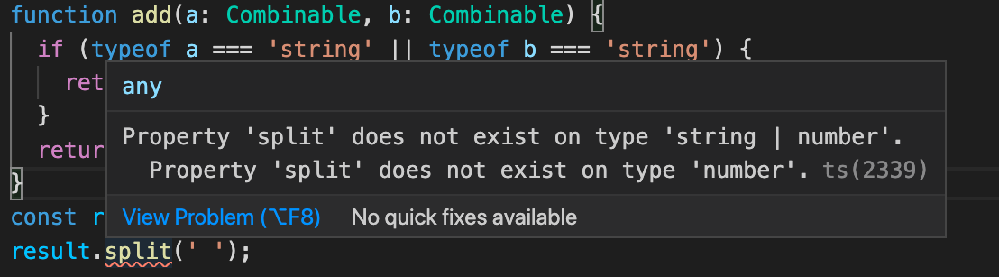
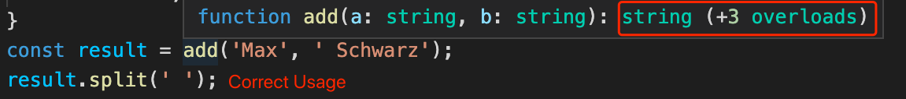

## TypeScript Day6 - Advanced Typing Concepts

#### I. [Intersection Types](#p1)

#### II. [More on Type Guards](#p2)

#### III. [Discriminated Union](#p3)

#### IV. [Type Casting](#p4)

#### V. [Index Properties](#p5)

#### VI. [Function Overloads](#p6)

#### VII. [Optional Chaining & Nullish Coalescing](#p7)

#### VIII. [References & Useful Links](#p8)

<div id="p1" />

### I. Intersection Types

Intersection Types use `"&"` ampersand sign,

- when it use on **Object**, it means combine both types; similar like "interface"
- when it use on **Union Types**, it means ONLY common type among them.

**Example 1: on Object types**

```js
type Admin = {
  name: string,
  privileges: string[]
};
type Employee = {
  name: string,
  startDate: Date
};
type ElevatedEmployee = Admin & Employee;
// interface ElevatedEmployee extends Employee, Admin {}
```

Usage:

```js
const e1: ElevatedEmployee = {
  name: "Max",
  privileges: ["create-server"],
  startDate: new Date()
};
```

**Example 2: on Union types**

```js
type Combinable = string | number;
type Numeric = number | boolean;
type Universal = Combinable & Numeric; // only "number"
```

<div id="p2" />

### II. More on Type Guards

**Type Guard Example 1: check one type known in JS**
When use Union Type, we do something call "type guards" to make sure which exact type is using.
For example:

```js
type Combinable = string | number;
function add(a: Combinable, b: Combinable) {
  if (typeof a === "string" || typeof b === "string") {
    // Type Guard
    return a.toString() + b.toString();
  }
  return a + b;
}
```

**Type Guard Example 2: check one property whether in Object**

`"in"` keyword is in JS that checks an property of object, disadvantage is that performance not good, since "in" go through proptotype chain checking **ALL** properties.

```js
type UnknownEmployee = Employee | Admin;
function printEmployeeInformation(emp: UnknownEmployee) {
  console.log("Name: " + emp.name);
  if ("privileges" in emp) {
    // type guard
    console.log("Privileges: " + emp.privileges);
  }
  if ("startDate" in emp) {
    // type guard
    console.log("Start Date: " + emp.startDate);
  }
}
```

**Type Guard Example 3: check is instance of one class**
When use Union Type, you might want to make sure which class is this object from. "[instanceof](https://developer.mozilla.org/en-US/docs/Web/JavaScript/Reference/Operators/instanceof)" is JS built in operator, since ES5.

```js
class Car {
  drive() {
    console.log("Driving...");
  }
}
class Truck {
  drive() {
    console.log("Driving a truck...");
  }
  loadCargo(amount: number) {
    console.log("Loading cargo ..." + amount);
  }
}
type Vehicle = Car | Truck;
const v1 = new Car();
const v2 = new Truck();
function useVehicle(vehicle: Vehicle) {
  vehicle.drive();
  if (vehicle instanceof Truck) {
    // type guard
    vehicle.loadCargo(1000);
  }
}
```

<div id="p3" />

### III. [Discriminated Union](https://www.typescriptlang.org/docs/handbook/unions-and-intersections.html#discriminating-unions)

It is to have a single field which uses **literal types** in all union types, which let TypeScript narrow down the possible current type.

For example: the common field "state"

```js
interface Bird {
  state: "bird";
  flyingSpeed: number;
}
interface Horse {
  state: "horse";
  runningSpeed: number;
}
type Animal = Bird | Horse;
```

**Usage:**
Instead of use "instanceof", here we can**NOT use it for types/interfaces**, but we have another common field as **"literal types" -> "state"** to differentiate sub-types in Union Type.

```js
function moveAnimal(animal: Animal) {
  let speed;
  switch (
    animal.state // type guard
  ) {
    case "bird":
      speed = animal.flyingSpeed;
      break;
    case "horse":
      speed = animal.runningSpeed;
  }
  console.log("Moving at speed: " + speed);
}
```

<div id="p4" />

### IV. Type Casting

**Docs:** [type assertions - TS](https://www.typescriptlang.org/docs/handbook/basic-types.html#type-assertions)

**Syntax:**

- "as" keyword
- angle bracket: `<>`

Examples: DOM element's type

```js
const userInputElement = <HTMLInputElement>document.getElementById('user-input')!;
const userInputElement2 = document.getElementById('user-input') as  HTMLInputElement;
```

**Note:**
when you do type casting, already tell TS this is **NOT NULL**, then don't need to use the **"!"** here.
But you can also do type casting after your null checking block, eg:

```js
const  userInputElement = document.getElementById('user-input'); // might be null
if (userInputElement) {
	(userInputElement  as  HTMLInputElement).value = 'Hi there!';
}
```

<div id="p5" />

### V. Index Properties

Use Case

- don't know property names
- don't know how many props will be in object

**Syntax Example:**

```js
interface ErrorContainer {
  [prop: string]: string;
}
```

Usage:

```js
const errorBag: ErrorContainer = {
  email: "Not a valid email!",
  username: "Must start with a capital character!"
};
```

<div id="p6" />

### VI. Function Overloads

**Use Case:**
when TS canNOT infer the correct return type from the function, function overloads can set multiple overloads to satisfy different conditions and returns.

**Error Example: return type is a Union type**



**Function Overloads Example:**

```js
function  add(a: number, b: number): number;
function  add(a: string, b: string): string;
function  add(a: string, b: number): string;
function  add(a: number, b: string): string;
function  add(a: Combinable, b: Combinable) {
	if (typeof  a === 'string' || typeof  b === 'string') {
		return  a.toString() + b.toString();
	}
	return  a + b;
}
```

**Usage:** correct example



<div id="p7" />

### VII. Optional Chaining & Nullish Coalescing

#### 7.1 [Optional Chaining](https://developer.mozilla.org/en-US/docs/Web/JavaScript/Reference/Operators/Optional_chaining) - ES2020

Avoid runtime error when this attribute is NOT in data. Using `"?"` sign.
Example:

```js
const fetchedUserData = {
  id: "u1",
  name: "Max",
  job: { title: "CEO", description: "My own company" }
};
console.log(fetchedUserData?.job?.title); // Optional Chaining
```

#### 7.2 [Nullish Coalescing](https://developer.mozilla.org/en-US/docs/Web/JavaScript/Reference/Operators/Nullish_coalescing_operator) - ES2020

The **nullish coalescing operator (`??`)** is a logical operator that returns its right-hand side operand when its left-hand side operand is [`null`](https://developer.mozilla.org/en-US/docs/Web/JavaScript/Reference/Global_Objects/null) or [`undefined`](https://developer.mozilla.org/en-US/docs/Web/JavaScript/Reference/Global_Objects/undefined), and otherwise returns its left-hand side operand.

Example:

```js
const userInput = undefined;
const storedData = userInput ?? "DEFAULT";
```

This can be contrasted with the [logical OR (`||`) operator](https://developer.mozilla.org/en-US/docs/Web/JavaScript/Reference/Operators/Logical_OR), which returns the right-hand side operand if the left operand is _any_ [falsy](https://developer.mozilla.org/en-US/docs/Glossary/Falsy) value, not only `null` or `undefined`.

```js
const storedData = userInput || "DEFAULT";
```

**But: Difference is that _falsy_ value might NOT be _undefined or null_ .**

- empty string: `''` -> falsy, but NOT null/undefined
- number `0`: -> falsy, but NOT null/undefined

<div id="p8" />

### VIII. References & Useful Links

- More on Advanced Types: [https://www.typescriptlang.org/docs/handbook/2/types-from-types.html](https://www.typescriptlang.org/docs/handbook/2/types-from-types.html)
