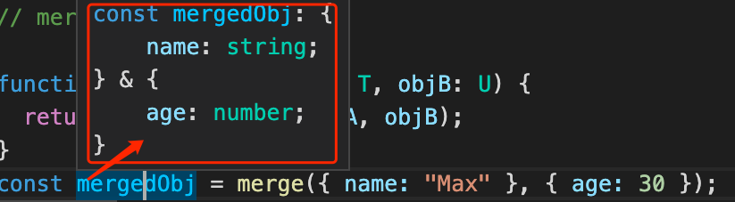
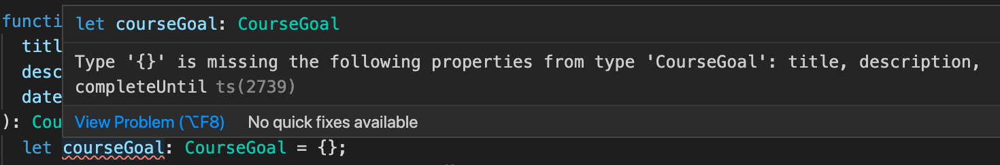

## TypeScript Day7 - Generics in TypeScript

#### I. [Built-in Generics & What are generics?](#p1)

#### II. [Create a Generic Function](#p2)

#### III. [Working with Constraints](#p3)

#### IV. [Another Generic Function](#p4)

#### V. [The "keyof" Constriant](#p5)

#### VI. [Generic Classes](#p6)

- 6.1 [Generic Constraints](#p6_1)
- 6.2 [Using Type Parameters in Generic Constraints](#p6_2)
- 6.3 [Generic Parameter Defaults](#p6_3)

#### VII. [Advantages of Generics](#p7)

#### VIII. [Generic Utility Types](#p8)

#### IX. [Generic Type vs. Union Types](#p9)

#### X. [References & Useful Links](#p10)

<div id="p1" />

### I. Built-in Generics & What are generics?

**Docs:** [TS-generics](https://www.typescriptlang.org/docs/handbook/2/generics.html)

In languages like C# and Java, one of the main tools in the toolbox for creating reusable components is _generics_, that is, being able to **create a component that can work over a variety of types** rather than a single one. This **allows users to consume these components and use their own types.**

**Notes**: **All about Generics are ONLY in TS, but NOT in JavaScript.**

**Built-in Generic types:**

- `Array<string>` , it gives more information about types inside of the array's elements
- Promise<number>, the `<>` angle bracket means, the [Promise](https://developer.mozilla.org/en-US/docs/Web/JavaScript/Reference/Global_Objects/Promise) eventually **produce a "number" result.**

Example

```js
const promise: Promise<number> = new Promise((resolve, reject) => {
  setTimeout(() => {
    resolve(10); // return value is number
  }, 2000);
});
promise.then((data) => {
  // data is a number type
  // data.split(); // Wrong
});
```

<div id="p2" />

### II. Create a Generic Function

[JS - Object.assign() - mdn](https://developer.mozilla.org/en-US/docs/Web/JavaScript/Reference/Global_Objects/Object/assign)

**Error Example:** "object" is a highly unspecific type

```js
function merge(objA: object, objB: object) {
  return Object.assign(objA, objB);
}
const mergedObj = merge({ name: "Max", hobbies: ["Sports"] }, { age: 30 });
mergedObj.age; // ERROR in TS, mergeObj is "object" type
```

Since "mergedObj" is a highly unspecific type, and TS doesn't know the specific type of "mergeObj" can have a "age" field.

**Fix 1: type casting**, but it's **cumbersome**

```js
const  mergedObj = merge({ name:  "Max" }, { age:  30 }) as {
	name: string;
	age: number;
};
mergedObj.age;
```

**Fix 2: use generics here**
TS will know T,U two unknown types, and will return the intersection of "T & U" for there.


```js
function merge<T, U>(objA: T, objB: U) {
  return Object.assign(objA, objB);
}
```

**Generic result:**



This generics is equal to :

```js
const  mergedObj = merge<{ name: string }, { age: number }>( // concrete types
	{ name:  "Max" },
	{ age:  30 }
);
```

**Important Notes:**
You can **fill in different concrete types for different function calls**, but it's redundant, since TS can **infer the types from generics easily** .

<div id="p3" />

### III. Working with Constraints

you can set some **constraint**s due to the types your **generic types can be based on**, and you do this with the "**extends**" keyword here.

**Example:** `T` type can be any object with any structure, **But `T` must be an object.**

```js
// constraint: T and U must be object
function  merge<T  extends  object, U  extends  object>(objA: T, objB: U) {
	return  Object.assign(objA, objB);
}
```

<div id="p4" />

### IV. Another Generic Function

**Use-Case:**
it doesn't care about the type is stirng or array...., but we Only care T should have a **"length"** property. So we make `T extends Lengthy;`

```js
interface  Lengthy {
	length: number;
}
function  countAndPrint<T  extends  Lengthy>(element: T) : [T, string]{
	let  desc = "Got no value.";
	if (element.length === 1) {
		desc = "Got 1 element.";
	} else  if (element.length > 1) {
		desc = "Got " + element.length + " elements.";
	}
	return [element, desc];
}
```

<div id="p5" />

### V. The "keyof" Constriant

We only wanna constrain the key existed in the object, and if you wanna access other properties, TS will generate an error.

For example:

```js
function  extractAndConvert<T  extends  object, U  extends  keyof  T>(
obj: T,
key: U
) {
return  'Value: ' + obj[key];
}
extractAndConvert({ name:  'Max' }, 'name'); // Correct
extractAndConvert({ name:  'Max' }, 'age'); // WRONG. 'age' is not existed
```

<div id="p6" />

### VI. Generic Classes

Build a simple generic class

```js
class  DataStorage<T  extends  string | number | boolean> {
	private  data: T[] = [];
	addItem(item: T) {
		this.data.push(item);
	}
	removeItem(item: T) {
		if (this.data.indexOf(item) === -1) {
		return;
		}
		this.data.splice(this.data.indexOf(item), 1); // -1: it removes the last one if not found
	}
	getItems() {
		return [...this.data];
	}
}
```

**Usage: generic class**

- we can have some flexibility to store different types
- but also have this strongly typed class in TS

```js
const  numberStorage = new  DataStorage<number>();
const  textStorage = new  DataStorage<string>();
const boolStorage = new DataStorage<boolean>();
```

<div id="p6_1" />

#### 6.1 Generic Constraints - [doc](https://www.typescriptlang.org/docs/handbook/2/generics.html#generic-constraints)

If you remember from an earlier example, you may sometimes want to write a generic function that works on a set of types where you have some knowledge about what capabilities that set of types will have.

**Problem:**

```ts
function loggingIdentity<Type>(arg: Type): Type {
  console.log(arg.length);
Property 'length' does not exist on type 'Type'.
  return arg;
}
```

**Fix:**
To do so, we’ll create an interface that describes our constraint. Here, we’ll create an interface that has a single .length property and then we’ll use this interface and the extends keyword to denote our constraint:

```ts
interface Lengthwise {
  length: number;
}

function loggingIdentity<Type extends Lengthwise>(arg: Type): Type {
  console.log(arg.length); // Now we know it has a .length property, so no more error
  return arg;
}
```

<div id="p6_2" />

#### 6.2 Using Type Parameters in Generic Constraints - [doc](https://www.typescriptlang.org/docs/handbook/2/generics.html#using-type-parameters-in-generic-constraints)

```ts
function getProperty<Type, Key extends keyof Type>(obj: Type, key: Key) {
  return obj[key];
}

let x = { a: 1, b: 2, c: 3, d: 4 };

getProperty(x, "a");
getProperty(x, "m");
Argument of type '"m"' is not assignable to parameter of type '"a" | "b" | "c" | "d"'.
```

<div id="p6_3" />

#### 6.3 Generic Parameter Defaults - [doc](https://www.typescriptlang.org/docs/handbook/2/generics.html#generic-parameter-defaults)

By declaring a default for a generic type parameter, you make it optional to specify the corresponding type argument. For example, a function which creates a new `HTMLElement`. Calling the function with no arguments generates a `HTMLDivElement`.

```ts
declare function create<T extends HTMLElement = HTMLDivElement, U = T[]>(
  element?: T,
  children?: U,
): Container<T, U>;

const div = create();

const div: Container<HTMLDivElement, HTMLDivElement[]>;

const p = create(new HTMLParagraphElement());

const p: Container<HTMLParagraphElement, HTMLParagraphElement[]>;
```

<div id="p7" />

### VII. Advantages of Generics

- gives us **flexibility**: the values & types used in the class
- also have full type support for what we do with functions & classes, TS will **infer and know the concrete types** when it's really created.

<div id="p8" />

### VIII. Generic Utility Types

**Docs:** [utility types - TS](https://www.typescriptlang.org/docs/handbook/utility-types.html)

#### 8.1 [Partial type](https://www.typescriptlang.org/docs/handbook/utility-types.html#partialtype)

```js
interface Foo {
  title: string;
  desc: string;
  time: Date;
}
```

What "Partial" keyword does is to change all the props to be **optional**. So at first, when we init a variable with this type, we don't need to assign all props at the beginning.

Error example:



**Fix:** use "Partial"

```js
let courseGoal: Partial<CourseGoal> = {};
courseGoal.title = "hello";
courseGoal.desc = "desc";
courseGoal.time = new Date();
```

#### 8.2 [Readonly type](https://www.typescriptlang.org/docs/handbook/utility-types.html#readonlytype)

**Example:** we cannot mutate this array after init.

```js
const names: Readonly<string[]> = ["Max", "Anna"];
names.push("Manu"); // WRONG
names.pop(); // WRONG
```

<div id="P9" />

### IX. Generic Type vs. Union Types

- "generic type" : whole class should **consist to one specific type** of data, if you wanna **lock in** a certain type
- "union type" : when you are **flexible** when every method/function call, you can use any of these types.

<div id="p10" />

### X. References & Useful Links

- More on Generics: [https://www.typescriptlang.org/docs/handbook/generics.html](https://www.typescriptlang.org/docs/handbook/generics.html)
