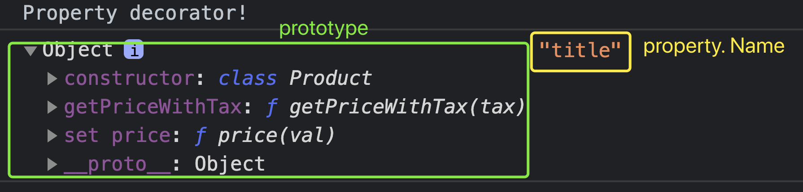

## TypeScript Day8 - Decorator

#### I. [What is Decorator in TypeScript?](#p1)

#### II. [Evaluation](#p2)

#### III. [Class Decorator](#p3)

#### IV. [Decorator Factories](#p4)

#### V. [More useful decorator example](#p5)

#### VI. [Use Multiple Decorator](#p6)

#### VII. [Property Decorators](#p7)

#### VIII. [ Accessor Decorator](#p8)

#### IX. [Method Decorator](#p9)

#### X. [Parameter Decorator](#p10)

#### XI. [Returning (and changing) a Class in a Class Decorator](#p11)

#### XII. [Example: create an "Autobind" decorator](#p12)

#### XIII. [Validation with Decorators](#p13)

#### XIV. [References & Useful Links](#p14)

<div id="p1" />

### I. What is Decorator in TypeScript ?

**Docs:**

- [TS - Decorators](https://www.typescriptlang.org/docs/handbook/decorators.html)
- [A Complete Guide to TypeScript Decorators - 2020](https://saul-mirone.github.io/a-complete-guide-to-typescript-decorator/)

There are 5 types of decorators we can use:

- 1.  Class Decorators
- 2.  Property Decorators
- 3.  Method Decorators
- 4.  Accessor Decorators
- 5.  Parameter Decorators

Simple Code example:

```typescript
@classDecorator1
class Bird {
  @propertyDecorator2
  name: string;

  @methodDecorator3
  fly(
    @parameterDecorator5
    meters: number
  ) {}

  @accessorDecorator4
  get egg() {}
}
```

<div id="p2" />

### II. Decorator Evaluation

#### 2.1 Timing

Decorators evaluate **only one** time when apply. Even NOT need to instantiate a class, the decorator **executes when your class defined.**

#### 2.2 Order of Evaluation

Decorators evaluate only one time when apply.

There is a well defined order to how decorators applied to various declarations inside of a class are applied:

- 1.  Instance Member:  
      Parameter Decorators -> Method / Accessor / Property Decorators (order by the place written in code)
- 2.  Static Member:  
      Parameter Decorators -> Method / Accessor / Property Decorators (order by the place written in code)
- 3.  Constructor: Parameter Decorators
- 4.  Class Decorators

More examples on this doc: [link](https://saul-mirone.github.io/a-complete-guide-to-typescript-decorator/)

<div id="p3" />

### III. Class Decorator

The class decorator is applied to the **constructor of the class** and can be used to _observe, modify, or replace_ a class definition.

- @Params:
  - `target`: The constructor of the class.
- @Returns:
  - If the class decorator returns a value, it will replace the class declaration.

#### 3.1 Compiler set up

```
{
	"compilerOptions": {
		"target": "ES6",
		"experimentalDecorators": true
	}
}
```

#### 3.2 write a simple Logger decorator

Example:

```js
function Logger(constructor: Function) {
  console.log("Logging...");
  console.log(constructor);
}
@Logger
class Person {
  name = "Max";
  constructor() {
    console.log("Creating person object...");
  }
}
```

Output in console:


<div id="p4" />

### IV. [Decorator Factories](https://www.typescriptlang.org/docs/handbook/decorators.html#decorator-factories)

A _Decorator Factory_ is simply a function that returns the expression that will be called by the decorator at runtime.

**Syntax:**

```js
function color(value: string) {
  // this is the decorator factory, it sets up
  // the returned decorator function
  return function (target) {
    // this is the decorator
    // do something with 'target' and 'value'...
  };
}
```

**Simple Example:**

```js
function Logger(logString: string) {
  return function (constructor: Function) {
    console.log(logString); // called
    console.log(constructor); // called
  };
}

@Logger("LOGGING - PERSON")
class Person {
  name = "Max";
  constructor() {
    console.log("Creating person object..."); // NOT called
  }
}
```

Even **no** instance created, decorator **still is called** while constructor function not called, then output is:


<div id="p5" />

### V. More

#### 5.1 render some context on HTML with decorator

A **trick** here the class decorator must have a **"constructor" as parameter**, but since we don't need it here, we just use `"_"` **underscore** sign to tell TS that we won't use it and don't need it.

```js
function WithTemplate(template: string, hookId: string) {
  return function (_: Function) {
    // a trick here
    const hookEl = document.getElementById(hookId);
    if (hookEl) {
      hookEl.innerHTML = template;
    }
  };
}

@WithTemplate("<h1>My Person Object</h1>", "app")
class Person {
  name = "Max";
  constructor() {
    console.log("Creating person object...");
  }
}
```

Result on browser UI:


#### 5.2 Access class fields inside the Decorator

take advantage of **"constructor" parameter** through decorator, then create a instance or use that class.

```js
function  WithTemplate(template: string, hookId: string) {
	return  function(constructor: any) {
		const  hookEl = document.getElementById(hookId);
		const  p = new  constructor();
		if (hookEl) {
			hookEl.innerHTML = template;
			hookEl.querySelector('h1')!.textContent = p.name; // access instance property
		}
	}
}

@WithTemplate('<h1>My Person Object</h1>', 'app')
class  Person {
	name = 'Max';
	constructor() {
		console.log('Creating person object...');
	}
}
```

<div id="p6" />

### VI. Use Multiple Decorator

You can apply multiple decorators to a single target. The order of the decorators composed is:

- 1.  Outer Decorator Evaluate
- 2.  Inner Decorator Evaluate
- 3.  Inner Decorator Call
- 4.  Outer Decorator Call

**For example:**

```typescript
function f(key: string) {
  console.log("evaluate: ", key);
  return function () {
    console.log("call: ", key);
  };
}

class C {
  @f("Outer Method")
  @f("Inner Method")
  method() {}
}
```

The code above will print the following messages:

```bash
evaluate: Outer Method
evaluate: Inner Method
call: Inner Method
call: Outer Method
```

<div id="p7" />

### VII. Property Decorators

The [property decorator](https://www.typescriptlang.org/docs/handbook/decorators.html#property-decorators) will be called as a function at runtime, with the following **two arguments**:

- 1.  Either the **constructor function** of the class for a **static member**, or **the prototype of the class for an instance member**.
- 2.  The name of the member.

Example: a log property decorator function

```js
function Log(target: any, propertyName: string) {
  console.log("Property decorator!");
  console.log(target, propertyName);
}
```

Usage in class:

```js
class  Product {
	@Log
	title: string;
	private  _price: number;
}
```

**Output** in console will be the prototype and the propName:



<div id="p8" />

### VIII. Accessor Decorator

The expression for the [accessor decorator](https://www.typescriptlang.org/docs/handbook/decorators.html#accessor-decorators) will be called as a function at runtime, with the following three arguments:

1.  Either the constructor function of the class for a static member, or the prototype of the class for an instance member.
2.  The name of the member.
3.  The _Property Descriptor_ for the member.

> NOTE  The _Property Descriptor_ will be `undefined` if your script target is less than `ES5`.

If the accessor decorator returns a value, it will be used as the _Property Descriptor_ for the member.

> NOTE  The return value is ignored if your script target is less than `ES5`.

**Example:** accessor decorator simple function

```js
function Log2(target: any, name: string, descriptor: PropertyDescriptor) {
  console.log("Accessor decorator!");
  console.log(target);
  console.log(name);
  console.log(descriptor);
}
```

**Usage** in the class:

```js
class  Product {
	title: string;
	private  _price: number;

	@Log2
	set  price(val: number) {
		if (val > 0) {
			this._price = val;
		} else {
			throw  new  Error('Invalid price - should be positive!');
		}
	}
	constructor(t: string, p: number) {
		this.title = t;
		this._price = p;
	}
}
```

**Output** in console is: _target, name, descriptor_


<div id="P9" />

### IX. Method Decorator

The expression for the [method decorator](https://www.typescriptlang.org/docs/handbook/decorators.html#method-decorators) will be called as a function at runtime, with the following three arguments:

1.  Either the constructor function of the class for a static member, or the prototype of the class for an instance member.
2.  The name of the member.
3.  The _Property Descriptor_ for the member.

> NOTE  The _Property Descriptor_ will be `undefined` if your script target is less than `ES5`.

If the method decorator returns a value, it will be used as the _Property Descriptor_ for the method.

> NOTE  The return value is ignored if your script target is less than `ES5`.

Example: method decorator function

```js
function Log3(
  target: any,
  name: string | Symbol,
  descriptor: PropertyDescriptor
) {
  console.log("Method decorator!");
  console.log(target);
  console.log(name);
  console.log(descriptor);
}
```

**Usage** in class:

```js
class  Product {
	title: string;
	private  _price: number;
	set  price(val: number) {
		if (val > 0) {
			this._price = val;
		} else {
			throw  new  Error("Invalid price - should be positive!");
		}
	}
	constructor(t: string, p: number) {
		this.title = t;
		this._price = p;
	}

	@Log3 // method decorator
	getPriceWithTax(tax: number) {
		return  this._price * (1 + tax);
	}
}
```

**Compare:** this is pretty similar with "**accessor decorator**", the only different is the JS built in "**descriptor object**", but it's not because of TS.


<div id="p10" />

### X. Parameter Decorator

The expression for the [parameter decorator](https://www.typescriptlang.org/docs/handbook/decorators.html#parameter-decorators) will be called as a function at runtime, with the following three arguments:

1.  Either the constructor function of the class for a static member, or the prototype of the class for an instance member.
2.  The name of the member. - the **"name of method"** that use this parameter
3.  "position" - The ordinal **index** of the parameter in the function’s parameter list.

> NOTE  A parameter decorator can only be used to observe that a parameter has been declared on a method.

Example: **parameter decorator** function

```js
function Log4(target: any, name: string | Symbol, position: number) {
  console.log("Parameter decorator!");
  console.log(target);
  console.log(name);
  console.log(position);
}
```

**Usage** in class:

```js
class  Product {
	title: string;
	private  _price: number;
	set  price(val: number) {
		if (val > 0) {
			this._price = val;
		} else {
			throw  new  Error("Invalid price - should be positive!");
		}
	}
	constructor(t: string, p: number) {
		this.title = t;
		this._price = p;
	}
	getPriceWithTax(@Log4  tax: number) { // parameter decorator
		return  this._price * (1 + tax);
	}
}
```

**Output** in console:


### XI. Returning (and changing) a Class in a Class Decorator

The **return value** and what you can return and what TypeScript is able to use depends on which kind of decorator you're working with:

- class decorator -> return a new **constructor function** can **replace** the original **constructor function**
  **For example:** return a new constructor function

```js
function  WithTemplate(template: string, hookId: string) {
	return  function <T  extends { new (...args: any[]): {} }>(originalConstructor: T) {
		return  class  extends  originalConstructor {
			constructor(..._: any[]) {
				super();
				// TODO
			}
		};
	};
}
```

- Accessor decorator: if returns a value, it will be used as the _Property Descriptor_ for the member.
  ```js
  function Log2(
    target: any,
    name: string,
    descriptor: PropertyDescriptor
  ): PropertyDescriptor {
    console.log("Accessor decorator!");
    // eg: return a new descriptor object
    return { get: () => {}, enumerable: true };
  }
  ```
- Method decorator: if returns a value, it will be used as the _Property Descriptor_ for the member.
- Property decorator : TS **NOT** support
- Parameter decorator: TS **NOT** support

<div id="p12" />

### XII. Example: create an "Autobind" decorator

#### 12.1 Problem in JS

we wanna have a autobind feature that we can call `object.method()` directly instead of using `.bind(object)`.

```js
class  Printer {
	message = 'This works!';
	showMessage() {
		console.log(this.message);
	}
}

const  p = new  Printer();
const  button = document.querySelector('button')!;
button.addEventListener('click', p.showMessage); // when click, it's undefined
// fix: button.addEventListener('click', p.showMessage.bind(p));
```

#### 12.2 create a method decorator to auto bind in TS

**Tip:**

- the "value" prop in "descriptor object" points to the original method
- the "get()" **getter** can do something before this "value" field returned, also before user access this method.
- "this" points to the original object inside the getter method

**Fix:**

```js
function Autobind(_: any, _2: string, descriptor: PropertyDescriptor) {
  const originalMethod = descriptor.value; // tip1: points to original method
  const newDescriptor: PropertyDescriptor = {
    configurable: true,
    enumerable: false,
    // tip2: add a getter before user access this method
    // we can exec something before user access and before this value returned
    get() {
      const boundFn = originalMethod.bind(this); // tip3: this refers to object defining the method
      return boundFn;
    }
  };
  return newDescriptor;
}
```

<div id="p13" />

### XIII. Validation with Decorators

#### 13.1 Problem

We wanna use two decorators in class to annotate on those property to be checked.

- "title" - required
- "price" - a positive number

Then we want to call `validate()` function to check the instance of this class, is it validate?

```js
class  Course {
	@Required
	title: string;
	@PositiveNumber
	price: number;

	constructor(t: string, p: number) {
		this.title = t;
		this.price = p;
	}
}
const  courseForm = document.querySelector('form')!;
courseForm.addEventListener('submit', event  => {
	event.preventDefault();
	const  titleEl = document.getElementById('title') as  HTMLInputElement;
	const  priceEl = document.getElementById('price') as  HTMLInputElement;
	const  title = titleEl.value;
	const  price = +priceEl.value;
	const  createdCourse = new  Course(title, price);
	if (!validate(createdCourse)) {
		alert('Invalid input, please try again!');
		return;
	}
});
```

#### 13.2 decorator functions implementation

- `constructor.name`: the class name - [stackoverflow_link](https://stackoverflow.com/questions/46217853/get-constructor-name-of-object)
- "registeredValidators" is in memory to store these decorators for different classes, data structure is like: `<className, Array<prop, validatorsName>>`

```js
interface ValidatorConfig {
  [property: string]: {
    // class name
    [validatableProp: string]: string[] // ['required', 'positive']
  };
}

// global variable
const registeredValidators: ValidatorConfig = {};

// decorator 1
function Required(target: any, propName: string) {
  registeredValidators[target.constructor.name] = {
    ...registeredValidators[target.constructor.name],
    [propName]: ["required"]
  };
}
// decorator 2
function PositiveNumber(target: any, propName: string) {
  registeredValidators[target.constructor.name] = {
    ...registeredValidators[target.constructor.name],
    [propName]: ["positive"]
  };
}
```

Build the validate function:

```js
function validate(obj: any) {
  const objValidatorConfig = registeredValidators[obj.constructor.name];
  if (!objValidatorConfig) {
    return true;
  }
  let isValid = true;
  for (const prop in objValidatorConfig) {
    for (const validator of objValidatorConfig[prop]) {
      switch (validator) {
        case "required":
          isValid = isValid && !!obj[prop];
          break;
        case "positive":
          isValid = isValid && obj[prop] > 0;
          break;
      }
    }
  }
  return isValid;
}
```

<div id="p14" />

### XIV. References & Useful Links

- More on Decorators: [https://www.typescriptlang.org/docs/handbook/decorators.html](https://www.typescriptlang.org/docs/handbook/decorators.html)
- Third party library for decorators: [@typestack/class-validators](https://github.com/typestack/class-validator)
- Angular also is an example that heavily rely on decorators, eg: the [`@Component` decorator](https://angular.io/api/core/Component)
- Nest JS : a server side framework for JS also enbraces TS
