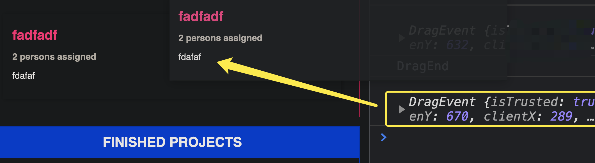
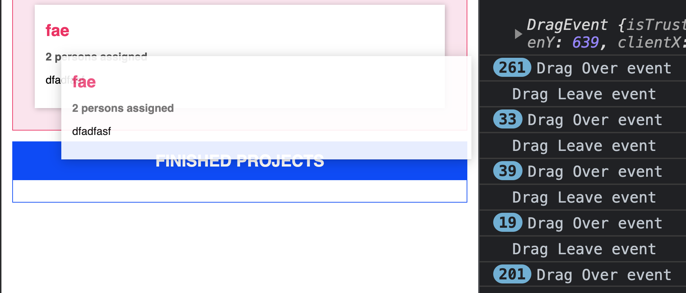

## TypeScript Day9 - Project

#### I. [Project set up](#p1)

#### II. [Interact with dom - input fields](#p2)

#### III. [Use Autobind on event listener's handler functions](#p3)

#### IV. [Fetch user input and validate values](#p4)

#### V. [Improve: a Re-Usable Validation Functionality](#p5)

#### VI. [Rendering Project Lists](#p6)

#### VII. [Manage App State with Singletons - for project list](#p7)

#### VIII. [More Classes & Custom Types](#p8)

#### IX. [Method Decorator](#p9)

#### X. [Parameter Decorator](#p10)

#### XI. [Rendering Project Items with a Class](#p11)

#### XII. [Improvement: using Getter in Item Class](#p12)

#### XIII. [Use Interfaces to implement Drag & Drop](#p13)

#### XIV. [Draggable Event on UI](#p14)

- [14.1 JavaScript Drag Events ](#p14-1)
- [14.2 Code Implementation](#p14-2)
- [14.3 HTML "draggable" Attribute](#p14-3)
- [14.4 UI Result](#p14-4)

#### XV. [Drop Event on UI](#p15)

- [feature-1: UI changes when drag over & leave the target droppable area](#p15-1)
- [feature-2: dataTransfer while drag and create a Droppable target area](#p15-2)
- [feature-3: drop the item and update internal state](#p15-3)

#### XVI. [Drag & Drop Demo](#p16)

#### XVII. [References & Useful Links](#p17)

<div id="p1" />

### I. Project Setup

**Prepare HTML:**

- [`<template>` tag:](https://developer.mozilla.org/en-US/docs/Web/HTML/Element/template)
  The **`<template>`** HTML element is a mechanism for holding HTML that is **NOT to be rendered immediately** when a page is loaded but may be instantiated subsequently during runtime using JavaScript.
- copy template HTML to real dom through JS
  - `template.content.cloneNode(true)`
  - `document.importNode(template.content, true)` : [importNode-mdn-doc](https://developer.mozilla.org/en-US/docs/Web/API/Document/importNode)
    The imported node is not yet included in the document tree. To include it, you need to call an insertion method such as [`appendChild()`](https://developer.mozilla.org/en-US/docs/Web/API/Node/appendChild "appendChild()") or [`insertBefore()`](https://developer.mozilla.org/en-US/docs/Web/API/Node/insertBefore "insertBefore()") with a node that _is_ currently in the document tree.

**Code Example:**

```js
const templateEL = document.getElementById("myTemplate");
// example 1
let element = templateEL.content.firstElementChild!.cloneNode(true);
body.appendChild(element);
// example 2
let element2 = document.importNode(templateEL.content, true).firstElementChild;
body.insertAdjacentElement("afterbegin", element2);
```

<div id="p2" />

### II. Interact with dom - input fields

#### 2.1 Fetch value from input fields

```js
class  ProjectInput {
	// ...
	titleInputElement: HTMLInputElement;
	descriptionInputElement: HTMLInputElement;
	peopleInputElement: HTMLInputElement;
	constructor() {
		// ...
		this.titleInputElement = this.element.querySelector(
		"#title"
		) as  HTMLInputElement;
		this.descriptionInputElement = this.element.querySelector(
		"#description"
		) as  HTMLInputElement;
		this.peopleInputElement = this.element.querySelector(
		"#people"
		) as  HTMLInputElement;
	}
}
```

#### 2.2 Setup Event Listeners on Submit event

> Note: we need to manually bind "this" in the function inside event listener to preset, another way to solve this is use TS decorator: [Autobind decorator](https://jialihan.github.io/blog/#/typescript/day8_decorator?id=p12) in TS.

```js
class  ProjectInput {
	// ...
	private  submitHandler(event: Event) {
		event.preventDefault();
		console.log(this.titleInputElement.value);
	}
	private  configure() {
		this.element.addEventListener("submit", this.submitHandler.bind(this));
	}
}
```

<div id="p3" />

### III. Use Autobind on event listener's handler functions

**Reference** the details in another article: [link](https://jialihan.github.io/blog/#/typescript/day8_decorator?id=p12)

#### 3.1 `tsconfig.json` setup

```
{
	"compilerOptions": {
		"target": "ES6",
		"experimentalDecorators": true,
		"noUnusedParameters" : false, // for code convenience
	}
}
```

#### 3.2 Implement Autobind decorator

```js
function Autobind(
  target: any, // in TS config, we set "noUnusedParameters" = false
  methodName: string,
  descriptor: PropertyDescriptor
) {
  const originalMethod = descriptor.value;
  const newDiscriptor: PropertyDescriptor = {
    configurable: true,
    get() {
      const boundFn = originalMethod.bind(this);
      return boundFn;
    }
  };
  return newDiscriptor;
}
```

#### 3.3 Usage in our class

```js
class  ProjectInput {
	// ...
	@Autobind
	private  submitHandler(event: Event) {
		event.preventDefault();
		console.log(this.titleInputElement.value);
	}
	private  configure() {
		this.element.addEventListener("submit", this.submitHandler); // with Autobind
	}
}
```

<div id="p4" />

### IV. Fetch user input and validate values

#### 4.1 fetch input value and simple validation

```js
private  gatherUserInput(): [string, string, number] | void {
	const  enteredTitle = this.titleInputElement.value;
	const  enteredDescription = this.descriptionInputElement.value;
	const  enteredPeople = this.peopleInputElement.value;
	if (
	enteredTitle.trim().length === 0 ||
	enteredDescription.trim().length === 0 ||
	enteredPeople.trim().length === 0
	) {
		alert("Invalid input, please try again!");
		return;
	} else {
		return [enteredTitle, enteredDescription, +enteredPeople];
	}
}
```

#### 4.2 Usage in submit handler

if values are correct from user input, clear forms and TODO is to submit in future.

```js
private  clearInputs() {
	this.titleInputElement.value = "";
	this.descriptionInputElement.value = "";
	this.peopleInputElement.value = "";
}
@Autobind
private  submitHandler(event: Event) {
	event.preventDefault();
	const  userInput = this.gatherUserInput();
	if (Array.isArray(userInput)) { // simple validation
		const [title, desc, people] = userInput;
		console.log(title, desc, people);
		this.clearInputs();
	}
}
```

<div id="p5" />

### V. Improve: a Re-Usable Validation Functionality

#### 5.1 Goal: create a more generic validation function

we want something like the following method `validate()`, which applies to **each field of form**.

```js
validate({ value: enteredTitle, required: true, minLength: 5 }) &&
  validate({ value: enteredDescription, required: true, minLength: 5 }) &&
  validate({ value: enteredPeople, required: true, minLength: 5 });
```

Then we need a type in TS to describe our argument object:

```js
// in TS
interface Validatable {
  value: string | number;
  required?: boolean;
  minLength?: number;
  maxLength?: number;
  min?: number;
  max?: number;
}
```

#### 5.2 validation function in TS

```js
function validate(validatableInput: Validatable) {
  let isValid = true;
  if (validatableInput.required) {
    // check isRequired
    isValid = isValid && validatableInput.value.toString().trim().length !== 0;
  }
  if (
    // check minLength
    validatableInput.minLength != null &&
    typeof validatableInput.value === "string"
  ) {
    isValid =
      isValid && validatableInput.value.length >= validatableInput.minLength;
  }
  if (
    // check maxLength
    validatableInput.maxLength != null &&
    typeof validatableInput.value === "string"
  ) {
    isValid =
      isValid && validatableInput.value.length <= validatableInput.maxLength;
  }
  if (
    // check min of a number
    validatableInput.min != null &&
    typeof validatableInput.value === "number"
  ) {
    isValid = isValid && validatableInput.value >= validatableInput.min;
  }
  if (
    // check max of a number
    validatableInput.max != null &&
    typeof validatableInput.value === "number"
  ) {
    isValid = isValid && validatableInput.value <= validatableInput.max;
  }
  return isValid;
}
```

#### 5.3 Usage in class submit handler function for validation

Create validator object description for **each form field**, here are the following:

- title
- description
- people's number

```js
const titleValidatable: Validatable = {
  value: enteredTitle,
  required: true
};
const descriptionValidatable: Validatable = {
  value: enteredDescription,
  required: true,
  minLength: 5
};
const peopleValidatable: Validatable = {
  value: +enteredPeople,
  required: true,
  min: 1,
  max: 5
};
```

Then call our generic validation function:

```js
if (
  !validate(titleValidatable) ||
  !validate(descriptionValidatable) ||
  !validate(peopleValidatable)
) {
  alert("Invalid input, please try again!");
  return;
} else {
  // TODO: submit the form data after validation
}
```

<div id="p6" />

### VI. Rendering Project Lists

**Goal:**
we want create two types of lists here: "finished" & "active" lists, then we need a constructor with params to differentiate types.

```js
class  ProjectList {
	constructor(private  type: "active" | "finished") {
		// TODO
	}
}
```

**Notes:**

- a literal Union Type
- shorthand in **constructor param**, using "private" keyword, also declare a private property field in class. - this syntax ONLY valid in TS, not in JS.

**Code Implementation:**

```js
// ProjectList Class
class  ProjectList {
	templateElement: HTMLTemplateElement;
	hostElement: HTMLDivElement;
	element: HTMLElement;

	// shorthand: create a private prop through constructor param
	// literal Union Types
	constructor(private  type: "active" | "finished") {
		this.templateElement = document.getElementById("project-list")! as  HTMLTemplateElement;
		this.hostElement = document.getElementById("app")! as  HTMLDivElement;
		this.element = this.templateElement.content.firstElementChild!.cloneNode(true) as HTMLElement;
		this.element.id = `${this.type}-projects`; // dynamic id
		this.hostElement.appendChild(this.element);
		this.renderContent();
	}
	private  renderContent() {
		const  listId = `${this.type}-projects-list`;
		this.element.querySelector("ul")!.id = listId;
		this.element.querySelector("h2")!.textContent =
		this.type.toUpperCase() + " PROJECTS";
	}
}
```

<div id="p7" />

### VII. Manage App State with Singletons - for project list

Here we wanna use 2 design patterns:

- **singleton** pattern: store data and manage state with **received user input data**
- **subscribe** pattern: whenever we add a new project, internal state changes, then we call the render data method to project list dynamically.

#### 7.1 Singleton pattern to stored received user project data

create a state management class (singleton) in our code:

```js
class  ProjectState {
	private  projects: any[] = [];
	private  static  instance: ProjectState; // singleton
	private  constructor() {}
	static  getInstance() {
		if (this.instance) {
			return  this.instance;
		}
		this.instance = new  ProjectState();
		return  this.instance;
	}
	addProject(title: string, description: string, numOfPeople: number) {
		const  newProject = {
			id:  Math.random().toString(),
			title:  title,
			description:  description,
			people:  numOfPeople
		};
		this.projects.push(newProject); // store into this singleton class
	}
}
```

**Usage: add logic in data submit handler**

```js
@Autobind
private  submitHandler(event: Event) {
	event.preventDefault();
	const  userInput = this.gatherUserInput();
	if (Array.isArray(userInput)) {
		const [title, desc, people] = userInput;
		projectState.addProject(title, desc, people); // add data to internal state
		this.clearInputs();
	}
}
```

#### 7.2 Subscribe pattern to render data dynamically

- private field: `listeners[]` to store listener functions **when internal data state changes**, here, we use it when adding a project data.
- **Call these listener functions** when data changes, here is when adding a project data.

```js
class  ProjectState {
private  listeners: any[] = []; // subscribe pattern
	// ...
	addListener(listenerFn: Function) {
		this.listeners.push(listenerFn);
	}
	addProject(title: string, description: string, numOfPeople: number) {
		const  newProject = {
			id:  Math.random().toString(),
			title:  title,
			description:  description,
			people:  numOfPeople
		};
		this.projects.push(newProject);
		// whenever add a project, we call these listener funcs
		for (const  listenerFn  of  this.listeners) {
			listenerFn(this.projects.slice());
		}
	}
}
```

**Usage: register a listener in project list**

```js
// ProjectList Class
class  ProjectList {
	// ...
	// register render project listener
	projectState.addListener((projects: any[]) => {
		this.renderProjects(projects);
	});
	// UI render method
	private  renderProjects(projects: any[]) {
		const  listEl = document.getElementById(`${this.type}-projects-list`)! as  HTMLUListElement;
		const  fragment = new  DocumentFragment();
		for (const  prjItem  of  projects) {
			const  listItem = document.createElement("li");
			listItem.textContent = prjItem.title;
			fragment.appendChild(listItem);
		}
		listEl.appendChild(fragment);
	}
}
```

<div id="p8" />

### XIII. More Classes & Custom Types

- Enum type: to describe two status of project, "finished" & "active"
- Listener function type
- Project class: since we want to instantiate it, so NOT a type or interface.

**Code Example:**

```js
// Project Types
enum  ProjectStatus {
	Active,
	Finished
}
type  Listener = (items: Project[]) =>  void;
class  Project {
	constructor(
		public  id: string,
		public  title: string,
		public  description: string,
		public  people: number,
		public  status: ProjectStatus
	) {}
}
```

<div id="p9" />

### IX. Filter different project with Enums

**Fix 1: render two types of projects**

```js
// in ProjectList class
projectState.addListener((projects: Project[]) => {
  const relevantProjects = projects.filter((proj) => {
    if (this.type === "active") {
      return proj.status === ProjectStatus.Active;
    }
    return proj.status === ProjectStatus.Finished;
  });
  this.renderProjects(relevantProjects);
});
```

**Fix 2: clear project list and re-render ALL projects everytime**

```js
private  renderProjects(projects: any[]) {
	// ...
	// clear and render all projects everytime
	listEl.innerHTML = "";
	for (const  prjItem  of  projects) {
		const  listItem = document.createElement("li");
		listItem.textContent = prjItem.title;
		fragment.appendChild(listItem);
	}
	listEl.appendChild(fragment);
}
```

<div id="p10" />

### X. Improve: use Inheritance & Generics

Things to be improved, some shared logic and functionalities:

- 1. interact with `<template>` in HTML and render in DOM -> create a "**Component**" class
- 2. State class: might need in many classes, eg: shopping cart state class, project class, etc.. then we can share the "listener" and "addListener()" logic to a base state class.

#### 10.1 Component Base Class

**Goal:**
grab the HTML from the **template(1)**, copy it to another destination "**host Element(2)**", and with optional whether you wanna assign a **"id"(3) attribute** for the new **copied Element** .
Then we at least need 3 property in our base class:

- templateId : string
- hostElementId : string
- (optional) newElementId? : string

**Code Implementation:**
Use **generics** since there might be different HTML Element, we cannot know which specific type of HTMLElement.

```js
// Component Base Class
abstract  class  Component<T  extends  HTMLElement, U  extends  HTMLElement> {
	templateElement: HTMLTemplateElement;
	hostElement: T;
	element: U;
	constructor(
		templateId: string,
		hostElementId: string,
		insertAtStart: boolean,
		newElementId?: string
	) {
		this.templateElement = document.getElementById(templateId)! as  HTMLTemplateElement;
		this.hostElement = document.getElementById(hostElementId)! as  T;
		this.element = this.templateElement.content.firstElementChild!.cloneNode(true) as  U;
		if (newElementId) {
			this.element.id = newElementId;
		}
		this.attach(insertAtStart);
	}
	private  attach(insertAtBeginning: boolean) {
		this.hostElement.insertAdjacentElement(
		insertAtBeginning ? "afterbegin" : "beforeend",
		this.element
		);
	}
	abstract  configure(): void; // to be inheriteda and implemented, OR make it optional with "configure?():void"
	abstract  renderContent(): void; // to be inheriteda and implemented
}
```

#### 10.2 State Base Class

The shared logic is we have `listeners[]` array to **hold registered listener functions**, and we also have a similar `addListener()` method.

Also use "**generics (T)**" for any types of state, ~~instead of "Project class" before~~.

```js
// type Listener = (items: Project[]) => void;
type  Listener<T> = (items: T[]) =>  void;
class  State<T> {
	protected  listeners: Listener<T>[] = [];
	addListener(listenerFn: Listener<T>) {
		this.listeners.push(listenerFn);
	}
}
```

<div id="p11" />

### XI. Rendering Project Items with a Class

**11.1 Problem and improvement:**

```js
private  renderProjects(projects: any[]) {
	// ...
	// TO Improve: use a Item Class to render
	listEl.innerHTML = "";
	for (const  prjItem  of  projects) {
		const  listItem = document.createElement("li");
		listItem.textContent = prjItem.title;
		fragment.appendChild(listItem);
	}
	listEl.appendChild(fragment);
}
```

**11.2 Code Implementation:**
1 ) create a Item class

- we wanna render an `"<li>"` element into the host element (`"<ul>"` element)
- we fetch the `<li>` from our template, and we append each item at the end of the list
- this Item should inherits "Component" class

```js
// ProjectItem Class
class ProjectItem extends Component<HTMLUListElement, HTMLLIElement> {
  constructor(hostId: string, project: Project) {
    super("single-project", hostId, false, project.id);
  }
}
```

2 ) complete Item class code

```js
// ProjectItem Class
class  ProjectItem  extends  Component<HTMLUListElement, HTMLLIElement> {
	private  project: Project;
	constructor(hostId: string, project: Project) {
		super("single-project", hostId, false, project.id);
		this.project = project;
		this.configure();
		this.renderContent();
	}
	configure() {}
	renderContent() {
		this.element.querySelector("h2")!.textContent = this.project.title;
		this.element.querySelector("h3")!.textContent =
		this.project.people.toString();
		this.element.querySelector("p")!.textContent = this.project.description;
	}
}
```

3 ) Usage of this Item class in ProjectList class

```js
// ProjectList Class
private  renderProjects(projects: Project[]) {
	// ...
	listEl.innerHTML = "";
	for (const  projItem  of  projects) {
		new ProjectItem(this.element.querySelector("ul")!.id, projItem); // (hostEL_ID, project_object)
	}
}
```

<div id="p12" />

### XII. Improvement: using Getter in Item Class

**Goal:**
we want to improve the Item class when we render **each prop of the Project object**, we wanna change the following:

```js
this.project.people => this.persons
```

**Code Implementation:**

```js
// ProjectItem Class
class  ProjectItem  extends  Component<HTMLUListElement, HTMLLIElement> {
	private  project: Project;
	// getter for project.people property
	get  persons() {
		if (this.project.people === 1) {
			return  "1 person";
		} else {
			return  `${this.project.people} persons`;
		}
	}
	// ...
}
```

**Usage** of this _"getter()"_ in render method:

```js
// ProjectItem Class
class  ProjectItem  extends  Component<HTMLUListElement, HTMLLIElement> {
	renderContent() {
		// ...
		// instead of "this.project.people.toString()";
		this.element.querySelector("h3")!.textContent = this.persons + " assigned";
	}
}
```

<div id="p13" />

### XIII. Use Interfaces to implement Drag & Drop

Two things need to be done here:

- drag & drop on UI
- project data status changes behind the scenes

#### 13.1 TS interface for any "draggable elements", the "**Item**" in the list

```js
interface Draggable {
  dragStartHandler(event: DragEvent): void;
  dragEndHandler(event: DragEvent): void;
}
```

#### 13.2 TS interface for any "drop target elements", the "**List**"

TS interface for drop events:

```js
interface DragTarget {
  dragOverHandler(event: DragEvent): void;
  dropHandler(event: DragEvent): void;
  dragLeaveHandler(event: DragEvent): void;
}
```

<div id="p14" />

### XIV. Draggable Event on UI

<div id="p14-1" />

#### 14.1 JavaScript Drag Events

JavaScript Drag event:

- ["dragstart" event](https://developer.mozilla.org/en-US/docs/Web/API/Document/dragstart_event)
- ["dragend" event](https://developer.mozilla.org/en-US/docs/Web/API/Document/dragend_event)

<div id="p14-2" />

#### 14.2 Code Implementation

```js
// ProjectItem Class
class ProjectItem
  extends Component<HTMLUListElement, HTMLLIElement>
  implements Draggable
{
  // ...
  @Autobind
  dragStartHandler(event: DragEvent) {
    console.log(event);
  }
  dragEndHandler(_: DragEvent) {
    console.log("DragEnd");
  }
  configure() {
    this.element.addEventListener("dragstart", this.dragStartHandler);
    this.element.addEventListener("dragend", this.dragEndHandler);
  }
}
```

<div id="p14-3" />

#### 14.3 Important : [HTML draggable Attribute](https://www.w3schools.com/tags/att_global_draggable.asp)

From [MDN Docs - draggable](https://developer.mozilla.org/en-US/docs/Web/HTML/Global_attributes/draggable):

The **draggable** [global attribute](https://developer.mozilla.org/en-US/docs/Web/HTML/Global_attributes) is an enumerated attribute that indicates whether the element can be dragged, either with native browser behavior or the [HTML Drag and Drop API](https://developer.mozilla.org/en-US/docs/Web/API/HTML_Drag_and_Drop_API).

`draggable` can have the following values:

- `true`: the element can be dragged.
- `false`: the element cannot be dragged.

> This attribute is _enumerated_ and not _Boolean_. A value of `true` or `false` is mandatory, and shorthand like `` is forbidden. The correct usage is ``.

**HTML Code:**

```html
<template id="single-project">
  <li draggable="true">
    <h2></h2>
    <h3></h3>
    <p></p>
  </li>
</template>
```

<div id="p14-4" />

#### 14.4 UI Result



<div id="p15" />

### XV. Drop Event on UI

Here the target area should be two "List", then the "List class" should implement this `DragTarget interface`:

```js
// ProjectList Class
class ProjectList
  extends Component<HTMLDivElement, HTMLElement>
  implements DragTarget {}
```

JavaScript Drop Events:

- [`dragover`](https://developer.mozilla.org/en-US/docs/Web/API/Document/dragover_event) : UI reflect changes when **item is dragged over the valid target droppable area**.
- [`dragleave`](https://developer.mozilla.org/en-US/docs/Web/API/Document/dragleave_event) : UI changes should be removed **when leave the draggable area**.
- [`drop`](https://developer.mozilla.org/en-US/docs/Web/API/Document/drop_event):

<div id="p15-1" />

#### 15.1 feature-1: UI changes when drag over & leave the target droppable area

- background color changes when the dragged element **over** on target area
  ```js
  // ProjectList Class
  @Autobind
  dragOverHandler(_: DragEvent) {
  	const  listEl = this.element.querySelector("ul")!;
  	listEl.classList.add("droppable");
  }
  ```
- background color recovered when the dragged element **leave** the target area
  ```js
  // ProjectList Class
  @Autobind
  dragLeaveHandler(_: DragEvent) {
  	const  listEl = this.element.querySelector("ul")!;
  	listEl.classList.remove("droppable");
  }
  ```

**UI Result:**



<div id="p15-2" />

#### 15.2 feature-2: dataTransfer while drag and create a Droppable target area

**1 ) Drag Event's DataTransfer interface**

The **drag operations** described in this document use the [`DataTransfer`](https://developer.mozilla.org/en-US/docs/Web/API/DataTransfer) interface.

The [**DataTransfer**](https://developer.mozilla.org/en-US/docs/Web/API/DataTransfer) object is used to hold the data that is being dragged during a drag and drop operation. It may hold one or more data items, each of one or more data types.

**2 ) Usage example:**

- `setData(format_string, data)`: [docs-dataTransfer.setData()](https://developer.mozilla.org/en-US/docs/Web/API/DataTransfer/setData)
  ```js
  event.dataTransfer.setData("text/plain", "This text may be dragged");
  ```
- [`DataTransfer.effectAllowed`](https://developer.mozilla.org/en-US/docs/Web/API/DataTransfer/effectAllowed) : Provides all of the types of operations that are possible. Must be one of `none`, `copy`, `copyLink`, `copyMove`, `link`, `linkMove`, `move`, `all` or `uninitialized`.
  ```js
  event.dataTransfer.effectAllowed = "move";
  ```
- [`dataTransfer.getData(format)`](https://developer.mozilla.org/en-US/docs/Web/API/DataTransfer/getData) : Retrieves the data for a given type, or an empty string if data for that type does not exist or the data transfer contains no data.

**3 ) create a Droppable area**
Only some area can be dropped, and we check this in `dragOverHandler` to see can we drop here?
**Note:**
`event.preventDefault()`, because original drag event cannot drop at the same event, but we allow drop back on the original area, which means NOT dragged.

```js
@Autobind
dragOverHandler(event: DragEvent) {
	// check valid droppable area
	if (event.dataTransfer && event.dataTransfer.types[0] === "text/plain") {
		event.preventDefault(); // Original drag event cannot drop at the same event
		const  listEl = this.element.querySelector("ul")!;
		listEl.classList.add("droppable");
	}
}
```

<div id="p15-3" />

#### 15.3 feature-3: drop the item and update internal state

1 ) We received the transferred data (project ID) from the `"dragstart" event`, then we can handle it in our `drop` event handler:

```js
const  prjId = event.dataTransfer!.getData('text/plain');
```

2 ) Drop event handler, we also need an method to **move the Item**, eg: `moveProject(...)`.

```js
@Autobind
dropHandler(event: DragEvent) {
	const  prjId = event.dataTransfer!.getData("text/plain");
	projectState.moveProject(
		prjId,
		// current drop place(element)'s status type
		this.type === "active" ? ProjectStatus.Active : ProjectStatus.Finished
	);
}
```

3 ) we need a method `moveProject()` inside our internal "State class". if the **same original place, don't need to move**.

```js
moveProject(projectId: string, newStatus: ProjectStatus) {
	const  project = this.projects.find((prj) =>  prj.id === projectId);
	// only drop to different target place(element)
	if (project && project.status !== newStatus) {
		// update internal data state
		project.status = newStatus;
		// re-render on UI
		this.updateListeners();
	}
}
```

<div id="p16" />

### XVI. Drag & Drop Demo


<div id="p17" />

### XVII. References & Useful Links

- More on Drag & Drop: https://developer.mozilla.org/en-US/docs/Web/API/HTML_Drag_and_Drop_API
