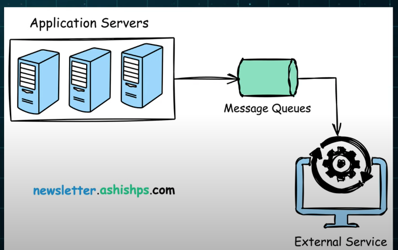

## Building Blocks in System Design

Github resources: [awesome-system-design-resources](https://github.com/ashishps1/awesome-system-design-resources?tab=readme-ov-file)

### 1. application servers

computers that handle the business logic and processing required by the application.

### 2. Load Balancers

**Distribute incoming requests to different servers to sensure no single server gets overwhelmed**.

### 3. Databases

- SQL
- NoSQL

### 4. Cache

[Cache](https://github.com/donnemartin/system-design-primer?tab=readme-ov-file#cache): store frequently acccessed data in a fast access storage to reduce the load on primary data source and improve response times.

- [Client caching](https://github.com/donnemartin/system-design-primer?tab=readme-ov-file#client-caching)
- [CDN caching](https://github.com/donnemartin/system-design-primer?tab=readme-ov-file#cdn-caching)
- [Web server caching](https://github.com/donnemartin/system-design-primer?tab=readme-ov-file#web-server-caching)
- [Database caching](https://github.com/donnemartin/system-design-primer?tab=readme-ov-file#database-caching)
- [Application caching](https://github.com/donnemartin/system-design-primer?tab=readme-ov-file#application-caching)
- [Caching at the database query level](https://github.com/donnemartin/system-design-primer?tab=readme-ov-file#caching-at-the-database-query-level)
- [Caching at the object level](https://github.com/donnemartin/system-design-primer?tab=readme-ov-file#caching-at-the-object-level)
- [When to update the cache?](https://github.com/donnemartin/system-design-primer?tab=readme-ov-file#when-to-update-the-cache)

  - Cache-aside
  - Write-through
  - Write-behind (write-back)
  - Refresh-ahead

### 5 Message Queue

Enable async communication between servers. It decouples the sender and the consumer, aligned them to work independently in different threads.

### 6. Storage

Stores and retrieve data such as files, images, videos.
They can be:

- Local file systems
- distrubuted file systems
- object storage system: eg: Amazon S3

### 7. Proxy Servers

It is an intermediary between clients & servers, it can be used for multiple purposes:

- for load balancing
- for caching
- for content filtering
- for security

### 8. CDN (content delivery network)

[CDN](https://github.com/donnemartin/system-design-primer?tab=readme-ov-file#content-delivery-network): It is a group of servers spread across different locations worldwide. It stores the copies of the website, eg: image, video and files.

- [Push CDN](https://github.com/donnemartin/system-design-primer?tab=readme-ov-file#push-cdns)
- [Pull CDN](https://github.com/donnemartin/system-design-primer?tab=readme-ov-file#pull-cdns)
