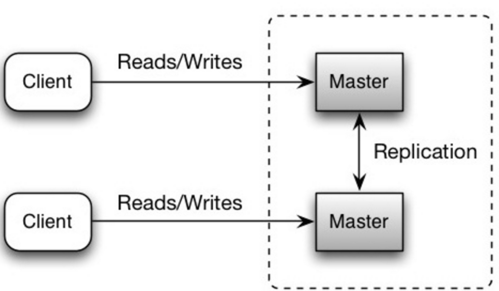

## Building Blocks in System Design

Github resources: [awesome-system-design-resources](https://github.com/ashishps1/awesome-system-design-resources?tab=readme-ov-file)

### 1. application servers

computers that handle the business logic and processing required by the application.

### 2. Load Balancers

**2.1 Distribute incoming requests to different servers to sensure no single server gets overwhelmed**.
[Load balancing algorithms](https://blog.algomaster.io/p/load-balancing-algorithms-explained-with-code):

- Random
- Least loaded
- Session/cookies
- [Round robin or weighted round robin](https://www.g33kinfo.com/info/round-robin-vs-weighted-round-robin-lb)
- [Layer 4](https://github.com/donnemartin/system-design-primer?tab=readme-ov-file#layer-4-load-balancing): Layer 4 load balancers look at info at the `transport layer` to decide how to distribute requests. Generally, this involves the source, destination `IP addresses, and ports in the header`, but not the contents of the packet.
- [Layer 7](https://github.com/donnemartin/system-design-primer?tab=readme-ov-file#layer-7-load-balancing):Layer 7 load balancers look at the application layer to decide how to distribute requests. This can involve contents of the `header, message, and cookies`.
  > Example: a layer 7 load balancer can direct **video traffic** to servers that host videos, while directing more sensitive user `billing traffic` to security-hardened servers.

**2.2 Problems caused by load balancing:**

> what if the same user come again, and assigned to another server, but it loses it's auth state?

**Storing sessions** using **RAID technology** can increase site performance and provide redundancy

- RAID technology can be used to store session data on a file server
- RAID 0 can improve performance by striping data across multiple identical hard drives, while RAID 1 mirrors data for redundancy

#### 2.3 Software for Load balancer solutions

- AWS Elastic Load Balancing
- Azure Load Balancer
- Google Cloud Load Balancing
- NGINX Plus

### 3. Databases

15 Types of DB: https://blog.algomaster.io/p/15-types-of-databases

#### 3.1 Relational DB

A relational database like `SQL` is a collection of data items organized in tables.

#### 3.2 How to scale the RDBMS?

#### 3.2.1 **master-slave replication**:

the master serves `reads and writes`, replicating writes to one or more slaves, which `serve only reads`.

**Disadvantages**:

- a potential for loss of data if the **master fails** before any newly written data can be replicated to other nodes.
- Writes are replayed to the read replicas. **If a lot of writes**, the read replicas can get bogged down with replaying writes and **can't do as many reads**.
- The **more read slaves**, the more you have to replicate, which leads to **greater replication lag**.

#### 3.2.2 **master-master replication**:

Both masters serve reads and writes and coordinate with each other on writes. If either master goes down, the system can continue to operate with both reads and writes.

**Disadvantages:**

- will need a **load balancer** or need to make changes to your application logic **to determine where to write**.
- Most "master-master" systems are either **loosely consistent (violating ACID)** or have **increased write latency due to synchronization**.
- **Conflict** resolution comes more into play as **more write nodes are added** and as latency increases.

#### 3.2.3 Functional Partitioning (Federation)

it **splits up databases by function**. For example, instead of a single, monolithic database, you could have three databases: `forums DB, users DB, and products DB`, resulting in less read and write traffic to each database and therefore less replication lag.

**Disadvantages:**

- Federation is **not effective** if your schema **requires huge functions or tables**.
- need to update your application logic to determine **which database to read and write**.
- **Joining data from two databases** is more complex with a [server link](https://stackoverflow.com/questions/5145637/querying-data-by-joining-two-tables-in-two-database-on-different-servers).

#### 3.2.4 sharding

It **breaks up large tables into horizontal data partitions**, each `Shard` contains a subset of data on a seprate database server.

**Types of sharding:**

- **geo-based sharding**: location of users
- **range-based sharding**: user-name firstName's 1st letter, eg: 26 buckets of letters.
- hash-based sharding: use a hashing algorithm to generate the k-v, use the hash value to do the partition.

**Advantages**:

- allow to scale as sizes of data increases, better than RDBMS
- smaller set of data in each shard, means the **indexes on that data are smaller**, which results in **faster query performance**.
- if one shard is down, the majority of other shards are still available

**Disadvantages:**

- not all data amenable to shard, eg: [Foreign key](https://www.cockroachlabs.com/blog/what-is-a-foreign-key/) relationship must be in a single shard.
- Joining tables from multiple shards is expensive, might be impossible.
- Data distribution can become lopsided in a shard.
  - **Rebalancing adds additional complexity**. A sharding function based on [consistent hashing](http://www.paperplanes.de/2011/12/9/the-magic-of-consistent-hashing.html) can reduce the amount of transferred data.

#### 3.2.5 SQL tuning

TODO: https://github.com/donnemartin/system-design-primer?tab=readme-ov-file#sql-tuning

#### 3.3 NoSQL

NoSQL is a collection of data items represented in a `key-value store`, `document store`, `wide column store`, or a `graph database`. Data is denormalized, and joins are generally done in the application code. Most NoSQL stores lack true `ACID` transactions and favor [eventual consistency](https://github.com/donnemartin/system-design-primer?tab=readme-ov-file#eventual-consistency).

`BASE` is often used to describe the properties of NoSQL databases. In comparison with the [CAP Theorem](https://github.com/donnemartin/system-design-primer?tab=readme-ov-file#cap-theorem), BASE chooses availability over consistency.

- **Basically available** - the system guarantees availability.
- **Soft state** - the state of the system may change over time, even without input.
- **Eventual consistency** - the system will become consistent over a period of time, given that the system doesn't receive input during that period.

#### 3.4 SQL vs. NoSQL

Doc: [SQL v.s NoSQL - 5 critical differences](https://www.integrate.io/blog/the-sql-vs-nosql-difference/)

- SQL databases are **relational**, and NoSQL databases are non-relational.
- SQL databases use structured query language (SQL) and have a predefined schema. NoSQL databases have **dynamic schemas for unstructured data**.
- SQL databases are **vertically scalable**, while **NoSQL databases are horizontally scalable**.
- SQL databases are **table-based**, while NoSQL databases are document, key-value, graph, or wide-column stores.
- SQL databases are better for multi-row transactions, while NoSQL is better for unstructured data like documents or JSON.

### 4. Cache

[Cache](https://github.com/donnemartin/system-design-primer?tab=readme-ov-file#cache): store frequently acccessed data in a fast access storage to reduce the load on primary data source and improve response times.

- [Client caching](https://github.com/donnemartin/system-design-primer?tab=readme-ov-file#client-caching)
- [CDN caching](https://github.com/donnemartin/system-design-primer?tab=readme-ov-file#cdn-caching)
- [Web server caching](https://github.com/donnemartin/system-design-primer?tab=readme-ov-file#web-server-caching)
- [Database caching](https://github.com/donnemartin/system-design-primer?tab=readme-ov-file#database-caching)
- [Application caching](https://github.com/donnemartin/system-design-primer?tab=readme-ov-file#application-caching)
- [Caching at the database query level](https://github.com/donnemartin/system-design-primer?tab=readme-ov-file#caching-at-the-database-query-level)
- [Caching at the object level](https://github.com/donnemartin/system-design-primer?tab=readme-ov-file#caching-at-the-object-level)
- [When to update the cache?](https://github.com/donnemartin/system-design-primer?tab=readme-ov-file#when-to-update-the-cache)

  - Cache-aside
  - Write-through
  - Write-behind (write-back)
  - Refresh-ahead

### 5 Message Queue

Enable async communication between servers. It decouples the sender and the consumer, aligned them to work independently in different threads.

### 6. Storage

Stores and retrieve data such as files, images, videos.
They can be:

- Local file systems
- distrubuted file systems
- object storage system: eg: Amazon S3

### 7. Proxy Servers

It is an intermediary between clients & servers, it can be used for multiple purposes:

- for load balancing
- for caching
- for content filtering
- for security

#### 7.1 Reverse Proxy(Web Server)

A [reverse proxy](https://github.com/donnemartin/system-design-primer?tab=readme-ov-file#reverse-proxy-web-server) is a web server that centralizes internal services and provides unified interfaces to the public. Requests from clients are forwarded to a server that can fulfill it before the reverse proxy returns the server's response to the client.

**Advantages:**

- Increased security: hide information about backend servers, blacklist IPs.
- can implement cache
- can implement load balancer

**Disadvantage(s)**: reverse proxy

- Introducing a reverse proxy results in increased complexity.
- A single reverse proxy is **a single point of failure**, configuring multiple reverse proxies (ie a failover) further increases complexity.

### 8. CDN (content delivery network)

[CDN](https://github.com/donnemartin/system-design-primer?tab=readme-ov-file#content-delivery-network): It is a group of servers spread across different locations worldwide. It stores the copies of the website, eg: image, video and files.

- [Push CDN](https://github.com/donnemartin/system-design-primer?tab=readme-ov-file#push-cdns)
- [Pull CDN](https://github.com/donnemartin/system-design-primer?tab=readme-ov-file#pull-cdns)
