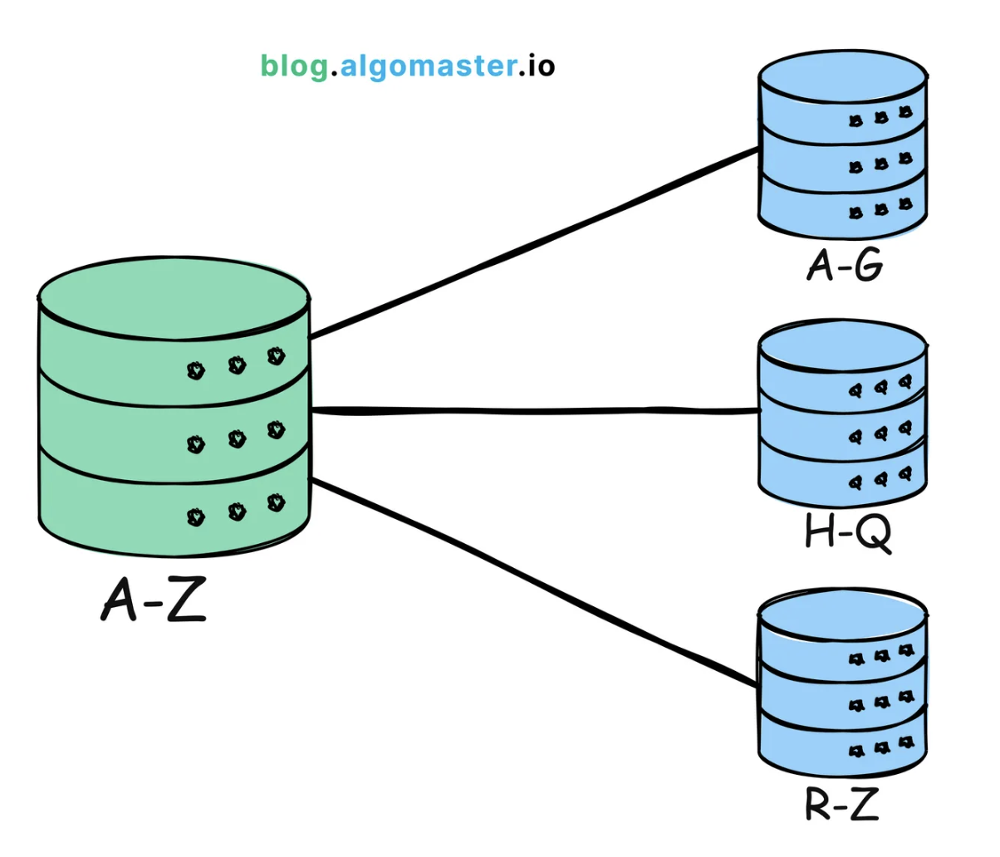
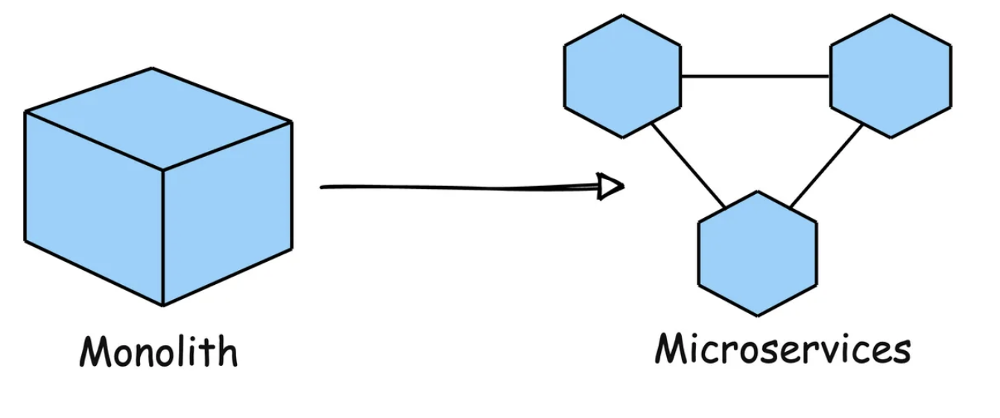
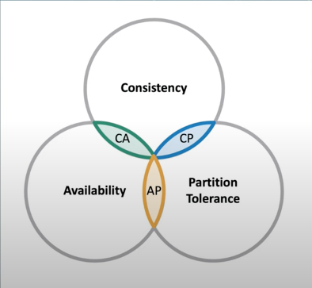
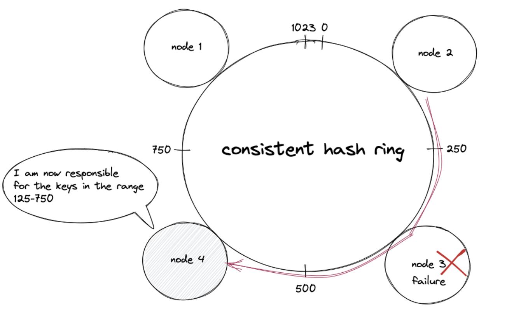

## System design fundamental Concepts

12 Key Concepts - [doc](https://github.com/donnemartin/system-design-primer?tab=readme-ov-file#how-to-approach-a-system-design-interview-question):

#### [1. Scalability](#q1)

#### [2. Performance](#q2)

#### [3. Availability](#q3)

#### [4. Reliability](#q4)

#### [5. Consistency](#q5)

#### [6. CAP theorem](#q6)

#### [7. Data Storage and Retrieval](#q7)

#### [8. ACID Transactions in DB](#q8)

#### [9. Consistent Hashing](#q8)

#### [10. Rate Limiting](#q10)

#### [11. Networking and Communication](#q11)

#### [12. Security and Privacy](#q12)

### 1 Scalability

Scalability([article](https://github.com/donnemartin/system-design-primer?tab=readme-ov-file#step-2-review-the-scalability-article)): How well a system can **handle more users or data without slowing down.**

#### 1. Problems of scalability

- more users: eg: social media platform
- more data: eg: vedio platform with more video content over time
- more features: eg: e-commerce another payment method
- more geographies: eg: expand products to another country

#### 2. type of scaling

- **Vertical Scaling**: getting more resouces **on a single machine**, eg: more hard-drive, or memory, add RAM or additional storage.
- **Horizontal Scaling**: add more machines to the system to spread the load. It's often **considered the most effective way to scale for large systems**. eg: netflix streaming services

#### 3. How to scale a system? - [doc](https://blog.algomaster.io/p/scalability)

- **3.1 Load balancing**: it's a method to distribute traffic across multiple servers to ensure no single sever becomes overwhelmed. eg: we want to support the search queries on google globally.
- **3.2 Caching**: store data **in-memory** to reduce the load to query DB, eg: `Redis(a in-memory cache)` ,RAM, it can reduce the response time a lot.
- **3.3 use CDN**: store static assets(images, videos, etc.) closer to user, this can reduce latency and result in faster load time. For example: Cloudflare provides CDN services. use case: youtube videos, pinterest images.
- **3.4 Partitioning**: database partitioning ([youtube](https://www.youtube.com/watch?v=-W9F__D3oY4)), Split data or functionality across multiple nodes/servers to distribute workload and avoid bottlenecks.

  

- **3.5 Async Communication**: Defer long-running or non-critical tasks to background queues or message brokers. This ensures your main application remains responsive to users.
  > Example: Slack uses asynchronous communication for messaging. When a message is sent, the sender's interface doesn't freeze; it continues to be responsive while the message is processed and delivered in the background.
- **3.6 microservices**: Break down your application into smaller, independent services that can be scaled independently. This improves resilience and allows teams to work on specific components in parallel.
  > Example: Uber has evolved its architecture into microservices to handle different functions like billing, notifications, and ride matching independently, allowing for efficient scaling and rapid development.
  > 
- **3.7 auto-scaling**: Automatically adjust the number of active servers based on the current load. This ensures that the system can handle spikes in traffic without manual intervention.
  > Example: `AWS Auto Scaling monitors applications` and automatically adjusts capacity to maintain steady, predictable performance at the lowest possible cost.
- **3.8 Multi-region Deployment**: **deploy the application in multiple data centers or cloud regions** to reduce latency and improve redundancy.
  > Example: Spotify uses multi-region deployments to ensure their music streaming service remains highly available and responsive to users all over the world, regardless of where they are located.

#####

#### 2 Performance

[Performance](https://github.com/binhnguyennus/awesome-scalability?tab=readme-ov-file#performance): **How fast the system works?**

**How to measure?**

- **Latency**: how long time does it take for a single task?
- **ThroughPut**: how many tasks your system can handle in a certain time?

Articles:

- [Performance vs scalability](https://github.com/donnemartin/system-design-primer?tab=readme-ov-file#performance-vs-scalability)
  - If you have a performance problem, your system is slow for a single user.
  - If you have a scalability problem, your system is fast for a single user but slow under heavy load.
- [Latency vs throughput](https://github.com/donnemartin/system-design-primer?tab=readme-ov-file#latency-vs-throughput): Generally, you should **aim for maximal throughput with acceptable latency**.
  - Latency is the time to perform some action or to produce some result.
  - Throughput is the number of such actions or results per unit of time.

#### 3 Availability

[Availability](https://github.com/binhnguyennus/awesome-scalability?tab=readme-ov-file#availability): the system is up and running when users need it **without any significant downtime**.

#### 3.1 Two complementary patterns to support high availability

- **fail-over**: [detail-doc](https://cloudpatterns.org/mechanisms/failover_system/), [overview-doc](https://github.com/donnemartin/system-design-primer?tab=readme-ov-file#fail-over): A failover system is configured to automatically switch over to a redundant or standby IT resource instance whenever the currently active IT resource becomes unavailable.

  - **[Active-active](https://github.com/donnemartin/system-design-primer?tab=readme-ov-file#active-active)**: both servers are managing traffic, spreading the load between them.
  - **[Active-passive](https://github.com/donnemartin/system-design-primer?tab=readme-ov-file#active-passive)** fail-over: it also can also be referred to as master-slave failover. the passive server takes over the active's IP address and resumes service. The **length of downtime is determined by whether the passive server is already running in 'hot' standby or whether it needs to start up from 'cold' standby**. Only the active server handles traffic.

**Disadvantages:**

- Fail-over adds more hardware and additional complexity.
- There is a potential for loss of data if the active system fails before any newly written data can be replicated to the passive.

#### 3.2 replication

This topic is further discussed in the [7. Database section](#q7):

- Master-slave replication
- Master-master replication

#### 3.3 [Availability in Numbers](https://github.com/donnemartin/system-design-primer?tab=readme-ov-file#availability-in-numbers): eg: `99.9% - three 9s`

Availability is often quantified by uptime (or downtime) as a percentage of time the service is available.

#### [99.9% availability - three 9s](https://github.com/donnemartin/system-design-primer?tab=readme-ov-file#999-availability---three-9s)

| Duration          | Acceptable downtime |
| ----------------- | ------------------- |
| Downtime per year | 8h 45min 57s        |
| Downtime per week | 10m 4.8s            |

#### [99.99% availability - four 9s](https://github.com/donnemartin/system-design-primer?tab=readme-ov-file#9999-availability---four-9s)

| Duration          | Acceptable downtime |
| ----------------- | ------------------- |
| Downtime per year | 52min 35.7s         |
| Downtime per week | 1m 5s               |

#### 4 Reliability

Reliability: **the system is doing what it's supposed to do even if things go wrong.**

Helpful patterns:

- [Replication](https://github.com/donnemartin/system-design-primer?tab=readme-ov-file#replication)
- Redundancy
- [Failover](https://github.com/donnemartin/system-design-primer?tab=readme-ov-file#fail-over) mechanisms

#### 5 Consistency

[Consistency](): All users see the same data at the same time no matter which part of the system they interact with.

**Limitations:**
but having a strong **consistency has a cost**, which might **slow down performance**.
Then many systems adpot **"Eventual Consistency": the data may not be upto date immediately but it will be after a specific time.**.

**[Consistency patterns](https://github.com/donnemartin/system-design-primer?tab=readme-ov-file#consistency-patterns):**

- [Weak consistency](-%20Weak%20consistency%20Eventual%20consistency%20Strong%20consistency)
- [Eventual consistency](https://github.com/donnemartin/system-design-primer?tab=readme-ov-file#eventual-consistency)
- [Strong consistency](https://github.com/donnemartin/system-design-primer?tab=readme-ov-file#strong-consistency)

### 6 CAP theorem

[CAP theorem](https://github.com/donnemartin/system-design-primer?tab=readme-ov-file#cap-theorem): In a distributed system, you can only have 2/3 of the below items:

- Consistency
- Availability
- Partition tolerance

#### [6.1 CP - consistency and partition tolerance](https://github.com/donnemartin/system-design-primer?tab=readme-ov-file#cp---consistency-and-partition-tolerance)

Waiting for a response from the partitioned node might result in a timeout error. CP is a good choice **if your business needs require atomic reads and writes**.

> Exampl: ATM Bank deposit or withdraw for security

#### [AP - availability and partition tolerance](https://github.com/donnemartin/system-design-primer?tab=readme-ov-file#ap---availability-and-partition-tolerance)

Responses return the most readily available version of the data available on any node, which might not be the latest. Writes might take some time to propagate when the partition is resolved.

AP is a good choice if the business needs to allow for eventual consistency or when the system needs to continue working despite external errors.

> Example: if you wanna **disconnected offline-operations**, eg: **google doc if no network**. need to design a higher availability system.

**Article:**

- [CP-consistency and partition tolerance](https://github.com/donnemartin/system-design-primer?tab=readme-ov-file#cp---consistency-and-partition-tolerance)
- [AP - availability and partition tolerance](https://github.com/donnemartin/system-design-primer?tab=readme-ov-file#ap---availability-and-partition-tolerance)

### 7 Data Storage and Retrieval

**[Database](https://github.com/donnemartin/system-design-primer?tab=readme-ov-file#database):**

1. choosing the right database:

   - [RDBMS(relational db management system)](https://github.com/donnemartin/system-design-primer?tab=readme-ov-file#relational-database-management-system-rdbms)
   - [NoSQL](https://github.com/donnemartin/system-design-primer?tab=readme-ov-file#nosql)
     - [key-value store](https://github.com/donnemartin/system-design-primer?tab=readme-ov-file#key-value-store)
     - [document store](https://github.com/donnemartin/system-design-primer?tab=readme-ov-file#document-store)
     - [graph database](https://github.com/donnemartin/system-design-primer?tab=readme-ov-file#graph-database)
   - [SQL or NoSQL](https://github.com/donnemartin/system-design-primer?tab=readme-ov-file#sql-or-nosql)

2. design database schema
3. How to optimize the DB storage and retrieval?

   - partitioning
   - [sharding](https://github.com/donnemartin/system-design-primer?tab=readme-ov-file#sharding)
   - replication:

     - [Master-slave replication](https://github.com/donnemartin/system-design-primer?tab=readme-ov-file#master-slave-replication)
     - [Master-master replication](https://github.com/donnemartin/system-design-primer?tab=readme-ov-file#master-master-replication)

   - [SQL tuning](https://github.com/donnemartin/system-design-primer?tab=readme-ov-file#sql-tuning)

### 8 ACID Transactions in DB

A way to make sure **everything we do in DB is done right and reliably**:

- `A`: Atomicity
- `C`: Consistency
- `I`: Isolation
- `D`: Durability

### 9 Consistent Hashing

[Consistent Hashing](https://www.paperplanes.de/2011/12/9/the-magic-of-consistent-hashing.html): **a method to spread data across a group of servers. **

**Operation Steps:**

- The output of the hash function such as MD5 is placed on the **hash ring**.
- The **IP address of the nodes is hashed to find the position of the nodes** on the hash ring
- The key of the data object is hashed using the same hash function to locate the position of the key on the hash ring
- Traverse the hash ring in the **clockwise direction** starting from the position of the key until the next node to identify the correct node to store or retrieve the data object

**The failure (crash) of a node**: results in the movement of data objects from the failed node to the immediate neighboring node in the clockwise direction. The remaining nodes on the hash ring are unaffected

**Benifit:**

- It makes the system easy to **remove/add a server without causing too many distrubances**.
- It also helps improve: **Scalability & Load balancing**.
- horizontally scalable
- minimized data movement when the number of nodes changes（fail, added）
- quick replication and partitioning of data

### 10 Rate Limiting

[Rate limiting](https://www.keycdn.com/support/rate-limiting): Control the rate at which clients can make requests to a system.

**Benefits:**

- Prevent Abuse
- Protect Against DDOS Attacks
- Ensures fair usage of resources

Examples:

- Control the rate at which clients can make requests to a system.
- Rate Limiting for Scaling to Millions of Domains at Cloudflare
- Cloud Bouncer: Distributed Rate Limiting at Yahoo
- [Scaling API with Rate Limiters at Stripe](https://stripe.com/blog/rate-limiters)
- Distributed Rate Limiting at Allegro
- [Ratequeue: Core Queueing-And-Rate-Limiting System at Twilio](https://www.twilio.com/blog/2017/11/chaos-engineering-ratequeue-ha.html)

#### 11 Networking and Communication

[Communication](https://github.com/donnemartin/system-design-primer?tab=readme-ov-file#communication): How different parts of a system communicate?

- Network Protocals: TCP, UDP, [RPC](https://github.com/donnemartin/system-design-primer?tab=readme-ov-file#remote-procedure-call-rpc), [REST](https://github.com/donnemartin/system-design-primer?tab=readme-ov-file#representational-state-transfer-rest)
- APIs
- [Message Queues](https://github.com/donnemartin/system-design-primer?tab=readme-ov-file#message-queues)
- Event Driven Architectures

### 12 Security and Privacy

[Security](https://github.com/donnemartin/system-design-primer?tab=readme-ov-file#security): Putting in place methods to keep important data safe and stop unwanted access.

- authentication
- authorization
- encryption
