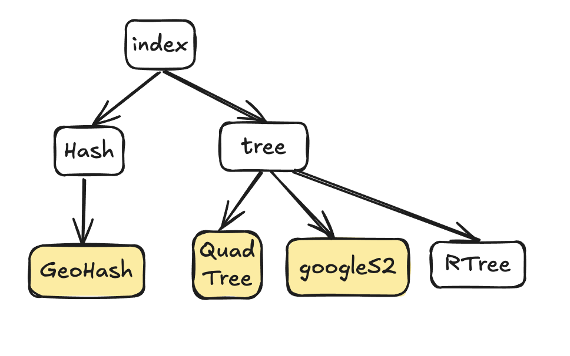
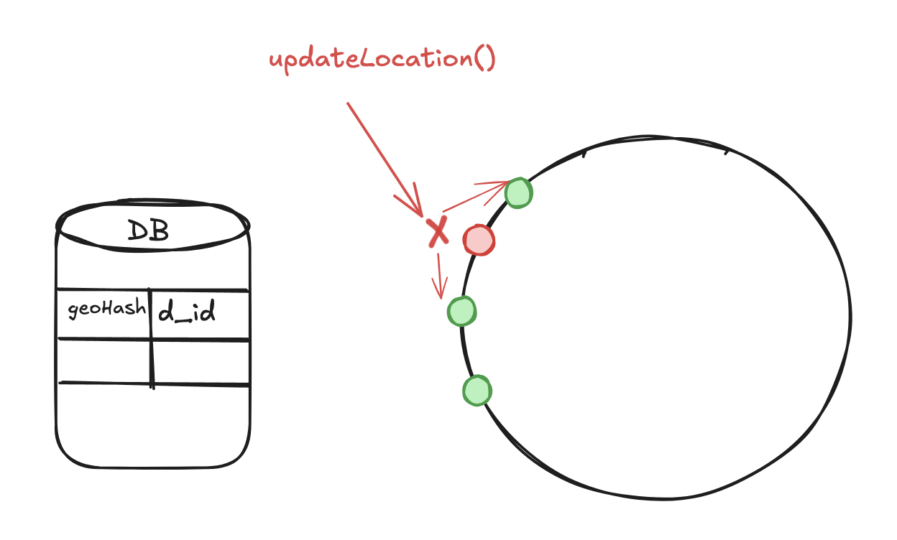
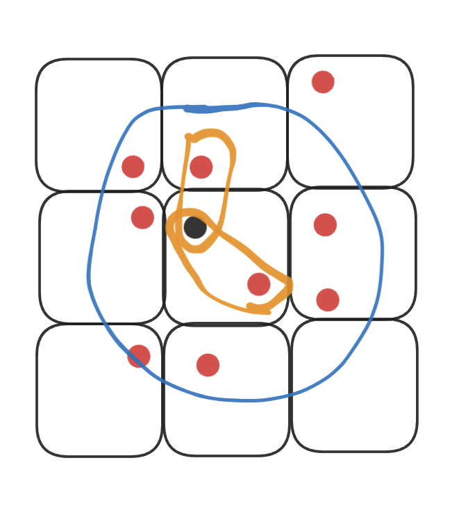

## System Design - Uber

### 1. Requirements

Functional:

- a user request a ride
- match a cloest driver
- show pricing info
- user accept the ride: share real-time location
  Out of Scope:
- user authentication
- calc & displaying ETA
- end trip: post trip functionalities, eg: payment, rating, tip.
  Non-functional:
- availability: 99.9%
- consistency:

### 2. Capacity

- 90M users per day
- QPS: 90M \* 1request / 24/ 3600 = 1.5K request/second
- storage: user & driver data: 90M _ 2 _ 1kb = 180 GB / day _ 365 _ 10year = 600 TB
  trip data: 90M _ 0.5K _ 365 \* 10 = 120 TB -> relational DB

### 3. Data model

Trip:

- trip_id
- user_id
- driver_id
- price
- src
- dest
- startTime
- endTime
- status: accepted, inprogress, finished, canceled

User：

- id
- phone
- address
- name

Driver：

- id
- carInfo
- address
- phone

Geospatial Index of Driver location:

- geo-hash-id
- driver_id

**How to find the closest driver?**

- geo-hash index
- consistent hashing - handling a cluster of DBs
  

- Find the neighbor 8 directions cells to avoid the border issue.
  

### 4. API

- `/requestRide`: (userId, location, radius) -> response: `<Trip>`
- POST: `/acceptTrip/trip_id` or `/cancelTrip/trip_id`
- User waiting pickup:
  - SSE, `/shareLocation`
  - web socket
  - long polling: not good
- Driver: `/updateLocation` --> DB write

### 5.
