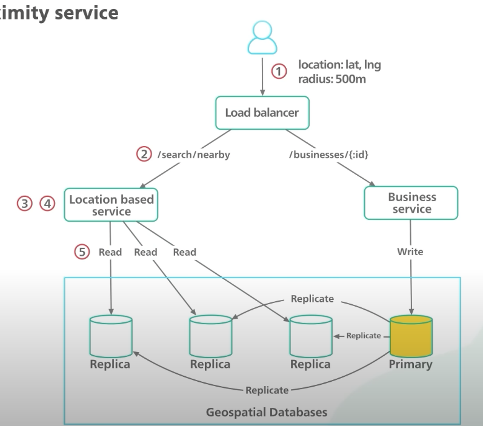

## Design a location based service - yelp

### 1. Requirements

#### 1.1 Functional Requirements

- return all listResults based on the `location` & `radius (<15miles)`
- business owners can `add/update/delete` an entity: no need to be in real time, eg: 1 day delay
- view detail page of a business

#### 1.2 non-functional requirements

- low latency
- availability: handle traffic spikes in peak hours

### 2. Capacity & traffic

- DAU: 100M active users / day
- what is the QPS? 100M \* 5 requests / 24 / 3600 (seconds) = 8K QPS
- business: 200 M business

### 3. API Design

- GET HTTP: `/getNearBy?page=1`, consider pagination
  - read heavy
  - QPS high
  - service stateless
- GET/PUT/DELETE/POST: `/business/id`,
- GET HTTP: `/getDetails/b_id`

### 4. data schema

- User:
- Business: id(Primary Key), country, location, --> geoIndex(location, business_id)

#### 4.2 DB choices

use **Geospatial DB**: [Redis geohash](https://redis.io/docs/latest/commands/geohash/), [PostGIS](https://postgis.net/).

**Problem**: can we map 2-dimensional data into 1 dimension, so we could build a single index on it?
**yes.**
**Solutions:**

- hash
- tree-based: [QuadTree](https://en.wikipedia.org/wiki/Quadtree#:~:text=A%20quadtree%20is%20a%20tree,into%20four%20quadrants%20or%20regions.), [Google S2](http://s2geometry.io/), Rtree

How to build our table?
Table:

- geoHashID
- business_id: 8 bytes (64bit)
- loc: (lat, long) 16 bytes

Total table size: `200M business * 30 bytes = 6 GB` (tiny)

| business_id | geohash |
| ----------- | ------- |
| 123         | f3lcad  |
| 121         | f3lcad  |
| 343         | 32feac  |
| 347         | 32feac  |

#### 4.3 DB improve

- add read replica
- no need to shard since the geo data set is tiny 6GB, a single server is enough.

### 5. architecture

Does cache needed? yes:

- get nearby
- getBusiness details

```
LB  --read--> Location Service ---> Redis(cache) --> DB (replica)
    --write--> Business Service
```


