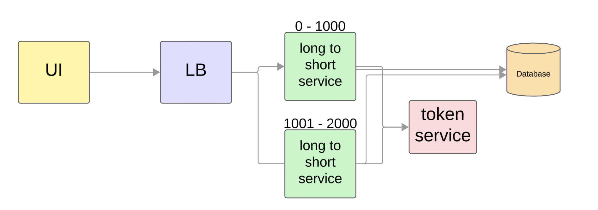

## System Design - TinyUrl

### 1. Requirement

Functional Requirements:

- convert long url to short url
- when giving short url, redirect user to long url

Non-functional requirements:

- low latency
- high availability: as a user, i don't want to receive a failure result when convert or redirect. eg: when recruiters paste short url

### 2. estimate Capacity

- url length
- how many urls? how frequently make requests to server (per second, per minute...)?
  eg: `X (per seconds) * 60 * 60 * 24 * 365 = Y (total per year)`
- any expire dates?
- how many "chars" are allowed? number/letter? eg: `a-z, A-Z, 0-9 = 62 chars`
  ```
  length --> counts of combinations
  1  --> 62
  2  --> 62^2
  ...
  n  --> 62^n  = 2^6n = Y (total per year)
  ```

### 3. Architecture

### 3.1 Long to short service (create -> write into DB)

- issue1: conflict for 2 servers, what if generate the same token?
- issue2: what if token is used up? - need to clean up and re-use expired token.



### 3.2 Short to long service (read from DB and redirect)

- issue3: since it's mostly read from DB, add a in-memory cache, Redis upon the DB.


### 4. DB

- since it's a key-value data, choose NoSQL is better.
- nosql easy to scale, using sharding, eg: letter-range-based, or hash-based (calc the token into hash key).

5.
