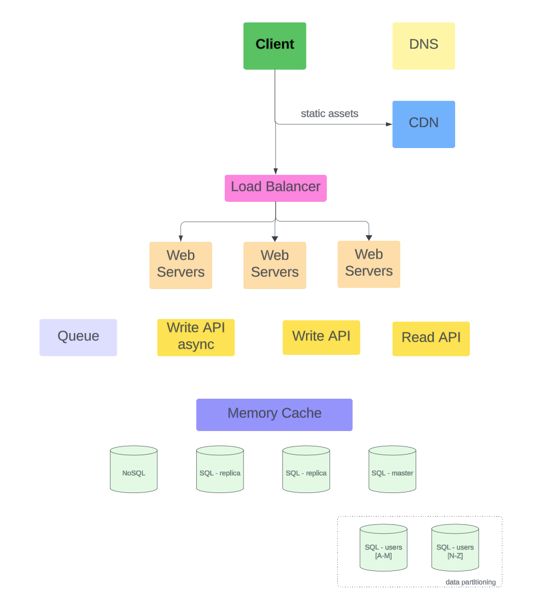
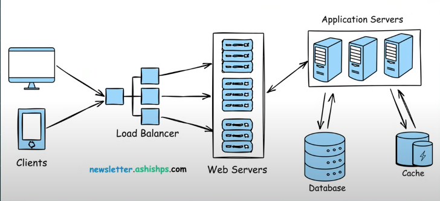

## Most Frequent System Design Questions

github source: [System Design Interview problems](https://github.com/ashishps1/awesome-system-design-resources?tab=readme-ov-file#-system-design-interview-problems).

### [What to expect to answer interview questions?](https://github.com/ashishps1/awesome-system-design-resources/tree/main?tab=readme-ov-file#-how-to-answer-a-system-design-interview-problem)

[Article](https://blog.algomaster.io/p/how-to-answer-a-system-design-interview-problem) in details:

1. Clarify **Requirements**: functional vs. non-functional
2. Estimate the **Capacity**
3. Choose the right **DB** and define **schema**
4. Design API: request and response pattern
5. Drawing a high level block diagram
   
6. Deep dive into key components
7. How to scale?
   - sharding
   - replication
   - partitionin
8. trade-offs: eg: sql vs no sql DB?
9. discuss caching
10. discuss handling failures:
    - replicas
    - fallbacks
    - retries

### 1. design a URL shortening service like TinyUrl

### 2. design a social media platform like twitter/insgram

### 3. design a chat application like what's app/slack

### 4. design a video straming service like youtube/netflix

### 5. design an e-commerce platform like amazon

### 6. design a ride sharing service like Uber/Lyft

### 7. design a notification systems

### 8. design a scalable logging and monitoring system
